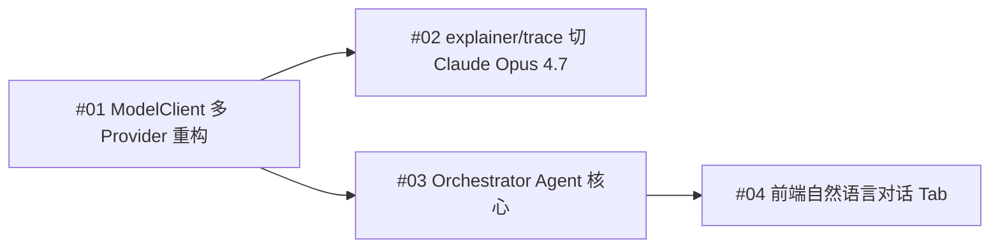

# PLANNING.md

## 项目概述
- 一句话描述：墨西哥市场多 Agent 用户画像后端
- 整体架构：单体 FastAPI 后端，五层（API → 编排 → Skill 执行 → 数据访问 → 外部服务）
- 入口文件：`app/main.py`

## 2026-06-29 M2B-8.1 Hybrid Candidate Provenance & Fallback Hardening

- `M2B-8` 已完成并合并，当前进入 `M2B-8.1`：
  - `docs/reviews/m2b-8-hybrid-candidate-runtime-grounding-results.md`
- 本阶段目标：
  - candidate empty / unusable SQL 必须 deterministic rerun
  - `structured_sql_plan` 改为 final-attempt scoped
  - final output provenance invariant 扩展覆盖 SQL、`structured_sql_plan`、SQL version、`context_hash`
- 本阶段新增或强化的 runtime contract：
  - `structured_sql_plan_provenance`
  - `candidate_sql_empty`
  - final snapshot 只能来自 final attempt
- 本阶段明确保持不变：
  - 不启用 `hybrid_enabled`
  - 不改 public API response schema
  - 不改 approve / execute / SQL HITL 语义
  - 不改 orchestrator 自动路由
  - 不改 seed / embedding records / vector index artifact
- 当前结论是：
  - `M2B-8.1` 已把 candidate-only fallback 和 final-attempt provenance 封口
  - `M2B-9` 之前必须继续保持这些不变量

## 2026-06-29 M2B-8 Hybrid Candidate Runtime Grounding

- `M2B-7` 已完成并合并，当前进入 `M2B-8`：
  - `docs/plans/m2b-8-hybrid-candidate-runtime-grounding-plan.md`
  - `docs/reviews/m2b-8-hybrid-candidate-runtime-grounding-results.md`
- 本阶段只让 `hybrid_candidate` 在严格 gate 下进入内部 prompt：
  - deterministic retrieval 仍然是 primary grounding source
  - accepted supplements 只作为 `supplemental_candidates_v1` 独立区块追加
  - `hybrid_shadow` 继续只审计不进 prompt
  - `hybrid_enabled` 继续强制 fallback
- 本阶段新增的 runtime contract：
  - `supplemental_candidates_v1`
  - `prompt_candidate_count`
  - `final_generation_pass`
  - `candidate_attempt`
  - final output provenance invariant
- 本阶段明确保持不变：
  - 不改 `app/data_knowledge/retriever.py`
  - 不改 orchestrator 自动路由
  - 不改 approve / execute / SQL HITL 语义
  - 不改 public API response schema
- rollback / rerun 边界固定为：
  - candidate attempt 只有 `query_only` 才可保留
  - candidate attempt 非 `query_only` 或 candidate generation 失败时，必须 deterministic rerun
  - 只允许 final attempt 创建 public SQL version
- 当前结论是：
  - `M2B-8` 已把 hybrid candidate 接入 runtime prompt，但保持 deterministic primary 和 strict HITL boundary
  - `hybrid_enabled` 仍留给后续阶段

## 2026-06-29 M2B-7 Hybrid Shadow Runtime Implementation

- `M2B-6` 已完成并合并，当前进入 `M2B-7`：
  - `docs/plans/m2b-7-hybrid-shadow-runtime-implementation-plan.md`
  - `docs/reviews/m2b-7-hybrid-shadow-runtime-implementation-results.md`
- 本阶段只做 `hybrid_shadow` runtime skeleton：
  - deterministic retrieval 仍然是唯一生效输入
  - hybrid 只生成 bounded internal audit trace
  - trace 只写入 `retrieval_snapshot_json.hybrid_trace`
- 本阶段新增的 runtime contract：
  - env-backed raw settings
  - `HybridRetrievalMode` / `HybridFallbackReason`
  - `HybridRetrievalConfigV1`
  - shadow-only vector artifact reader
  - bounded audit trace builder
- 本阶段明确保持不变：
  - 不改 `app/data_knowledge/retriever.py`
  - 不改 `app/data_agent/sql_plan.py`
  - 不改 orchestrator 自动路由
  - 不改 prompt text
  - 不改 approve / execute / SQL HITL 语义
  - 不改 public API response schema
- rollout boundary 继续保守收口：
  - 只允许 `MX + cohort_query` 尝试 shadow
  - `bucket_writeback` / `TH` 全部 fallback
  - `hybrid_candidate` / `hybrid_enabled` 在本阶段不会生效
- 当前结论是：
  - `M2B-7` 只证明 hybrid shadow 可配置、可降级、可审计、且不影响 SQL 决策
  - 真正让 supplements 进入 prompt/context 必须进入后续独立阶段

## 2026-06-29 M2B-6 Hybrid Retrieval Governance / Runtime-facing Design

- `M2B-5` 已完成并合并，当前进入 `M2B-6`：
  - `docs/plans/m2b-6-hybrid-retrieval-governance-plan.md`
  - `docs/specs/m2b-6-hybrid-retrieval-governance-spec.md`
  - `docs/specs/m2b-6-hybrid-runtime-contract.md`
  - `docs/specs/m2b-6-hybrid-audit-schema.md`
  - `docs/specs/m2b-6-hybrid-eval-gate.md`
  - `docs/reviews/m2b-6-hybrid-retrieval-governance-results.md`
- 本阶段只做 runtime-facing governance design：
  - retrieval modes
  - feature flag / config contract
  - fallback policy
  - audit trace schema
  - evaluation gate
  - rollout scope matrix
  - SQL safety boundary
- 首个实际 runtime rollout boundary 固定为：
  - `country=mx`
  - `sql_kind=query_only`
  - `run_type=cohort_query`
  - mode 从 `deterministic_only / hybrid_shadow` 起步
- future gated design 只保留：
  - `MX bucket_writeback`
  - `TH cohort_query`
  - `TH bucket_writeback` 继续 out of scope
- 本阶段明确不做：
  - 不改 `app/data_knowledge/retriever.py`
  - 不改 `app/data_knowledge/service.py`
  - 不改 `app/data_agent/service.py`
  - 不改 `app/data_agent/sql_plan.py`
  - 不改 `data_acquisition_agent/orchestrator.py`
  - 不接 runtime hybrid implementation
  - 不调用 LLM
  - 不生成或执行 SQL
  - 不修改 M2B-5 产物、`m2b_legacy_v3` seed、embedding records、vector index
- 当前结论是：
  - `M2B-6` 只负责把 hybrid runtime contract 和 gate 设计清楚
  - 真正 runtime 接入必须进入 `M2B-7` 或新阶段单独 PR

## 2026-06-28 M2B-5 Hybrid Retrieval Fusion

- `M2B-4` 已完成，当前进入 `M2B-5`：
  - `docs/plans/m2b-5-hybrid-retrieval-fusion-plan.md`
  - `docs/reviews/m2b-5-hybrid-retrieval-fusion-results.md`
  - `docs/reviews/m2b-5-deterministic-vs-vector-vs-hybrid-comparison.md`
- 本阶段只做离线 hybrid baseline：
  - 输入固定为 deterministic/vector baseline 与 golden set
  - 使用 `primary_merge_v1`
  - deterministic 作为主召回，vector 只做受控补充
- 本阶段继续保持不变：
  - 不改 `app/data_knowledge/retriever.py`
  - 不改 `app/data_knowledge/service.py`
  - 不接 Data Agent runtime
  - 不调用 LLM
  - 不生成或执行 SQL
  - 不重跑 seed / embedding / vector index
- 当前 `M2B-5` 结果：
  - deterministic：`11 pass / 8 partial / 0 fail`
  - vector：`2 pass / 17 partial / 0 fail`
  - hybrid：`13 pass / 6 partial / 0 fail`
  - 明确改善：
    - `mx-no-withdraw-cohort`：`partial -> pass`
    - `th-asset-snapshot-query`：`partial -> pass`
    - `mx-app-profile-query`：missing 收缩但仍为 `partial`
  - 当前结论是：hybrid fusion 已有稳定收益，下一步可进入更 runtime-facing 的 hybrid 设计阶段

## 2026-06-25 M2B-4 Vector Index Prototype

- `M2B-3` 已完成，当前进入 `M2B-4`：
  - `docs/plans/m2b-4-vector-index-prototype-plan.md`
  - `docs/reviews/m2b-4-vector-index-prototype-results.md`
  - `docs/reviews/m2b-4-deterministic-vs-vector-comparison.md`
- 本阶段只做离线 vector prototype：
  - 输入固定为 `embedding_records.m2b_legacy_v3.jsonl` 与 `embedding_manifest.m2b_legacy_v3.yaml`
  - 使用 `local_hashing_bow_v1` 构建 `vector_index.m2b_legacy_v3.json`
  - 对 `baseline_results.m2b_legacy_v3.deterministic.json` 做 vector-only 对照
- 本阶段继续保持不变：
  - 不调用真实 embedding API
  - 不建立生产向量库
  - 不做 hybrid retrieval
  - 不改 `app/data_knowledge/retriever.py` / `app/data_knowledge/service.py`
  - 不改 Data Agent runtime / SQL HITL / orchestrator bridge
  - 不回头修改 `m2b_legacy_v3` seed 或 `embedding_records`
- 当前 `M2B-4` 结果：
  - vector index record_count：`101`
  - vector baseline：`2 pass / 17 partial / 0 fail`
  - 明确出现 `vector_only_matches` 的 case：
    - `mx-no-withdraw-cohort`
    - `mx-app-profile-query`
    - `th-asset-snapshot-query`
  - `th-asset-snapshot-query` 在 vector-only baseline 中提升为 `pass`
  - 当前结论是：可进入 `M2B-5 Hybrid Retrieval Fusion`，但前提是保持 “deterministic 为主、vector 为补充” 的融合设计

## 2026-06-25 M2B-3 Embedding Text Builder

- `M2B-2.2` 已完成，当前进入 `M2B-3`：
  - `docs/plans/m2b-3-embedding-text-builder-plan.md`
  - `docs/reviews/m2b-3-embedding-text-builder-results.md`
- 本阶段只做离线 embedding text 构建：
  - 输入固定为 `data_knowledge_seed/m2b/m2b_legacy_v3.yaml`
  - 输出 `embedding_records.m2b_legacy_v3.jsonl`
  - 输出 `embedding_manifest.m2b_legacy_v3.yaml`
  - 输出 `embedding_preview.m2b_legacy_v3.md`
- 本阶段继续保持不变：
  - 不调用 embedding API
  - 不生成 vector / index
  - 不改 `app/data_knowledge/retriever.py` scoring/top-k/filtering
  - 不改 `app/data_knowledge/service.py` / Data Agent runtime / SQL HITL / orchestrator bridge
  - 不读取 `docs/knowledge-base` raw docs
- 当前 `M2B-3` 结果：
  - `record_count=101`
  - `catalog_table=10`
  - `catalog_field=61`
  - `glossary_term=28`
  - `sql_example=2`
  - `sql_error_case=0`
  - preview 已覆盖 `mob1 / withdraw_uuid / user_uuid / asset_finish_at / credit_profile`
  - 当前结论是：可以进入 `M2B-4 Vector Index Prototype`

## 2026-06-25 M2B-2.2 Targeted Deterministic Grounding Patch

- `M2B-2.1` 已完成，当前进入 `M2B-2.2`：
  - `docs/plans/m2b-2-2-targeted-deterministic-grounding-patch-plan.md`
  - `docs/reviews/m2b-2-2-missing-grounding-analysis.md`
  - `docs/reviews/m2b-2-2-targeted-grounding-results.md`
  - `docs/reviews/m2b-2-2-v2-v3-baseline-comparison.md`
- 本阶段只做最后一轮 deterministic grounding patch：
  - 生成完整替代 patch `data_knowledge_seed/m2b/m2b_legacy_v3.yaml`
  - 继续强化 `withdraw_uuid / user_uuid / overdue / asset_* / mob1` 的 runtime-visible seed 文本与映射
  - 在同一版 runner 下复跑 `m2b_legacy_v2` 与 `m2b_legacy_v3`，保证 v2/v3 A/B 对比公平
- 本阶段继续保持不变：
  - 不做 embedding / vector index / hybrid retrieval
  - 不改 `app/data_knowledge/retriever.py` scoring/top-k/filtering
  - 不改 `app/data_agent/service.py` / `app/data_agent/sql_plan.py` / SQL HITL / orchestrator bridge
  - `business_rule / cohort_definition / canonical_field_policy` 仍不进入 runtime seed family
- 当前 `M2B-2.2` 结果：
  - rerun v2 baseline：`5 pass / 14 partial / 0 fail`
  - v3 baseline：`11 pass / 8 partial / 0 fail`
  - `mx-first-loan-never-overdue`、`mx-withdraw-cohort`、`mx-no-apply-cohort`、`dws-renewal-loan-segment-query`、`dws-fox-boc-behavior-query`、`th-ask-loan-risk-query` 均从 `partial -> pass`
  - `mx-mob1-settled-7d-churn` 从 6 个 missing 缩减到仅剩 `glossary:first_loan`
  - `mx-credit-profile-query` 在 v3 中保持 `pass`，不存在 v2/v3 regression
  - 当前结论是：可以进入 `M2B-3 Embedding Text Builder`

## 2026-06-25 M2B-2.1 Seed / Alias / Deterministic Grounding Patch

- `M2B-2` 已完成并产出 `m2b_legacy_v1` deterministic baseline，当前进入 `M2B-2.1`：
  - `docs/plans/m2b-2-1-seed-alias-deterministic-grounding-patch-plan.md`
  - `docs/reviews/m2b-2-1-deterministic-grounding-results.md`
  - `docs/reviews/m2b-2-1-v1-v2-baseline-comparison.md`
- 本阶段只做 deterministic grounding patch：
  - 生成完整替代 patch `data_knowledge_seed/m2b/m2b_legacy_v2.yaml`
  - 用 glossary synonyms、field business meaning、mapped tables/fields、normalization 修补 deterministic retrieval grounding
  - 对 `m2b_legacy_v1` 与 `m2b_legacy_v2` 跑 A/B baseline
- 本阶段继续保持不变：
  - 不做 embedding / vector index / hybrid retrieval
  - 不改 `app/data_knowledge/retriever.py` scoring/top-k/filtering
  - 不改 `app/data_agent/service.py` / `app/data_agent/sql_plan.py` / SQL HITL / orchestrator bridge
  - `business_rule / cohort_definition / canonical_field_policy` 仍不进入 runtime seed family
- 当前 `M2B-2.1` 结果：
  - `m2b_legacy_v2` 已生成并保持 isolated evaluation namespace
  - v1 baseline：`18 partial / 1 fail / 0 pass`
  - v2 baseline：`16 partial / 3 pass / 0 fail`
  - 改善最明显的 case 包括 `mx-credit-profile-query`、`mx-high-risk-cohort`、`mx-recent-7d-risk-users`
  - 仍存在 `withdraw_uuid / user_uuid / overdue_days / asset_*` 与 `mob1` 相关缺口
  - 当前结论是：下一步优先 `M2B-2.2`，暂不直接进入 `M2B-3`

## 2026-06-25 M2B-2 Seed Promotion & Deterministic Retrieval Baseline

- `M2B-1` 已完成，当前进入 `M2B-2 Seed Promotion & Deterministic Retrieval Baseline`：
  - `docs/plans/m2b-2-seed-promotion-deterministic-baseline-plan.md`
  - `docs/reviews/m2b-2-seed-promotion-review.md`
  - `docs/reviews/m2b-2-deterministic-baseline-results.md`
  - `docs/reviews/m2b-2-golden-set-deterministic-coverage.md`
- 本阶段只做：
  - `M2B-1` candidate assets 的 promotion review
  - 独立 seed patch `data_knowledge_seed/m2b/m2b_legacy_v1.yaml`
  - 隔离临时 DB 中的 deterministic retrieval baseline
- 当前 runtime 仓库事实保持不变：
  - 公开 seed bundle 仍只有 `mx / ph / common`
  - 正式 runtime seed family 仍只有 `catalog / glossary / sql_examples / error_cases`
  - `business_rule / cohort_definition / canonical_field_policy` 暂不直接进入 runtime seed schema
- 本阶段明确不做：
  - embedding / vector index / hybrid retrieval
  - `app/data_knowledge/retriever.py` scoring/top-k/filtering 改造
  - `app/data_agent/service.py` / `app/data_agent/sql_plan.py` / SQL HITL / orchestrator bridge 改造
  - raw docs 进入 prompt 或 runtime retrieval
- `data_knowledge_seed/m2b/` 在本阶段的身份固定为 isolated evaluation namespace：
  - 不自动加入公开 `mx/ph/common` bundle
  - 只用于 seed promotion 评估与 deterministic baseline
  - baseline 若仍明显缺表、缺字段、缺 glossary grounding，则下一步进入 `M2B-2.1`，而不是直接进入 `M2B-3`

## 2026-06-25 M2B-1 Structured Knowledge Extraction

- `M2B-0` 已完成，当前进入 `M2B-1 Structured Knowledge Extraction`：
  - `docs/plans/m2b-1-structured-knowledge-extraction-plan.md`
  - `docs/reviews/m2b-1-structured-knowledge-extraction-results.md`
  - `docs/reviews/m2b-1-golden-set-coverage.md`
- 本阶段只做 first-batch、golden-set-driven、high-confidence candidate asset extraction：
  - 将 `docs/knowledge-base/` 的 legacy raw docs 抽取成 `data_knowledge_eval/m2b/extracted_assets/`
  - 产出 `catalog_table` / `catalog_field` / `glossary_term` / `business_rule` / `cohort_definition`
  - 产出 sanitized `sql_example_pattern` / `sql_error_case` / `canonical_field_policy`
  - 新增 asset validator 与 golden-set coverage report
- 本阶段明确不做：
  - seed import / runtime integration
  - `app/data_knowledge/retriever.py` 改造
  - `app/data_agent/service.py` / `app/data_agent/sql_plan.py` 改造
  - embedding / vector index / reranker / hybrid retrieval
  - raw docs 直接进入 prompt 或 runtime retrieval
- `data_knowledge_eval/m2b/extracted_assets/` 在本阶段的身份固定为 `candidate structured assets`：
  - 允许提交去敏后的结构化资产与 coverage 产物
  - 不代表已经写入 runtime knowledge store
  - `M2B-2` 才考虑 seed promotion 与 Data Knowledge Store update

## 2026-06-25 M2B-0 Knowledge Inventory & Retrieval Baseline

- `M2A-RQ-FU7` 已确认后续进入 `M2B Hybrid Retrieval`，但 `M2B` 的第一个子阶段固定为 `M2B-0`：
  - `docs/specs/m2b-hybrid-retrieval-grounding-design.md`
  - `docs/specs/m2b-knowledge-asset-taxonomy.md`
  - `docs/plans/m2b-0-knowledge-inventory-baseline-plan.md`
  - `docs/reviews/m2b-legacy-knowledge-inventory.md`
  - `docs/evals/m2b-retrieval-golden-set.md`
  - `docs/reviews/m2b-retrieval-baseline-results.md`
- 本阶段只做知识治理与评估框架，不做 runtime 检索改造：
  - 扫描 `docs/knowledge-base/` 原始文档
  - 生成 inventory / taxonomy / golden set / baseline template
  - 新增 template-only baseline runner stub
- 本阶段明确不做：
  - real retriever execution
  - `app/data_knowledge/retriever.py` 改造
  - embedding / vector index / reranker
  - SQL HITL、approve / execute、orchestrator bridge 改造
  - raw docs 直接进入 prompt 或 RAG
- `docs/knowledge-base/` 在本阶段的身份固定为 `legacy raw knowledge sources`：
  - 只允许本地 inventory 使用
  - 可能包含敏感连接信息与高风险历史 SQL 模板
  - 不允许直接作为 runtime knowledge store
  - 只允许提交脱敏后的 inventory、taxonomy、golden set、baseline 等派生产物

## 2026-06-24 M2A-Runtime Quality

- `M2A` 与 `M2A-Verify Seed Patch 1/1.1` 已完成，当前进入独立 follow-up 阶段 `M2A-Runtime Quality`：
  - `docs/plans/m2a-runtime-quality-plan.md`
  - `docs/reviews/m2a-runtime-quality-baseline.md`
  - `docs/reviews/m2a-runtime-quality-results.md`
  - `docs/specs/m2a-rq-fu2-generation-style-design.md`
  - `docs/plans/m2a-rq-fu2-generation-style-plan.md`
- 本阶段只做 runtime quality 收敛，不做 `M2B`，也不继续把 runtime 问题伪装成 seed patch：
  - unresolved placeholder safety check
  - deterministic retriever false positive 收敛
  - SQL example / few-shot 风格控制
  - structured output fallback
  - generation style drift control
- 当前第一轮收口结果：
  - placeholder SQL 现会被 Safety Gate blocked
  - `mx high-risk cohort` 的 behavior false positive 已被压下
  - prompt context 已改为更强的 pattern guidance
  - structured output unrecoverable 已明确为 pre-HITL `HTTP 422`
  - FU2 已明显压下 historical date / source-filter drift，但 combo writeback 与 field-family drift 仍需后续 runtime follow-up
- 下一轮 runtime follow-up 固定为 `M2A-RQ-FU3`：
  - stronger field grounding with warning-only unsupported-field risk
  - normalize under-specified `bucket_writeback` refusal into a Data Agent specific `422`
  - 当前 FU3 第一轮结果：
    - unsupported-field 已可作为 warning 暴露给 reviewer / audit
    - under-specified `bucket_writeback` 已归一为 `DATA_AGENT_WRITEBACK_REQUIRES_COHORT`
    - combo writeback historical template drift 仍未完全收口，暂不进入 `M2B`
- FU3.1 edge-case cleanup 已确认：
  - generic writeback verbs 不再单独构成 specified writeback
  - select alias / aggregate alias / CTE output field 不误报 `UNSUPPORTED_FIELD`
- 下一轮 follow-up 固定为 `M2A-RQ-FU4`：
  - canonical field policy = prompt + warning
  - SQL intent plan = prompt-side internal plan for combo writeback
  - 当前阶段仍不进入 `M2B`
- FU4 第一轮结果：
  - under-specified `bucket_writeback` 继续稳定返回 `DATA_AGENT_WRITEBACK_REQUIRES_COHORT`
  - high-risk cohort 现会把 `user_uuid` 暴露为 unsupported grounding gap，但 canonical policy 仍受 retrieval snapshot 覆盖限制
  - combo writeback 已形成 `sql_intent_plan_summary`，但生成 SQL 仍明显绕过 plan，回退 historical template
  - 当前不进入 `M2B`，下一步应为 `FU5: Plan Validation / Plan-to-SQL Consistency Review`
- 下一轮 follow-up 固定为 `M2A-RQ-FU5`：
  - deterministic post-generation review for plan adherence
  - warning-only `PLAN_*` risk surfaced to reviewer
  - 当前阶段仍不进入 `M2B`
- FU5 当前目标：
  - review generated SQL against `sql_intent_plan_summary`
  - 显式标出 fixed historical date drift、source filter drift、canonical field drift
  - 在 `behavior` writeback 上标出 required-field missing 与 broad-scan risk
  - 继续保持 pure warning-only，不改变 `safety_status` 或 SQL HITL 状态机
- FU5 第一轮结果：
  - combo writeback 中的 fixed historical dates 与 fixed source filters 已能以后验 `PLAN_*` warnings 稳定暴露给 reviewer
  - under-specified `bucket_writeback` 继续保持 stable refusal
  - high-risk cohort 仍主要受 retrieval grounding gap 影响
  - 当前仍不进入 `M2B`，下一步应为 `FU6: Plan-guided Regeneration / Repair`
- 下一轮 follow-up 固定为 `M2A-RQ-FU6`：
  - bounded one-shot repair for repairable `PLAN_*` warnings
  - repair trace stays inside `safety_result_json`
  - repair remains generation-only and still passes through SQL HITL
  - 当前阶段仍不进入 `M2B`
- FU6 第一轮结果：
  - bounded repair harness 已在定向测试里验证通过
  - `mx-high-risk-cohort` 仍主要是 retrieval grounding gap，因此未触发 repair
  - `mx-behavior-writeback` 继续稳定 `DATA_AGENT_WRITEBACK_REQUIRES_COHORT`
  - `mx-glossary-combo-writeback` 在 `2026-06-24` live rerun 中两次卡在 `SCHEMA_VALIDATION_FAILED`，未进入可评审 repair 路径
  - 当前仍不进入 `M2B`，下一步应为 `FU7: Structured SQL Plan Contract`
- 本阶段继续保持不变：
  - orchestrator `query_data`
  - `M1` SQL HITL 状态机
  - `M1.5` artifact contract
  - public `GenerateRequest` / `retrieved_context` 边界
  - vector DB / embedding / reranker 仍不进入本阶段

## 2026-06-23 M2A-Verify Knowledge Quality Validation

- M2A 首版代码实现与本地定向验证已完成，当前进入 `M2A-Verify`：
  - `docs/plans/m2a-verify-knowledge-quality-plan.md`
  - `docs/reviews/m2a-verify-runbook-template.md`
  - `docs/reviews/m2a-verify-sample-set-round1.md`
  - `docs/reviews/m2a-verify-seed-gap-round1.md`
- 本阶段只验证知识质量，不新增架构能力：
  - 使用固定样例验证 retrieval / prompt context / SQL 生成质量
  - 识别 catalog / glossary / SQL examples / error cases 的 seed 缺口
  - 为后续 seed 补齐与 M2B 优先级提供依据
- 继续保持不变：
  - orchestrator `query_data`
  - M1 SQL HITL 状态机
  - M1.5 artifact contract
  - public `retrieved_context` 边界

## 2026-06-15 M2A Data Agent Knowledge RAG

- 已确认下一阶段为 `M2A: Data Agent Knowledge RAG`，相关设计与执行文档：
  - `docs/specs/m2a-data-agent-knowledge-rag-design.md`
  - `docs/plans/m2a-data-agent-knowledge-rag-plan.md`
- 本阶段只增强显式 Data Agent 的 SQL 生成质量，不改变 M1/M1.5 边界：
  - 只接 `DataAgentService.create_run()` 与 `revise_run()`
  - 不改 orchestrator `query_data`
  - 不改 M1 SQL HITL 状态机
  - 不改 M1.5 artifact contract
- M2A 首版采用 DB-backed knowledge store：
  - runtime truth = DB
  - seed file = 初始化与回归基线
  - deterministic retrieval = country/project-aware DB read + Python scoring
- M2A 首版新增独立 knowledge 权限域：
  - `data:knowledge:read`
  - `data:knowledge:write`
  - `data:knowledge:manage`
- M2A 首版新增知识资产范围：
  - Data Catalog
  - Business Glossary
  - SQL Example Memory
  - SQL Error Case Memory
- 继续保持不变：
  - SQL Safety Gate
  - Human Review
  - approve / edit / revise / reject / execute 权限
  - 不允许 public API 传入 `retrieved_context`

## 2026-06-11 M0 Identity & Permission Foundation

- 已落地 `M0: Identity & Permission Foundation`，相关设计与执行文档：
  - `docs/specs/m0-identity-permission-foundation-design.md`
  - `docs/plans/m0-identity-permission-foundation-plan.md`
- 后端新增 `app/auth/` 与全局 `UserContext / RequestContext / audit` 基础层：
  - SQLAlchemy Auth DB、JWT、password hash、seed、`/api/auth/*`
  - 角色/权限/项目 scope 建模
  - `AUTH_ENABLED` feature flag + demo user fallback
- 关键 API 已接入权限依赖与用户上下文传递：
  - `/api/analyze*`
  - `/api/trace/*`
  - `/api/orchestrator/*`
  - `/api/data-acquisition/*`
- Orchestrator 会话与 trace 已开始记录 actor/request 身份信息：
  - session `active_entities` 持久化 `user_context_snapshot` 与 `request_context`
  - execution trace `internal_metadata` 记录 `session_id / request_id / actor`
- 前端已落地轻量认证壳层：
  - `AuthGate + LoginPage + RegisterPage + authStore + httpClient`
  - Bearer token、401 自动退出、项目/国家头自动注入
  - Memory/Session UI 已绑定真实登录身份，不再默认手填 demo identity
- 2026-06-11 hardening 补丁已补齐当前阶段 4 个关键缺口：
  - `401` 只用于认证失败，scope / permission 一律返回 `403`
  - country alias 统一归一化（`mx/mexico`、`th/thailand`）
  - Orchestrator session 现按 `user + project + country` 三元组绑定，旧 session 不再被新 scope 改写
  - chat `query_data` 现要求 `data:query:view_sql + data:query:execute`，并补 preview / execute runtime audit
- Memory SQLite v1 现已固定共享语义：
  - `project` = 同项目同国家跨用户共享
  - `global` = 同项目跨国家共享
  - 共享 scope 去重不再受创建者 `user_id` 影响
- 前端 scope selector 现以 `/api/auth/my-projects` + `/api/ui-config.supported_countries` 为真源，不再硬编码 `mx/th`
- 当前边界保持 P0-lite：
  - 已具备本地账号、角色权限、项目/国家 scope、关键 API 鉴权与 actor 审计基础
  - 暂未进入 OAuth/SSO、复杂组织架构、可视化 RBAC 后台、LangGraph 正式迁移

## 2026-06-12 M1 Data Agent SQL HITL Kickoff

- 已确认下一阶段为 `M1: Data Agent SQL HITL`，相关设计与执行文档：
  - `docs/specs/m1-data-agent-sql-hitl-design.md`
  - `docs/plans/m1-data-agent-sql-hitl-plan.md`
- 本阶段目标是在 M0 的身份、权限与审计基础上，落地受控 SQL 审核闭环：
  - SQL 生成
  - SQL Safety Gate
  - human approve / edit / revise / reject
  - 仅 approved `query_only` 可执行
  - `cohort_query` 与 `bucket_writeback` 双产物模式
  - 完整 actor / hash / review / execute / writeback 审计
- 当前范围明确收敛：
  - 首版挂在 `ChatPanel` 的显式 Data Agent 模式
  - 不改 orchestrator 自动路由
  - `build_table_script` 为 review-only artifact，不进入执行链路
  - `bucket_writeback` 新增独立权限 `data:bucket:writeback`

## 2026-06-12 M1.5 Orchestrator ↔ Data Agent Tool Bridge

- 已新增 M1.5 bridge 设计与执行文档：
  - `docs/specs/m1-5-orchestrator-data-agent-bridge-design.md`
  - `docs/plans/m1-5-orchestrator-data-agent-bridge-plan.md`
- 当前 Orchestrator 已支持受控创建 `data_agent_run`：
  - intent：`create_data_agent_run`
  - clarify intent：`clarify_data_request`
  - flow：`DataAgentRunFlow`
  - resolution flow：`ClarifyDataRequestFlow`
  - tool：`create_data_agent_run_tool`
- M1.5 的硬边界已落地：
  - Orchestrator 只 create run，不 approve / execute
  - `create_data_agent_run_tool` 不进入 `GeneralChatFlow` 的 broad tool registry
  - Orchestrator 不传 `sql_text / approved_sql / manual_sql`
  - `bucket_writeback` 必须显式命中写回意图 + 明确 bucket
- Chat turn artifact 契约已固定：
  - `ConversationTurn.artifacts[] = { type: "data_agent_run", run_id }`
  - assistant final turn 持久化 artifacts
  - 普通 chat 已可复用 `SQLReviewCard`

## 2026-06-05 Data Agent Local MySQL Sandbox

- `data_acquisition_agent` 新增本地 Docker MySQL 8 沙盒支持，用于验证 `generate -> execute -> write by_uid -> profile read` 的真实工程闭环。
- `DA_LOCAL_DEV=1` 现在不仅切 `mexico.local.yaml`，也切知识库 INDEX / BM25 路由命名空间，避免 `/generate` 回落到生产墨西哥 `scheme.md` / `few.md`。
- `local_dev` schema 从历史 3 表升级为 4 表：
  - `app_install_list`
  - `behavior_events`
  - `credit_report_raw`
  - `app_label_dictionary`
- 本地沙盒继续保持目标边界：只验证本地 MySQL query-only 闭环，不承担 StarRocks / Hive / mob1 / eKYC 高还原目标。

## 2026-05-27 状态补丁

- NL Chat 现已显式拆分三层状态：`左侧 workspace state / 右侧 chat session / reusable workspace snapshot`。
- 历史会话列表默认只切右侧 transcript，不再通过整页跳转隐式清空左侧画像。
- 左侧 workspace 会写入浏览器 `sessionStorage`，同一 tab 刷新后可恢复当前画像与模块状态。
- `POST /api/orchestrator/sessions` 与 `POST /api/orchestrator/sessions/{id}/messages` 支持可选 `workspace_snapshot`，后端存入 `active_entities.workspace_snapshot`。
- `agent_loop` 在进入常规 LLM 决策前，会对 read-only 追问执行确定性复用守卫：优先读同 session 成功 `tool_calls`，再读 `workspace_snapshot`；只有缺模块或用户显式要求重跑时才回退到 `run_profile`。

## 2026-05-28 状态补丁

- Orchestrator Chat 新增 visible execution fast path：`Intent Router -> Data Availability Check -> Visible Plan -> Tool Execution -> Deterministic Review -> Final Answer`。
- `OrchestratorSession` 持久化 `execution_traces`，短期会话恢复会同时恢复 transcript、tool stream 与 execution trace。
- 已知意图（只读画像追问 / 单 UID / 多 UID / cohort / trace）优先走确定性执行器；未知/general chat 继续回落到原有 LLM loop。
- 新增真实 bucket availability 检查：直接检查 `data/app|behavior|credit/by_uid`，不再把 sample fallback 当作可执行画像依据。
- 新增 `repair_profile_data` 补数能力；`mx` 支持 Data Agent 补数 + ACK + CSV 落地，其它国家在 Data Agent 闭环处显式 blocked。
- SSE 新增 `execution_plan`、`plan_step_status`、`review_result`；前端右侧 Chat 新增 execution trace 卡，但仍保留原有低层工具流。
- V2 hardening：新增 `RequestUnderstanding` 契约，`execution_plan` 现在会显式携带 `route_label / rewritten_goal / focus / answer_mode / route_reason`。
- 只读画像追问默认改为 `workspace_evidence_answer`：基于已有 `summary + structured_result` 调一次受限 LLM；模型失败再回退模板式 summary。
- `general_chat` 也会先发送 lightweight `execution_plan`，不再完全黑盒等待。
- `answer_from_workspace` 在没有可复用上下文时不再静默兜底：有 UID 提升为画像执行；无 UID 直接 visible blocked。
- repair 以 bucket 为粒度，仅对真实缺失该 bucket 的 UID 发起补数，不再整批 UID 一刀切。

## 2026-05-29 状态补丁

- Visible execution 进入 reliability hardening：保留现有架构，不引入 LangGraph / reflection。
- 路由升级为 hybrid：先做确定性提取，再只对模糊请求启用轻量 routing classifier；修复中文紧贴 UID、workspace rerun 自动补 UID、trace days 解析。
- `data/id_files/...` 批量入口继续保留：命中 UID 文件时先显式执行 `parse_uid_file`，再进入 per-UID 画像规划。
- availability 增加 `usable_for_profile` 与 `checked_sources`，并修复 invalid JSON 遮蔽有效 CSV 的 precedence 问题。
- behavior / credit CSV 不再只靠 `uid` 判可用，必须满足最小画像字段和有效记录要求。
- 模块执行严格尊重用户请求；batch 改成 per-UID 规划；visible execution 调 `run_profile` 一律 `strict_data_mode=True`。
- `LocalUserRepository` 新增 sample fallback 开关；strict mode 下禁止 sample 污染 Chat 可见执行结果。
- `repair_profile_data` 改为懒加载 Data Agent 执行依赖，并在 CSV 写回后重新跑 availability 复检。
- execution trace 统一使用 `review_final`，general chat 计划至少包含 `general_answer` step。

## 2026-05-29 V3 Stability Pass

- `query_data` 改成 lazy import + no-write cohort 执行：cohort 查询只返回 UID 列表和 SQL 元信息，不再污染 `data/*/by_uid` bucket。
- ACK 生命周期统一收口到 `agent_loop`：`open_ack -> awaiting_user_ack -> wait/execute`，修复快速确认时的竞态风险。
- availability 增加列名归一化与 prepared JSON 最低质量门槛，并补充 `quality_score / weak_reasons / row_count`。
- deterministic review 现在会读取 `profile_output` 实际模块结果，识别模块错误、空 summary、空 structured_result 和模型降级痕迹。
- `general_chat` 下若 LLM 仍决定调 `run_profile`，orchestrator 会强制注入 `strict_data_mode=True`，不再允许绕过 strict mode。

## 2026-05-30 UX 回归修复补丁

- NL Chat 发送消息时现在会先创建 optimistic turn，用户问题无需等待 `turn_started/final` 即可立即可见。
- `run_profile` 的 `profile_module_completed` progress 现已直连左侧 workspace 分发，单模块完成即可立即查看对应画像，不必等待整轮 6/6 完成。
- 右侧 run 状态新增更明确的前端反馈：`cancel_requested / cancelling` 会替换普通“思考中”提示，完成/取消/失败后默认自动收缩执行过程。
- execution trace 前端改为渐进展示：只展开已启动步骤，未来 pending 步骤汇总为“后续 N 个步骤已规划，等待执行”，避免一开始整块铺开。

## 2026-06-01 Orchestrator Phase 5A Kickoff

- `execution/repair_runner.py` 已补齐外部 `asyncio.CancelledError` cleanup：外部 task cancel 不再遗留 `pending_ack` / `awaiting_user_ack`，并统一收敛为 cancelled `ToolCallRecord` + `RepairRunResult`。
- `flows/base.py` 新增 `KnownFlow.can_handle()`；known flow 现在分成“候选选择”和“可处理性判断”两步。
- `flows/answer_workspace.py` 已落地，开始接管 `answer_from_workspace` 中已有 workspace/reusable evidence 可直接回答，以及旧语义仍属于 workspace guard answer 的只读子路径。
- `agent_loop.py` 的 known-intent dispatch 现为 `select_known_flow() -> can_handle() -> flow.run() / fallback`；evidence 不足且需要 promote/rerun profile 的路径、clarification resume 后半段、以及少量未迁移 repair 逻辑继续回退 legacy。
- 当前 `select_known_flow()` 已接管 `answer_from_workspace / need_clarification / run_trace / profile / query_data_then_profile / general_chat`；其中 `general_chat` 的 `can_handle=False` 现只进入薄 defensive fallback，不再进入旧主 LLM/tool loop。

## 2026-06-01 Orchestrator Phase 5B ClarifyScopeFlow

- `flows/clarify_scope.py` 已落地，开始接管 `need_clarification` 的交互等待壳：`execution_plan -> clarify_scope awaiting_resolution -> pending_resolution -> awaiting_resolution SSE`。
- `flows/base.py` 新增 `FlowControlSignal` 内部控制协议；known flow 现在允许产出两类输出：
  - 普通 `dict`：前端可见 SSE
  - `FlowControlSignal`：仅供 `agent_loop.py` 内部调度，不对前端透出
- `ClarifyScopeFlow` 在收到完整 `country + time_window` answers 后，不直接执行 `query_data / profile / repair`，而是发出 `FlowControlSignal(kind="clarification_resume")`。
- `agent_loop.py` 新增 clarification resume 接线：内部消费 `FlowControlSignal`，再复用 legacy clarification 后半段做 `apply answers -> re-normalize -> refine -> continue known intent`。
- 本轮仍保持窄边界：clarification 的等待壳迁入 `flows/`，answers 后的完整业务恢复链暂不迁出 `agent_loop.py`。

## 2026-06-01 Orchestrator Phase 5C RunTraceFlow

- `flows/run_trace.py` 已落地，开始接管 known-intent `run_trace` 分支，形成 `execution_plan -> run_trace step -> ToolRunner(run_trace) -> review_result -> final` 的 flow 组合接管。
- `RunTraceFlow` 只在 `run()` 内懒获取 `tools.run_trace`，不调用 `get_tool_registry()`，保持 monkeypatch 与 optional dependency lazy 行为。
- `RunTraceFlow.can_handle()` 当前要求 `intent == "run_trace"` 且至少有一个 UID；无 UID 的 malformed trace 请求继续回退 legacy fallback。
- 多 UID 仍保持 legacy 语义：本轮只取首个 UID 执行 trace，不新增批量 trace 能力。
- `RunTraceFlow` 成功路径现已补齐 cancel parity：`tool_completed` 后、`review/final` 前会检查 run cancel，若用户已停止则只发 cancellation events，不再生成 final。

## 2026-06-01 Orchestrator Phase 5D-1 ProfileFlow

- `flows/profile.py` 已落地，开始接管 `profile_uid` 的最小成功路径：仅限单 UID、非 UID 文件、availability 可直接跑、无需 repair 的 known-intent 画像请求。
- `ProfileFlow.can_handle()` 允许做纯读 availability gate，但只能通过 `ctx.deps.check_data_availability(...)`；`can_handle(True/False)` 均不写 session/event/trace/message。
- `ProfileFlow.run()` 只处理 `execution_plan -> check_data -> run_profile -> review_final -> final` 闭环，复用 `ProfileRunner`、deterministic review 与 finalization helper，不中途回退 legacy。
- 当前 `select_known_flow()` 已接管 `profile_uid -> ProfileFlow`；`profile_batch` 已接入 `ProfileFlow`，`uid_file` 仅在 capability disabled/unavailable 时接入 `ProfileFlow` parse 分支，repair 与 `query_data_then_profile` 仍保留 legacy fallback。

## 2026-06-01 Orchestrator Phase 5D-2A ProfileFlow Batch No-Repair

- `ProfileFlow` 已从单 UID 扩展到 multi-UID / `profile_batch` 的 no-repair 成功路径，继续复用 `build_uid_module_plan / group_uid_module_plan / ProfileRunner`，不引入新的 flow signal。
- `ProfileFlow.can_handle()` 现允许两类请求进入 flow：`intent in {"profile_uid", "profile_batch"}` 且 `uids` 非空；或 `uid_file_path` 存在且 capability disabled/unavailable 的文件画像预解析请求。capability enabled 的 `uid_file`、repair-required、`query_data_then_profile` 仍继续 legacy fallback。
- mixed batch 的 per-UID module planning 保持 legacy 语义：数据完整 UID 跑全模块，部分缺桶但仍可直接执行的 UID 只跑可支撑模块组。
- 当前 `select_known_flow()` 已接管 `profile_uid -> ProfileFlow` 与 `profile_batch -> ProfileFlow`；`uid_file` 中 capability disabled/unavailable 的 parse 分支也已迁入 `ProfileFlow`，repair 与 `query_data_then_profile` 仍保留旧逻辑。

## 2026-06-01 Orchestrator Phase 5D-3 ProfileFlow Availability Guard

- `ProfileFlow` 已引入私有 `_ProfileGateDecision`，把 `success / partial_unavailable / blocked_unavailable / legacy_repair / not_applicable` 固化为 flow 内部 gate decision，不改公共 `KnownFlow` 协议。
- `LoopDependencies` 新增 `get_data_acquisition_capability` seam；`ProfileFlow` 通过 `ctx.deps` 纯读判断 Data Agent capability，不再依赖 `agent_loop.py` 内部 helper。
- `requested_missing` 且 capability `enabled=True` 的请求现在会明确 `can_handle=False`，继续完整回退 legacy repair path。
- `requested_missing` 且 capability `enabled=False` 的请求现在可由 `ProfileFlow` 接管 `data_acquisition_unavailable` guard：
  - 有 runnable modules：`data_acquisition_unavailable=skipped`，继续 partial profile，review 至少 `warning`
  - 无 runnable modules：`data_acquisition_unavailable=blocked`，不执行 `run_profile`，直接 blocked final
- 当前 `ProfileFlow` 已覆盖：no-repair success path + availability-unavailable guard path + `uid_file / parse_uid_file` 的 no-repair 路径（仅 capability disabled/unavailable）。capability enabled 的 `uid_file`、repair、`query_data_then_profile`、general-chat profile 仍保留旧逻辑。

## 2026-06-02 Orchestrator Phase 5D-2B.1 + 5D-4A

- `uid_file` 路径的双 `execution_plan` 现已固化为正式契约：
  - 第 1 次 `execution_plan` 表示 pre-parse plan，至少包含 `parse_uid_file`
  - 第 2 次 `execution_plan` 表示 parse 后 plan update；parse 成功时追加 `check_data / run_profile / review_final`，parse 失败或空 UID 时追加 terminal `review_final`
- `LoopDependencies` 现已新增 repair seam：`prepare_repair_query`、`execute_repair_query`、`original_repair_profile_data`，`ProfileFlow` repair 路径通过 `ctx.deps.*` 复用 legacy helper，不反向 import `agent_loop.py`。
- `ProfileFlow` 私有 `_ProfileGateDecision` 现已新增 `repair_ready`，只接管最小 repair approved success path：
  - `profile_uid`
  - 单 UID
  - 非 `uid_file`
  - capability `enabled=True`
  - 恰好 1 个 missing bucket
  - `mx`
- `ProfileFlow` repair 主路径现已接入 `RepairRunner` 的 `prepare_then_execute` 模式：
  - `execution_plan -> check_data=done -> repair_<bucket> -> awaiting_user_ack -> approved execute -> post-repair availability recheck -> run_profile -> review_final -> final`
  - repair step id 严格沿用 legacy `repair_<bucket>`，不新造前端未知 step 名
- `rejected / expired / cancelled / failed` 现已在 flow 内做最小安全收口：
  - 不进入 `run_profile`
  - 不中途 fallback legacy
  - `rejected / expired / cancelled` 对齐现有取消语义
  - repair 后若仍不是 `success`，则由 `ProfileFlow` 自己 blocked/fail terminal 收口

## 2026-06-02 Orchestrator Phase 5D-4C

- `ProfileFlow` 的 `repair_ready` 现已从单 bucket 扩到 **单 UID + 恰好 2 个 missing buckets**：
  - 仍仅限 `profile_uid`
  - 仍要求 `mx`、capability `enabled=True`、非 `uid_file`、非 `query_data_then_profile`
  - `requested_missing > 2`、多 UID、`profile_batch`、`uid_file + repair` 继续 legacy
- 多 bucket repair 第一版固定采用 **顺序 repair + 全部成功后统一 recheck**：
  - `repair_behavior -> awaiting_user_ack -> completed`
  - `repair_credit -> awaiting_user_ack -> completed`
  - 全部 repair 成功后统一 `check_data_availability`，只有 `success` 才进入 `run_profile`
- 多 bucket repair 继续沿用现有 step id 契约 `repair_<bucket>`，不引入 `repair_profile_data_1/2` 之类的新 step 名。
- 当前已补齐一个最小 safety case：第一个 repair 成功、第二个 repair failed 时，`ProfileFlow` 不执行 `run_profile`、不 fallback legacy，并按 terminal fail final 收口。

## 2026-06-02 Orchestrator Phase 5D-4D-1

- `ProfileFlow` 的 `repair_ready` 现已扩到 **batch-like + 单 missing bucket** 的最小 approved success path：
  - `profile_batch`
  - 或 `profile_uid` 且 `len(uids) > 1`
  - 非 `uid_file`
  - `mx`
  - capability `enabled=True`
  - 恰好 1 个 missing bucket
- batch repair 现已显式按 `missing_bucket -> affected_uids` 选择 repair 输入：
  - `RepairProfileDataInput.uids` 只传真实缺失该 bucket 的 UID
  - 不再盲传整批请求 UID
- batch repair success 后会统一重新做 availability recheck，并按 repair 后结果重算 `execution_groups`：
  - 只有 recheck 为 `success` 才进入 `run_profile`
  - `strict_data_mode=True` 保持不变
- 当前仍保持窄边界：
  - mixed bucket
  - multi-bucket batch repair
  - `uid_file + repair`
  - `query_data_then_profile`
  继续 legacy
- 一旦 batch 请求已进入 flow 并执行 repair，后续若 recheck 不是 `success`，由 `ProfileFlow` 自己 terminal 收口，不 fallback legacy。

## 2026-06-02 Orchestrator Phase 5D-4D-2

- batch-like / 单 bucket repair 的非成功矩阵现已补齐：
  - ACK `rejected / expired / cancelled` 继续沿用 cancel semantics，不进入 `run_profile`
  - repair execute failed 继续 terminal fail 收口
  - post-repair still unavailable 继续 blocked/fail terminal 收口
- 上述分支全部保持 flow 内闭环，不 fallback legacy。

## 2026-06-02 Orchestrator Phase 5D-4D-3A

- batch-like / 单 bucket repair 现已支持 post-repair partial runnable 语义：
  - repair success 后，recheck 若仍非完整 `success`，但仍存在 runnable `execution_groups`，则继续执行 partial profile
  - `review_result.status == warning`，并追加 `data_acquisition_unavailable + partial_repair` issue
- repair 后的 recheck 现已使用 **post-repair 专用 decision 语义**：
  - 不再重新进入 `repair_ready` 或 `legacy_repair`
  - 只能归类到 `success / partial_unavailable / blocked_unavailable`
- 当前仍保持窄边界：
  - mixed bucket
  - multi-bucket batch repair
  - `uid_file + repair`
  - `query_data_then_profile`
  继续 legacy 或留待后续阶段。

## 2026-06-02 Orchestrator Phase 5D-4D-3B

- `ProfileFlow` 的 `repair_ready` 现已扩到 **batch-like + 恰好 2 个 mixed buckets** 的 approved success path：
  - `profile_batch`
  - 或 `profile_uid` 且 `len(uids) > 1`
  - 非 `uid_file`
  - `mx`
  - capability `enabled=True`
  - `requested_missing` 恰好 2 个 bucket
- mixed bucket repair 现已固定为 **顺序 repair + 统一 recheck**：
  - repair 顺序按 `credit -> behavior -> app`
  - `RepairProfileDataInput.uids` 只传该 bucket 的真实缺失 UID
  - 全部 repair success 后才允许进入 `run_profile`
- 当前 mixed bucket approved success 已同时覆盖两类 batch-like 输入：
  - `profile_batch`
  - `profile_uid + 多 UID`

## 2026-06-02 Orchestrator Phase 5D-4D-3C

- mixed bucket / batch-like repair 的核心异常矩阵现已补齐：
  - 第一个 repair failed：不启动第二个 repair / `run_profile`
  - 第二个 repair failed：不启动 `run_profile`
  - 第一个 repair `rejected`：走 cancel semantics，不启动第二个 repair / `run_profile`
  - 第二个 repair `rejected / expired / cancelled`：走 cancel semantics，不启动 `run_profile`
  - 两个 repair success 后 still unavailable：不启动 `run_profile`，terminal fail/block
  - 两个 repair success 后 partial runnable：继续 partial profile，`review_result.status == warning`
- 所有上述分支继续保持 flow 内闭环：
  - non-approved 不产出普通 `review_result` / `final`
  - failed / still-unavailable 不混入 cancel semantics
  - `pending_ack` 和 repair `ToolCallRecord` cleanup 契约保持成立
  - 不 fallback legacy，不调用 `get_tool_registry` / `query_data`
- 当前仍未接管的范围保持不变：
  - `requested_missing > 2`
  - `uid_file + repair`
  - `query_data_then_profile`
  - general-chat profile

## 2026-06-02 Orchestrator Phase 5D-4E-1

- `ProfileFlow` 的 `uid_file` 路径现已从“只接 parse 后 no-repair”扩到“parse 后可进入既有 repair bridge”：
  - `uid_file_path + capability enabled in {True, False}` 都会先进入 `parse_uid_file`
  - capability unknown 仍不接管
- `uid_file` parse 成功后，`resolved_request` 现会复用既有 single-UID / batch-like gate：
  - `success / partial_unavailable / blocked_unavailable` 继续走现有 profile path
  - `repair_ready` 现已接入 `_run_repair_path(...)`
  - `legacy_repair / not_applicable` 在 parse 后一律 terminal blocked，不 fallback legacy
- `_run_repair_path()` 现已支持复用 parse trace：
  - 普通 repair 路径仍自己创建 trace
  - `uid_file + repair` 会沿用 parse trace，并发第 2 次 `execution_plan`
  - 第 2 次 `execution_plan` 只展示 parse 后的 `check_data / repair_<bucket> / run_profile / review_final`，不重复 `parse_uid_file`
- 当前 5D-4E-1 只正式验收 single-bucket approved-success bridge：
  - parse 后单 UID repair approved-success
  - parse 后 batch-like repair approved-success
  - repair 后必须 recheck availability，只有 `success` 才进入 `run_profile`
- 当前仍未接管的 `uid_file + repair` 范围：
  - non-approved
  - failed
  - still-unavailable
  - partial-runnable
  - mixed-bucket
  - `requested_missing > 2`

## 2026-06-02 Orchestrator Phase 5D-4E-2

- `uid_file + repair` 的核心分支现已在 `ProfileFlow` 内闭环收口：
  - non-approved：沿用 cancel semantics，不进入 `run_profile`，不产出普通 `review_result` / `final`
  - execute failed：terminal fail，不混入 cancel semantics
  - post-repair still unavailable：`run_profile` step blocked，terminal fail/block
  - post-repair partial runnable：继续 partial profile，`review_result.status == warning`
- `uid_file + repair` 继续复用 parse 后共享 repair bridge：
  - parse 成功后统一走 `_run_repair_path(..., trace=parse_trace)`
  - `pending_ack` cleanup、repair `ToolCallRecord` 收尾、post-repair recheck 与 batch grouping 语义均与普通 repair path 保持一致
  - parse 后不 fallback legacy，不调用 `get_tool_registry` / `query_data`
- `uid_file + mixed-bucket` 现已用 approved-success smoke 锁定：
  - parse 后多 UID 命中 `credit + behavior` 时，继续按 `credit -> behavior` 顺序 repair
  - 第 2 次 `execution_plan` 只展示 parse 后的 repair/profile steps，不重复 `parse_uid_file`
- 当前仍未迁移的范围收敛为：
  - `requested_missing > 2`
  - `query_data_then_profile`
  - general-chat profile

## 2026-06-02 Orchestrator Phase 5E-1

- `flows/query_data_then_profile.py` 已落地，开始接管 `query_data_then_profile` 的最小 deterministic guard shell：
  - `country != "mx"`：`query_data` step blocked，`review_result.status == fail`，issue 含 `unsupported_country`
  - data acquisition capability `disabled / unavailable`：`query_data` step blocked，`review_result.status == fail`，issue 含 `data_acquisition_unavailable`
- `select_known_flow()` 现已返回 `QueryDataThenProfileFlow` 候选 flow；实际是否接管仍由 `can_handle()` 判定：
  - unsupported country / capability unavailable → flow 接管
  - `mx + capability enabled=True` → `can_handle=False`，继续 legacy `_run_known_request()`
- 5E-1 仍保持纯 guard 边界：
  - 不启动 `DataQueryRunner`
  - 不调用 `query_data` / `run_profile`
  - 不调用 `get_tool_registry`
  - 不新增 step id / SSE event / `NormalizedRequest` 字段
- 当前 `query_data_then_profile` 仍主要保留旧逻辑的范围：
  - query preview / ACK / execute / cohort result
  - cohort empty / too large
  - query 后的 profile / repair / partial / blocked
  - general-chat query_data path

## 2026-06-02 Orchestrator Phase 5E-2

- `QueryDataThenProfileFlow` 现已接通 clarification 后的 query-only 执行桥：
  - `need_clarification` resolved 后，若 `answers.auto_profile is False`
  - clarified request 收敛到 `query_data_then_profile`
  - `country == "mx"` 且 data acquisition capability `enabled=True`
  - flow 会在同一 `execution_id` 上发第 2 次 `execution_plan`，并复用 clarification trace
- clarification resume 后的 query-only 现已由 flow 内闭环处理：
  - 第 2 次 `execution_plan` 只展示 `clarify_scope / query_data / review_final`
  - `DataQueryRunner` 负责 `tool_started -> awaiting_user_ack -> tool_completed`
  - ACK `approved` 后执行 cohort 查询并产出 query-only final
  - final 仅表达 cohort 查询结果与“如需继续画像”的提示，不进入 `check_data / run_profile / repair_*`
- query-only 的 non-approved 现也由 flow 自行安全收口：
  - `rejected / expired / cancelled` 共用 cancel semantics
  - 不发普通 `review_result` / `final`
  - `pending_ack` cleanup、`run.status=cancelled`、`ToolCallRecord` 收尾都在 flow 内完成
  - 一旦 flow 已启动 `DataQueryRunner`，不再 fallback legacy
- 当前 `query_data_then_profile` 仍保留旧逻辑的范围：
  - 首轮直接命中的 `mx + capability enabled=True` 请求
  - `auto_profile=true`
  - query 后的 profile / repair / partial / blocked
  - general-chat query_data path

## 2026-06-02 Orchestrator Phase 5E-3

- clarification 后 `auto_profile=false` 的 query-only 分支现已补齐 branch closure：
  - `rejected / expired / cancelled` 全部按 cancel semantics 收口
  - preview failed / execute failed 统一产出 `tool_error` fail final
  - empty cohort 继续保持稳定 query-only final，不改成 fail
  - `len(uids) > 200` 继续以 `cohort_too_large` blocked final 阻断
  - preview 直接 `completed` 的 no-ACK path 已正式锁定，不再要求 `awaiting_user_ack`
- query-only 分支仍保持同一 execution 内闭环：
  - 第 2 次 `execution_plan` 继续只含 `clarify_scope / query_data / review_final`
  - 不进入 `check_data / run_profile / repair_*`
  - 不调用 `get_tool_registry`
  - 一旦 flow 已启动 `DataQueryRunner`，不再 fallback legacy
- 当前 `query_data_then_profile` 仍主要保留旧逻辑的范围：
  - 首轮直接命中的 `mx + capability enabled=True` 请求
  - `auto_profile=true`
  - query 后的 profile / repair / partial / blocked
  - general-chat query_data path

## 2026-06-02 Orchestrator Phase 5E-4

- clarification 后 `auto_profile=true` 的 query→profile no-repair success path 现已迁入 `QueryDataThenProfileFlow`：
  - `need_clarification` resolved 后，若 `answers.auto_profile is True`
  - clarified request 收敛到 `query_data_then_profile`
  - `country == "mx"` 且 data acquisition capability `enabled=True`
  - query phase 继续复用 flow 内共享 `_run_query_data_phase(...)`，与 query-only 路径保持同一套 `approved / non-approved / failed / no-ACK completed` 语义
- clarification resume 后的 auto-profile 成功链现已由 flow 内闭环处理：
  - `query_data` approved success 且 `0 < len(uids) <= 200`
  - 第 2 次 `execution_plan` 仅在 query 成功后展开，并显示 `clarify_scope / query_data / check_data / run_profile / review_final`
  - post-query 只有 `decision.mode == "success"` 且 `requested_missing == []` 且 `execution_groups` 非空时，才进入 `run_profile`
  - `run_profile -> review_result(pass) -> final` 现复用共享 `_profile_runtime.py` 的窄 helper，不嵌套调用 `ProfileFlow.run()`
- auto-profile 的非 success query / availability 分支也已由 flow 安全收口：
  - `len(uids) == 0` -> `empty_cohort` blocked/fail final，不复用 query-only empty final
  - `len(uids) > 200` -> `cohort_too_large` blocked/fail final
  - post-query `repair_ready / blocked_unavailable` -> `run_profile blocked -> review_result(fail) -> final`
  - 一旦 flow 已启动 `DataQueryRunner`，不再 fallback legacy，也不启动 `repair_profile_data`
- 当前 `query_data_then_profile` 仍保留旧逻辑的范围：
  - 首轮直接命中的 `mx + capability enabled=True` 请求
  - query 后的 repair 主链
  - general-chat query_data path

## 2026-06-02 Orchestrator Phase 5E-5A

- clarification 后 `auto_profile=true` 的 query→profile post-query no-repair decision 现已正式收口到 `QueryDataThenProfileFlow`：
  - query phase 仍复用共享 `_run_query_data_phase(...)`
  - 第 2 次 `execution_plan` 继续保持 `clarify_scope / query_data / check_data / run_profile / review_final`
  - clarification-resume live path 现在显式走 post-query no-repair decision，不再把 runnable-but-missing-bucket 场景一律挡成 terminal fail
- post-query no-repair decision 现已固定为三类：
  - `success`：`requested_missing == []` 且 `execution_groups` 非空，继续 `run_profile -> review(pass) -> final`
  - `partial_unavailable`：`requested_missing` 非空且 `execution_groups` 非空，继续 `run_profile -> review(warning) -> final`
  - `blocked_unavailable`：`execution_groups` 为空或保守 mismatch，`run_profile blocked -> review(fail) -> final`
- clarification-resume 的 partial path 现已复用共享 `_profile_runtime.py`：
  - `decision_mode="partial_unavailable"`
  - 继续保持 `strict_data_mode=True`
  - 不调用 `ProfileFlow.run()`、`get_tool_registry()`，也不反向 import `agent_loop.py`
- 当前 partial warning 继续复用共享 runtime 的既有 issue payload：
  - `data_acquisition_unavailable`
  - `partial_repair`
  - 这是阶段性语义复用，后续如需更精确表达，再参数化 partial issue type
- 当前 `query_data_then_profile` 仍保留旧逻辑的范围：
  - 首轮直接命中的 `mx + capability enabled=True` 请求
  - query 后 repair 的非 success / multi-bucket 主链
  - general-chat query_data path

## 2026-06-02 Orchestrator Phase 5E-5B

- clarification 后 `auto_profile=true` 的 query→profile live path 现已正式打开 single-bucket repair approved-success bridge：
  - query 成功后不再统一走 no-repair helper，而是先走 post-query repair bridge decision
  - live path 的优先级现为：`success -> run_profile`，`single-bucket repair_ready -> RepairRunner`，其他缺失场景先保守 `blocked_unavailable`
  - 5E-5A 的 partial 语义未删除，仍保留在 no-repair helper / seam 中
- `QueryDataThenProfileFlow` 的 post-query helper 现已明确分为三类：
  - repair-aware seam：保留更完整的 `repair_ready` 语义，供后续 5E-5C 扩展
  - no-repair decision：继续支持 `success / partial_unavailable / blocked_unavailable`
  - repair bridge decision：只允许 `success / single-bucket repair_ready / blocked_unavailable`
- single-bucket repair bridge 当前只正式接管 approved-success 主路径：
  - 第 2 次 `execution_plan` 在 `check_data done` 后更新为 `clarify_scope / query_data / check_data / repair_<bucket> / run_profile / review_final`
  - query ACK 与 repair ACK 已隔离，repair ACK 只能在 `query_data completed` 之后出现
  - `RepairProfileDataInput.uids` 只传该 bucket 的真实缺失 UID 子集
  - repair success 后会重新做 availability recheck，且 post-repair recheck 禁止再次进入 `repair_ready`
- post-repair 当前只允许 `success` 继续进入 shared `_profile_runtime.py`：
  - `post_repair.mode == success` -> `run_profile -> review(pass) -> final`
  - `post_repair.mode != success` -> `run_profile blocked -> review(fail) -> final`
  - `rejected / expired / cancelled` 继续沿用 cancel semantics，不 fallback legacy，也不产出普通 final/review
- 当前 `query_data_then_profile` 仍保留旧逻辑的范围：
  - 首轮直接命中的 `mx + capability enabled=True` 请求
  - query 后 repair 的 multi-bucket 主链
  - general-chat query_data path

## 2026-06-02 Orchestrator Phase 5E-5C

- clarification 后 `auto_profile=true` 的 single-bucket query repair path 现已补齐 branch closure：
  - `rejected / expired / cancelled` 继续沿用 cancel semantics，不产出普通 `review_result / final`，也不 fallback legacy
  - repair execute failed 现稳定收口到 terminal fail：`repair_<bucket> failed -> review_result(fail, tool_error) -> final`
- repair 成功后的 availability recheck 继续禁止二次 repair：
  - query repair path 统一复用 post-query no-repair decision helper
  - post-repair 只允许 `success / partial_unavailable / blocked_unavailable`
  - 不会再次返回 `repair_ready`
- post-repair 现已正式支持 partial runnable：
  - `post_repair.mode == partial_unavailable` 且存在 runnable `execution_groups` 时，直接复用 shared `_profile_runtime.py`
  - `run_profile` 按 recheck 后的 execution groups 执行，`review_result.status == warning`，继续复用 `data_acquisition_unavailable + partial_repair` issue payload
- post-repair blocked / still unavailable 继续 terminal：
  - `run_profile` 不启动，`run_profile` step 标记 `blocked`
  - `review_result.status == fail`
  - `final == 1`，assistant final message `+1`
- 当前 `query_data_then_profile` 仍保留旧逻辑的范围已缩小为：
  - 首轮直接命中的 `mx + capability enabled=True` full query path
  - query 后 repair 的 multi-bucket 主链
  - general-chat query_data path
  - 其中 first-turn full `query_data_then_profile` 已由后续 5E-6 接管

## 2026-06-02 Orchestrator Phase 5E-6 + 5F

- 首轮 `query_data_then_profile + mx + capability enabled=True` 现已由 `QueryDataThenProfileFlow` 接管：
  - first-turn 初始 `execution_plan` 固定为 `query_data / check_data / run_profile / review_final`
  - first-turn 所有路径均不展示 `clarify_scope`
  - query phase 复用 `_run_query_data_phase(...)`，不复制 preview / ACK / execute / cancel cleanup 逻辑
  - query 成功后与 clarification `auto_profile=true` 共用 query 后 continuation，继续覆盖 success / partial / blocked / single-bucket repair 分支
- first-turn full query path 现已覆盖：
  - query approved success -> no-repair profile pass
  - post-query partial runnable -> profile warning
  - post-query blocked / `requested_missing > 1` -> terminal fail/block
  - single-bucket repair approved success -> post-repair recheck -> profile pass
  - repair non-approved / failed smoke
  - query rejected / expired / cancelled、query failed、empty cohort、too-large cohort、no-ACK completed
- `agent_loop.py` 中首轮 `query_data_then_profile` legacy 主业务分支已关闭为 defensive blocked fallback：
  - 正常首轮请求不再走 `_run_known_request()` query 主链
  - 如果旧主链被误触发，只产出明确 blocked/fail，不再默默执行 query/profile/repair 旧逻辑
  - `execute_query_data_cohort` / `_complete_query_data_cohort` 作为 `LoopDependencies` 与 monkeypatch compatibility shim 保留
- 当前 `query_data_then_profile` 已迁入 `QueryDataThenProfileFlow` 的范围：
  - deterministic guard
  - clarification query-only
  - clarification auto-profile success / partial / blocked / repair branch closure
  - first-turn full query-data-then-profile
- 仍未迁移的范围：
  - 上述过渡状态已在后续 Phase 6 完成：general-chat 的 no-tool / run_trace / query_data / run_profile / memory 现都由 `GeneralChatFlow` 接管
  - multi-bucket query repair 主链继续按 `requested_missing > 1` blocked
  - Phase 7 已启动；当前 7A/7B 已完成 `agent_loop.py` 审计、dead helper 清理、docs truth sync、import boundary 固化与最小 compat shim contraction，后续只剩 7C 的 final shim reduction / line-count 收口

## 2026-06-02 Orchestrator Phase 6A

- `flows/general_chat.py` 已落地，开始接管明确 no-tool 的 `general_chat` 普通回答：
  - `request_understanding` 必须存在
  - `answer_mode == "general_chat"`
  - `requires_tools is False` 使用 identity 判断
  - 请求中不得包含 `uids / uid_file_path / query_request`
- `select_known_flow()` 现会返回 `GeneralChatFlow` 候选；`can_handle=False` 时只进入薄 defensive fallback，不再落回旧的 general-chat 主 LLM/tool loop。
- `runtime/llm_input.py` 已抽出原 `_build_llm_input(system_prompt, messages)` 等价实现；`agent_loop.py` 只保留兼容 alias，并把拼好的 `system_prompt` 注入 `FlowContext`。
- no-tool success 现在由 flow 产出 `general_answer done -> run_completed -> final`，assistant message 只持久化一次。
- no-tool failure（LLM exception、budget exceeded、缺失/空 `final_message`、或模型返回 `tool_call`）统一走 `general_answer failed -> run_failed/error`，不发普通 final，不新增 assistant final message。
- Phase 6A 不迁移 general-chat tool loop；`get_tool_registry()`、`query_data / run_profile / run_trace / memory_*`、多轮 ReAct 与 tool observation continuation 继续保留旧路径，作为 Phase 6B/6C 入口。

## 2026-06-02 Orchestrator Phase 6B-1

- `GeneralChatFlow` 已扩展到最小 tool-loop：trace-like `general_chat` 可接管单次 `run_trace` 工具调用。
- `GeneralChatFlow` 当前支持两种模式：
  - `no_tool`：沿用 Phase 6A 普通回答路径，继续禁止调用 `get_tool_registry()`
  - `run_trace_tool_loop`：只在 prompt / summary / understanding 明确命中 `trace / run trace / 轨迹 / 行为轨迹 / 路径 / 操作路径 / timeline / 时间线` 且非 memory/profile/query 请求时接管
- `run_trace_tool_loop` 的执行顺序为 `execution_plan(general_answer) -> tool_started(run_trace) -> tool_completed(run_trace) -> tool observation -> LLM continuation -> general_answer done -> run_completed -> final`。
- `run_trace` 工具输入会先校验 `RunTraceInput`；unsupported tool、invalid args、registry missing、tool error、continuation 返回第二个 tool_call 都由 flow 自己 `general_answer failed -> run_failed/error` 收口，不 fallback legacy、不发普通 final。
- general-chat 的 `query_data / run_profile / memory_*`、多工具 ReAct、tool failure continuation 仍留给 Phase 6B-2 / 6B-3。

## 2026-06-02 Orchestrator Phase 6B-2

- `GeneralChatFlow` 已扩展到 `query_data_tool_loop`：query-like `general_chat` 可接管单次 `query_data` 工具调用。
- `GeneralChatFlow` 当前支持三种模式：
  - `no_tool`：沿用 Phase 6A 普通回答路径，继续禁止调用 `get_tool_registry()`
  - `run_trace_tool_loop`：沿用 Phase 6B-1 的单次 `run_trace` 工具链路
  - `query_data_tool_loop`：只在 prompt / summary / understanding 明确命中 `查询 / 筛选 / 找出 / 拉取 / 获取 / 分群 / cohort / query_data / 用户列表` 且非 memory/profile/trace 请求时接管
- `query_data_tool_loop` 不调用 `get_tool_registry()`，而是复用 `DataQueryRunner + LoopDependencies.execute_query_data_cohort / complete_query_data_cohort`，保留 SQL preview、`awaiting_user_ack`、ACK non-approved cancel、no-ACK completed 与 tool error 语义。
- `query_data` 成功后只追加 tool observation 并允许一次 LLM continuation final；empty output 也作为 query-only observation 交给 continuation，不进入 profile / repair。
- unsupported tool、invalid `QueryDataInput`、ACK rejected/expired/cancelled、query execute failed、continuation 第二个 tool_call 均由 flow 自己收口，不 fallback legacy、不发普通 final。
- general-chat 的 `run_profile / memory_*`、多工具 ReAct、tool failure continuation 仍留给 Phase 6B-3 / 6C。

## 2026-06-02 Orchestrator Phase 6B-3/4

- `GeneralChatFlow` 已完成已迁工具 hardening，并新增 `run_profile_tool_loop`：profile-like `general_chat` 可接管单次 `run_profile` 工具调用。
- `GeneralChatFlow` 当前支持四种模式：
  - `no_tool`：明确 no-tool 普通回答
  - `run_trace_tool_loop`：trace-like prompt，使用 `ToolRunner + tools.get_tool_registry()`
  - `query_data_tool_loop`：query-like prompt 且非 profile-like，使用 `DataQueryRunner`，不调用 registry
  - `run_profile_tool_loop`：profile-like prompt，使用 `ProfileRunner`，不调用 registry、不调用 `ProfileFlow.run()`
- query-like + profile-like 复合请求（如“筛选用户并画像”）本轮不接管，继续返回 legacy seam，避免 query-only 工具路径误吞复杂意图。
- `run_profile_tool_loop` 强制 `strict_data_mode=True`，`modules` 缺失时默认 `["app"]`，并通过 `ProfileRunner` 保留 `tool_started / tool_progress / tool_completed` 可见执行契约。
- 三条工具路径统一只允许一次 tool observation 后的 LLM continuation；`ensure_context_fits` 失败、第二个 tool_call、空 final、LLM exception / budget exceeded 均 failed 收口，无 ordinary final。
- general-chat 的 `memory_*`、多工具 ReAct、tool failure continuation 与最后的 legacy cleanup 留给 Phase 6C。

## 2026-06-03 Orchestrator Phase 6C

- `GeneralChatFlow` 已正式接管 `memory_write / memory_read` 的 general-chat ownership，并新增 `memory_tool_loop`。
- `GeneralChatFlow` 当前支持五种模式：
  - `no_tool`
  - `run_trace_tool_loop`
  - `query_data_tool_loop`
  - `run_profile_tool_loop`
  - `memory_tool_loop`
- `memory_tool_loop` 采用显式 memory intent gate：
  - write-like prompt 只允许 `memory_write`
  - read-like prompt 只允许 `memory_read`
  - 首轮 direct final 一律 failed，必须真实执行 memory tool
- `memory_write` 通过 `ctx.memory.write(...)` 调用 scoped facade，成功后固定 `general_answer done -> run_completed -> final("已记住。")`，不再走 continuation。
- `memory_read` 通过 `ctx.memory.read(...)` 调用 scoped facade，成功后走 `tool observation -> 一次 continuation final`；空结果按成功 retrieval 处理，不转成 `run_failed/error`。
- `MemoryFacade` 现绑定 `session.user_id / session.project_id / detected_country or session.country or "mx"`；flow 层不再手动拼 memory scope。
- multi-family prompt 现会在 `no_tool` 之前被保守拦下；`query+memory`、`trace+memory`、`profile+memory`、`query+profile` 等复杂请求不再被单工具 mode 误吞。
- `agent_loop.py` 中旧的 general-chat 主 LLM/tool loop 已移除；`select_known_flow() -> can_handle() -> flow.run()` 之外，`general_chat` 仅保留薄 defensive fallback，并继续保留 `_build_llm_input` / `get_tool_registry` 等兼容 alias。
- 6C 仍不支持 multi-tool ReAct、tool failure continuation、`query_data -> profile/repair`、`trace -> memory`、`memory -> query/profile` 等链式执行；当前已进入 Phase 7 收尾。

## 2026-06-03 Orchestrator Phase 6C Closeout

- `GeneralChatFlow` 不再 direct `save_session()`；tool observation 持久化现统一经 `SessionLifecycle.append_tool_observation(...)`，failed/error 类路径持久化现统一经 `SessionLifecycle.mark_run_failed(...)`。
- 这轮 closeout 不改变 SSE event、step id、前端字段或 public API；`memory_write` 仍固定 `final("已记住。")`，`memory_read` 仍保持 observation + 单次 continuation final。
- 当前 `agent_loop.py` decomposition 已完成；Phase 6 与 Phase 7 均可视为 Done，当前 orchestrator 已收敛为 LangGraph-ready thin shell，并保留少量有明确用途的 compat / defensive seam。

## 2026-06-03 Orchestrator Phase 7A

- `agent_loop.py` 当前已按 7A 固化三类职责：
  - live shell / compat surface：`run_agent_loop`、`build_loop_dependencies`、`execute_query_data_cohort`、`_complete_query_data_cohort`、`_build_memory_facade`、`_build_llm_input`、`get_tool_registry`
  - temporary legacy seam：`_run_known_request`、`_run_clarification_resume_legacy`、`_run_general_chat_defensive_fallback`
  - dead helper：旧 snapshot-answer helper cluster 已删除
- `tests/orchestrator_agent/test_import_boundaries.py` 已落地，使用精确 import regex 固化 `flows / execution / runtime / finalization / planning` 不得反向 import `agent_loop.py`。
- 7A 完成时，active docs 已统一为：Phase 6 Done；Phase 7 In progress（7A/7B Done；7C Pending）。
- `visible execution` active spec 已同步当前真实 general-chat 路径：`general_chat` 先进入 `GeneralChatFlow`，复杂 multi-family prompt 只走薄 defensive fallback，不再重新进入已退役的全量通用聊天执行回路。

## 2026-06-03 Orchestrator Phase 7B

- `agent_loop.py` 已完成最小 compat/shim contraction：`_call_tool_with_optional_progress` 与 `_log_run_profile_progress` 这两个仅在本地使用的 shim 已删除，`ProfileRunner` 现直接接到 `execution.profile_runner` 的真实实现。
- `_run_known_request`、`_run_clarification_resume_legacy`、`_run_general_chat_defensive_fallback` 继续保留，但职责边界现已在代码注释和测试中锁定：
  - `_run_known_request` 仅承担未迁 known intent 的 legacy 主链与少量 compat fallback
  - `_run_clarification_resume_legacy` 仅承担 flow prepare/resume 无法接管时的 clarification fallback
  - `_run_general_chat_defensive_fallback` 只做薄错误收口，不执行 registry/tool/final
- `GeneralChatFlow`、`ProfileFlow`、`QueryDataThenProfileFlow` 的已迁路径已通过守护测试继续证明不会误回落到上述 legacy seam。
- 7B 完成时，Phase 7 已进入最后阶段：7C 只剩更进一步的 shim reduction、line-count closure 和 README/final docs sync。

## 2026-06-03 Orchestrator Phase 7C

- 最终审计确认：`agent_loop.py` 当前剩余 helper 均有 live caller、monkeypatch seam、compat alias 或 defensive fallback 价值，因此 7C 不再为“行数”强删代码，以零额外删除收官。
- README 与 active docs 已完成最终同步：
  - `agent_loop.py` 现明确描述为 LangGraph-ready thin orchestrator shell
  - 当前主流程为 `AnswerWorkspaceFlow`、`ClarifyScopeFlow`、`RunTraceFlow`、`ProfileFlow`、`QueryDataThenProfileFlow`、`GeneralChatFlow`
  - 当前不是 multi-agent 架构，也没有 multi-tool ReAct 产品能力
  - LangGraph-ready 不等于 LangGraph-migrated
- 最终边界保持：
  - `flows / execution / runtime / finalization / planning` 不反向 import `agent_loop.py`
  - `GeneralChatFlow` 不 direct `save_session`
  - `_run_general_chat_defensive_fallback` 继续只做薄错误收口
- Phase 7 现已完成；后续若继续推进 LangGraph migration，应视为新阶段，而不是本次 decomposition 收尾的一部分。

## 2026-06-03 Post-Decomposition Stabilization（First Pass）

- 这不是 `Phase 7D`，也不是 LangGraph migration；post-decomposition stabilization 已完成：
  - `S0 Final Baseline Freeze: Done`
  - `S1 Test / CI Stability Closure: Done`
  - `S2 Regression Command Standardization: Done`
  - `S3 Runtime Observability & Trace Quality: Done`
  - `S4 Docs / Developer Guide Stabilization: Done`
  - `S5 Post-Decomposition Quality Backlog: Done`
- `S5` 是后续质量优化 backlog 整理阶段，不直接实施 Data Agent / Profile / Memory / LangGraph 改造；本轮只输出优先级、边界、测试与验收标准。
- Next execution phase: `D1 Data Agent / Text-to-SQL Quality`
- 当前 decomposition baseline 已冻结到执行时 `HEAD`，并明确记录本地工作区 dirty 状态；baseline 语义以 `TASK.md` 中的 baseline freeze 记录与 seam snapshot 为准。
- 新增最小 `pytest.ini`，仅注册 `timeout` marker；不在 repo 级默认配置里全局禁用 `ddtrace`。
- README 现已标准化三档回归：
  - minimal PR regression
  - orchestrator full regression
  - final release regression
- README 也已明确记录 `ddtrace` teardown hang 的命令层处理策略，以及 `visible_execution` 的分批运行方式。
- 新增开发者指南 [docs/dev/orchestrator-decomposition-guide.md](/Users/zhengli/Desktop/workspace/CHORD/docs/dev/orchestrator-decomposition-guide.md)，固定：
  - `agent_loop.py` 当前职责
  - `flows / execution / runtime` 边界
  - `LoopDependencies` seam 规则
  - `can_handle()` 纯读规则
  - import boundary 规则
  - Flow / Runner checklist
  - docs truth checklist
- Post-decomposition quality backlog lives in [docs/plans/post-decomposition-quality-backlog.md](/Users/zhengli/Desktop/workspace/CHORD/docs/plans/post-decomposition-quality-backlog.md).

## 2026-05-29 V4 Data Compatibility & Review Accuracy Pass

- availability 的 credit CSV 兼容真实 MX raw 字段：新增 `user_uuid` 等 UID alias 与 `valor / nombrescore / consultas_detail_json / creditos_detail_json` 等信用信号别名。
- `query_data` 的 UID 列提取支持 `user_uuid` / `customer_id` 等 alias，避免 cohort SQL 返回真实字段名时误报缺少 UID。
- review 改成“满足用户请求”优先：显式单模块请求成功即 `pass`，不再因为未请求 bucket 缺失而自动 warning。
- direct `repair_profile_data()` 保留兼容层，但 ACK 顺序已对齐为先注册再触发 preview callback。
- `app.main` 启动时按依赖可用性决定是否挂载 `/api/data-acquisition/*`，主应用不再被 Data Agent 执行依赖拖垮。

## 2026-05-29 V5 Clarification & Cohort Repair Gating

- cohort 路径新增 `need_clarification`：当请求明显是在筛一批用户，但缺国家或时间范围时，右侧 Chat 会先进入可恢复 clarification 卡，而不是掉回 general chat。
- 新增通用 resolution 交互：SSE 发送 `awaiting_resolution`，前端通过 `/api/orchestrator/sessions/{id}/resolve` 回传 clarification answers 或 repair strategy selection。
- clarification 默认收集 `country + time_window`，补充后在同一 execution 内继续执行 query_data / availability / profile。
- 当 cohort 返回 UID `> 20` 且缺失 bucket `>= 2` 类时，先弹 repair 策略卡，再决定只分析已有数据、只补 behavior、补齐全部或先缩小范围。
- 前端 chat 状态拆成 `pendingAck + pendingResolution` 两条交互通道，SQL 审批和 Agent 澄清/策略选择不再复用同一状态位。

## 2026-05-29 V5 Production Hardening Pass

- credit repair 正式改成 raw-first：Data Agent 补数只要求 `uid / user_uuid / valor / nombrescore / razones / consultas_detail_json / creditos_detail_json / timestamp_` 等原始 Buró 字段，不再要求直接生成画像摘要字段。
- availability 继续兼容 legacy summary credit 数据，并为 credit bucket 增加 `source_shape` 可观测性，区分 `raw_buro / summary / mixed / prepared`。
- `data_acquisition_agent/api.py` 去掉顶层 executor / connection 强依赖；`from data_acquisition_agent.api import router` 在缺 `pymysql` 的环境下不再直接失败。
- `output_writer.validate_bucket_schema()` 前移 behavior / credit 最小 schema 校验，uid-only 结果不会再写入 `data/*/by_uid` 后才由 availability 报错。
- clarification 卡升级为可编辑表单，支持 `country / time_window / auto_profile`；cohort repair strategy 触发规则收敛为 `UID >= 10`、`missing buckets >= 2`、或 `estimated repairs >= 2` 任一命中。
- `query_data()` 单次调用现已优先返回真实 `rows_estimated`，与流式 cohort 路径口径一致。
- `ack_bus / resolve_bus` 仍为进程内实现，但注释/契约已明确未来可替换目标 key 为 `session_id + execution_id + step_id`。

## 2026-05-29 V6 Consistency & Data Quality Pass

- clarification answers 中 `auto_profile=false` 现已真正生效：cohort 请求只执行 `query_data`，直接返回 UID 列表与 SQL/行数元信息，不再自动进入 availability / repair / profile。
- review 的 weak bucket warning 收敛到 requested buckets；显式 App-only 请求不会再被 legacy credit summary fallback 误降级。
- credit signal contract 拆成 strong raw / weak meta / summary 三层；`timestamp_ / code / apply_risk_id / folioconsulta` 不再单独让 credit bucket 通过。
- `data_availability` 与 `data_acquisition_agent.output_writer` 现在共用同一套字段归一化与 credit signal 规则。
- output writer 新增 uid 实际列解析与 behavior / credit 行级非空校验，避免“字段存在但关键值全空”的结果落盘。
- Data Agent capability 改成 tri-state：`unset=auto`、`false=disabled`、`true=required`；router 挂载、query-data、repair 统一使用同一能力判定。

## 2026-05-29 V8 Turn/Run Sessionization & Cancelability

- NL Chat 现在以 `turn -> run -> trace/tool/final` 为核心状态模型，不再把工具流和执行轨迹当作全局底部面板。
- `OrchestratorSession` 持久化新增 `turns / run_events / active_turn_id / active_run_id / active_run_status`；历史恢复优先从 turn/run 还原。
- SSE 事件统一补齐 `event_id / event_seq / turn_id / run_id / trace_id`，前端 reducer 改为按 run 归并而不是 append 到全局数组。
- 新增 run 级取消接口 `/api/orchestrator/sessions/{session_id}/runs/{run_id}/cancel`；运行中输入框从发送切到停止。
- clarification / repair strategy / SQL ACK 都开始显式绑定 run，避免旧交互卡片在新提问中“串台”。
- cancelled run 默认不覆盖当前 workspace snapshot，也不进入默认 `answer_from_workspace` 证据链；只保留 turn 内 partial 结果。
- 右侧 Chat 历史回合默认折叠执行过程，仅保留最终回答和结果入口，降低旧执行流对新追问的干扰。

## 2026-05-30 V8 P0/P1 Stability Closure

- `TurnRunRecord` 新增显式 `pending_ack / pending_resolution`：pending 字段仅表示“当前仍在等待”，approve/reject/cancel/expired 后会先写 `run_events` 再清成 `None`。
- `ack_endpoint` 现在严格匹配 `ack_id or tool_call_id`；`resolve_endpoint` 强制要求 `resolution_id`，clarification / repair strategy 不再只靠 `execution_id + step_id` 模糊提交。
- reducer 新增 `seenEventIds + lastEventSeqByRun`，优先按 `event_id` 去重，仅用 `event_seq` 阻止旧事件回滚，不会粗暴丢弃同序号不同类型补丁事件。
- ACK / Resolution 卡片已移动到所属 `run` 内部，停止按钮在 cancel API `accepted` 后先本地进入 `cancel_requested`，再等待 SSE 推进到 `cancelling / cancelled`。
- `send_message` 现在除 active-run lock 外，还会检查 `_PENDING_PROMPTS`；session 创建后但 stream 未消费前，新的 prompt 不会再静默覆盖旧 prompt。
- `extract_reusable_profile_results()` 已显式忽略 `cancelled run` 的 `run_profile` 结果；cancelled partial 只保留在当前 turn artifacts，不进入默认 workspace evidence bundle。

## 2026-05-30 V8 Acceptance Closure

- known-request 与 general-chat 两条执行链都补齐了“结果返回后、写入前”的 cancel 检查；`query_data_then_profile`、`run_trace`、`repair_profile_data`、`run_profile` 与 general chat tool/final 都不会在 stop 之后继续写 output / final。
- SQL ACK timeout 现统一按 cancel 处理：记录 `ack_expired`，清空 `pending_ack`，触发 `run_cancelled`，不执行 SQL、不提交 workspace，也不生成普通 final。
- known request 路径避免了 cancel event 二次 decorate；`run_cancelling / run_cancelled` 在 `run_events` 中只记录一次。
- legacy `/api/orchestrator/chat` 已补 active-run 与 pending-prompt 最小保护，旧入口不再能绕过新会话锁。
- 前端 tool stream 与历史恢复显式支持 `cancelled`，实时与刷新后都显示 `CANCELLED`；`run_cancelled` 会同步清空 run 内等待态。
- 会话恢复优先使用 `pending_ack / pending_resolution`，缺失时回退扫描 `run_events`，能保守恢复未闭合的 ACK / resolution 等待态。

## 开发指导入口

- 当前项目是 **Codex-first**：项目级开发规则以 `AGENTS.md` 为准。
- `CLAUDE.md` 仅保留为 Claude Code 历史兼容入口，不能再作为独立规则源维护。
- `.codex/config.toml` 只保存 Codex 配置，不承载长篇开发规范。
- 架构、边界、已知约束和参考代码路径维护在本文档；任务状态维护在 `TASK.md`。
- 非平凡改动必须先做 Harness layer impact 判断：信息边界、工具接口、执行编排、记忆/状态、评估/观测、约束/恢复。
- 跨层改动、公共契约改动、新模块、新路由、Prompt 契约变化必须先更新或新增 `docs/specs/` 与 `docs/plans/`，再实施代码改动。
- Harness Engineering 详细治理方法见 `docs/specs/harness-engineering-governance.md`；只有复杂改动或架构判断时按需读取，不塞入 `AGENTS.md`。

## 现有目录结构

标注符号：
- ✅ 已实现
- ⭐ 新模块照这个风格写
- ⚠️ 需重构
- 🗑️ 待废弃
- 🔲 未来新增（当前不存在）

```
CHORD/
├── app/
│   ├── main.py                          ✅ FastAPI 入口（53 行）
│   ├── api/
│   │   ├── analyze.py                   ✅ /api/analyze + /api/analyze-file + /api/ui-config 路由
│   │   ├── analyze_module.py            ✅ /api/analyze-module 模块级渐进加载端点（2026-05-02）
│   │   ├── analyze_stream.py            ✅ /api/analyze-stream SSE 端点（保留，前端已切换到 analyze-module）
│   │   └── trace.py                     ✅ GET /api/trace/{uid}（已挂载 main.py）
│   ├── services/
│   │   ├── orchestrator.py              ✅ AnalysisOrchestrator + SkillRegistry 装配 + shared_orchestrator 单例 + 模块级缓存 + analyze_module()
│   │   ├── batch_service.py             ✅ 批量分析封装
│   │   └── report_renderer.py           ✅ Markdown 报告渲染
│   ├── runtime_skills/
│   │   ├── base.py                      ✅ BaseSkill + SkillRegistry（141 行）
│   │   ├── app_profile_agent.py         ⭐ AppProfileSkill 入口（六步管线参考）
│   │   ├── app_profile/                 ⭐ 六步管线参考实现
│   │   │   ├── contracts.py             ✅ TypedDict 契约
│   │   │   ├── data_access.py           ✅
│   │   │   ├── feature_builder.py       ✅
│   │   │   ├── decision_engine.py       ✅
│   │   │   ├── explainer.py             ✅ LLM 调用层
│   │   │   └── assembler.py             ✅
│   │   ├── behavior_profile_agent.py    ✅
│   │   ├── behavior_profile/            ✅ 六步管线（结构与 app_profile 对齐）
│   │   ├── credit_profile_agent.py      ✅
│   │   ├── credit_profile/              ✅ 六步管线（结构与 app_profile 对齐）
│   │   ├── comprehensive_agent.py       ✅ 薄入口（≤ 80 行）
│   │   ├── comprehensive/               ✅ 六步管线（结构与 app_profile 对齐）
│   │   ├── product_advice_agent.py      ⭐ stage=2 入口（当前 stub，业务逻辑见 docs/specs/operation-skills-design.md）
│   │   ├── product_advice/              ⭐ 六步管线骨架（contracts 已扩展，5 子层 NotImplementedError 占位）
│   │   ├── ops_advice_agent.py          ⭐ stage=2 入口（当前 stub，业务逻辑见 docs/specs/operation-skills-design.md）
│   │   ├── ops_advice/                  ⭐ 六步管线骨架（contracts 已扩展，5 子层 NotImplementedError 占位）
│   │   └── trace_analyzer/              ⭐ 独立服务模块（非 SkillRegistry Skill，按需 GET 端点；docs/specs/trace-analyzer-design.md，2026-05-01）
│   │       ├── analyzer.py              ⭐ 入口（Step 3 stub，无 _agent 后缀，避免误读为 BaseSkill）
│   │       ├── contracts.py             ✅ TypedDict 契约（5 个 TypedDict 真实定义）
│   │       ├── data_access.py           ⭐ Step 3 stub（NotImplementedError）
│   │       ├── feature_builder.py       ⭐ Step 3 stub（NotImplementedError）
│   │       ├── decision_engine.py       ⭐ Step 3 stub（NotImplementedError）
│   │       ├── explainer.py             ⭐ Step 3 stub（NotImplementedError）
│   │       └── assembler.py             ⭐ Step 3 stub（NotImplementedError）
│   ├── core/
│   │   ├── config.py                    ✅ Settings（dotenv + env override）
│   │   ├── model_client.py              ✅ ModelClient（mock / gemini / vertex）
│   │   └── logger.py                    ✅
│   ├── repositories/
│   │   ├── base.py                      ✅ BaseUserRepository 抽象（22 行）
│   │   ├── local_repository.py          ✅ 本地文件后端
│   │   └── warehouse_repository.py      ✅ 数仓后端 stub
│   ├── schemas/
│   │   ├── final_response.py            ✅ AgentOutput / UserAnalysisResult / AnalyzeResponse（已扩展 product_advice / ops_advice 为 Optional）
│   │   ├── request.py                   ✅
│   │   ├── response.py                  ✅
│   │   ├── app_profile.py               ✅
│   │   ├── behavior_profile.py          ✅ 已补全强类型子模型（2026-04-30，4 sub-models + 3 top-level levels）
│   │   ├── credit_profile.py            ✅ 已补全强类型子模型（2026-04-30，4 sub-models + 5 top-level levels）
│   │   ├── comprehensive_profile.py     ✅
│   │   ├── product_advice.py            ⭐ ProductAdviceStructuredResult（Step 3 stub）
│   │   ├── ops_advice.py                ⭐ OpsAdviceStructuredResult（Step 3 stub）
│   │   └── trace_analyzer.py            ✅ TraceAnalyzeResponse + 7 子 model（Pydantic 真实定义，2026-05-01）
│   ├── country_packs/
│   │   ├── app_profile.py / behavior_profile.py / credit_profile.py
│   │   └── mx/                          ✅ 墨西哥市场配置（已新增 segments.py / product_advice_rules.py / ops_advice_rules.py 占位）
│   ├── prompts/                         ✅ Markdown prompt 模板
│   ├── scripts/
│   │   ├── data_prep/                   ✅ UID 切分 / 数据预处理
│   │   ├── chart_builder.py             ✅
│   │   └── ...                          ✅
│   ├── ui/
│   │   ├── live_frontend.py             ✅ 已删除（2026-04-30，拆分到 app/static/ + build_frontend.py）（docs/specs/ui-separation-design.md）
│   │   └── mock_frontend.py             ✅
│   ├── static/                          ✅ 前端 JSX/JS 组件（build_frontend.py 拼接 38 文件）
│   │   └── js/
│   │       ├── app.jsx                  ✅ 顶层入口（渐进加载 + 假动画过渡，2026-05-02 重写）
│   │       ├── utils/                   ✅ normalize.js / chartLookup.js / displayMappers.js / advice.js
│   │       ├── services/api.js          ✅ analyzeByUid / analyzeByFile / analyzeModule / fetchUiConfig / fetchTrace
│   │       ├── components/
│   │       │   ├── HomeView.jsx         ✅ UID 输入 + 文件上传
│   │       │   ├── LoadingView.jsx      ✅ 假动画轮播过渡页（2026-05-02 增强）
│   │       │   ├── ProgressView.jsx     ✅ SSE 进度展示（保留，前端不再默认使用）
│   │       │   ├── DashboardView.jsx    ✅ 7-tab Dashboard + ModuleStatusPanel 集成（2026-05-02）
│   │       │   ├── common/
│   │       │   │   ├── ModuleStatusPanel.jsx  ✅ 四态模块包裹组件（2026-05-02 新增）
│   │       │   │   ├── LabelsOverviewCard.jsx ✅ 标签概览卡
│   │       │   │   └── ...              ✅ InfoRow / ProgressRow / MarkdownBlock / MetricHelpTip 等 10 个
│   │       │   ├── charts/              ✅ DonutChart / CreditGauge / CreditRiskStructure
│   │       │   └── panels/
│   │       │       ├── AppPanel.jsx     ✅ 含大模型分析报告卡片
│   │       │       ├── BehaviorPanel.jsx ✅ 四大卡片 + Timeline + LLM 大纲摘要（2026-05-02 修复乱码）
│   │       │       ├── RichCreditPanel.jsx ✅
│   │       │       ├── ComprehensivePanel.jsx ✅
│   │       │       ├── ProductAdvicePanel.jsx ✅
│   │       │       ├── OpsAdvicePanel.jsx ✅
│   │       │       └── trace/           ✅ TracePanel + 6 子组件（2026-05-02 注册 LOAD_ORDER）
│   ├── utils/                           ✅
│   └── agents/                          ✅ 已删除（2026-04-28）
├── tests/
│   ├── test_app_profile_phase1.py       ✅ 参考测试结构
│   ├── test_behavior_profile_phase18.py ✅
│   ├── test_credit_profile_phase17.py   ✅
│   ├── test_data_prep_phase15.py        ✅
│   └── test_data_prep_phase16.py        ✅
├── data/                                ✅ 仅追踪 .gitkeep
├── docs/                                ✅ 已存在（内容未读取，Plan 阶段确认）
├── outputs/                             ✅ 运行产物（git 忽略）
├── .agents/skills/                      🗑️ Codex 编辑器辅助技能，不参与运行时（不修改）
├── data_acquisition_agent/              ✅ 顶层独立 package（AGENTS.md / 本文档受控例外，V1 已实现 2026-04-29）
│   ├── __init__.py                      ✅ 空
│   ├── demo0/                           ✅ 知识库源材料（已脱敏，764a647 已追踪）
│   ├── configs/                         ✅ YAML manifest 数据目录
│   │   ├── mexico.yaml                  ✅ V1 验证国家（真实路径已填）
│   │   ├── indonesia.yaml               🔲 留位（placeholder，V1 不验证；未来扩展前需补 yaml 字段）
│   │   ├── pakistan.yaml                ⏸️ 已填 yaml（未来扩展接口；V1 不进测试矩阵）
│   │   ├── thailand.yaml                ✅ V1 验证国家（真实路径已填）
│   │   └── philippines.yaml             ⏸️ 已填 yaml（未来扩展接口；V1 不进测试矩阵）
│   ├── api.py                           ✅ FastAPI router（POST /generate + POST /execute 已接编排）
│   ├── orchestrator.py                  ✅ 端到端编排（manifest→redact→assemble→LLM→scan→response）
│   ├── manifest.py                      ✅ CountryManifest YAML 加载与校验
│   ├── prompt_assembler.py              ✅ prompt 拼装 + CJK token 估算 + 800K 阈值
│   ├── redactor.py                      ✅ L1 凭据脱敏（11 family）
│   ├── output_scanner.py                ✅ L2 输出扫描 + Python 黑名单（8 条）+ DDL 策略
│   ├── schemas.py                       ✅ Pydantic 请求/响应/错误 model + validators（V1+V2 完整）
│   ├── connection.py                    ✅ V2 实现（2026-04-30）— env→pymysql 短生命周期 StarRocks 连接
│   ├── executor.py                      ✅ V2 实现（2026-04-30）— 守门 + COUNT 预检 + execute_query + run_execute_pipeline
│   ├── output_writer.py                 ✅ V2 实现（2026-04-30）— bucket 切片 + schema 校验 + .tmp + os.replace
│   └── tests/                           ✅ 163 passed + 1 skipped（V1 72 + V2 71 + real-LLM skip）
│       ├── __init__.py                  ✅ 空
│       ├── test_redactor.py             ✅ 15 tests
│       ├── test_manifest.py             ✅ 3 tests
│       ├── test_prompt_assembler.py     ✅ 9 tests
│       ├── test_output_scanner.py       ✅ 25 tests
│       ├── test_schemas.py              ✅ 10 tests（V1 5 + V2 5）
│       ├── test_e2e_mock_llm.py         ✅ 1 test
│       ├── test_smoke_real_llm_mexico.py 🔲 Stub（pytest skip）
│       ├── test_connection.py           ✅ 5 tests（V2）
│       ├── test_executor.py             ✅ 22 tests（V2）
│       ├── test_output_writer.py        ✅ 14 tests（V2）
│       ├── test_api_v2.py               ✅ 9 tests（V2）
│       └── test_e2e_mock_executor.py    ✅ 16 tests（V2 T1-T4 + happy path）
├── config.yaml                          ✅
├── requirements.txt                     ✅
├── .gitignore                           ✅
├── .env.example                         ✅ 已清理为占位符
└── key.json                             🔒 凭据，git 忽略
```

## 目标目录结构（未来新增）

- ⭐ `app/runtime_skills/comprehensive/` — Stub 已建，六步管线骨架就位（contracts / data_access / feature_builder / decision_engine / explainer / assembler），实现按 docs/plans/comprehensive-refactor-plan.md 推进
- ✅ `app/runtime_skills/product_advice/` — 产品策略 Skill，stage=2，依赖 `comprehensive_profile`（已建 Stub）
- ✅ `app/runtime_skills/ops_advice/` — 运营策略 Skill，stage=2，依赖 `comprehensive_profile`（已建 Stub）
- ⭐ `app/runtime_skills/trace_analyzer/` — 单用户埋点深度解析（独立服务模块，**不进 SkillRegistry**，按需 GET /api/trace/{uid}）。Step 3 架构 Stub 已落地（2026-05-01）：六步管线骨架（analyzer/contracts/data_access/feature_builder/decision_engine/explainer/assembler）+ 路由 stub（app/api/trace.py，未挂载 main.py）+ Pydantic 出口（app/schemas/trace_analyzer.py，真实定义）+ prompt 占位（app/prompts/trace_analyzer_prompt.md）。Design Doc：[docs/specs/trace-analyzer-design.md](docs/specs/trace-analyzer-design.md)。
- ✅ `docs/specs/sse-progress-design.md` — SSE 进度推送 Design Doc（2026-05-01，Q1-Q6 全部锁定，Step 5 实现）
- ✅ `docs/specs/` — Design Doc 落地点（已新增 `data_acquisition_agent.md`）
- ✅ `docs/plans/` — Plan 文档落地点（已有 data-acquisition-v1-plan.md）
- ✅ `docs/reviews/` — 审计 / Review 报告
- ✅ `data_acquisition_agent/` — 顶层独立 Python package（AGENTS.md / 本文档受控例外）。**V1 已实现**（2026-04-29，72 tests），墨西哥 mob1 验证。**V2 已实现**（2026-04-30，71 tests，全量 163 passed）：受控执行层——分析师审核后 SQL → query_only 执行 → bucket 切片 → per-uid 文件落地。Design Doc：[docs/specs/data_acquisition_agent.md](docs/specs/data_acquisition_agent.md)。V2 Design Doc：[docs/specs/data_acquisition_agent_v2.md](docs/specs/data_acquisition_agent_v2.md)。V2 Plan：[docs/plans/data-acquisition-v2-plan.md](docs/plans/data-acquisition-v2-plan.md)。

画像 Skill 的具体字段、stage 间数据形状、与 LangGraph 的对齐方式留待 Plan 阶段确认。`data_acquisition_agent` 不是 SkillRegistry Skill，不适用 BaseSkill / stage 注册规则。

## 技术选型

来自 `requirements.txt`：

- `fastapi >=0.115,<1.0` — Web 框架
- `uvicorn[standard] >=0.32,<1.0` — ASGI server
- `pydantic >=2.9,<3.0` — schema 校验
- `pandas >=2.2,<3.0` — 数据处理
- `python-dotenv >=1.0,<2.0` — 环境变量
- `jinja2 >=3.1,<4.0` — 模板
- `python-multipart >=0.0.12` — 文件上传
- `google-genai >=1.0,<2.0` — Gemini / Vertex AI 客户端
- `pyyaml >=6.0,<7.0` — YAML manifest 加载（da-agent V1 新增）

运行命令：
- 启动服务：`uvicorn app.main:app --reload`
- 跑测试：`python -m pytest tests/ -v`

## 数据流向

> **Business Stage 0**：`data_acquisition_agent` 属于业务 Stage 0：自然语言取数需求 → 生成待审核 SQL/Python artifact → 分析师人工审核与执行 → 产出数据文件 → 进入现有画像流程。该阶段不属于 Runtime SkillRegistry stage 编号体系。

```
UID list
  ↓ POST /api/analyze 或 /api/analyze-file
AnalysisOrchestrator._analyze_single_user(uid)
  ↓
SkillRegistry.run_all(uid, repository, application_time)
  │
  ├── stage 0（并行 max_workers=3）
  │     ├── AppProfileSkill        → app_profile
  │     ├── BehaviorProfileSkill   → behavior_profile
  │     └── CreditProfileSkill     → credit_profile
  │
  ├── stage 1（串行）
  │     └── ComprehensiveProfileSkill（depends_on 上述三者）→ comprehensive_profile
  │
  └── ✅ stage 2（已建 Stub，并行）
        ├── ProductAdviceSkill（depends_on=["comprehensive_profile"]）
        └── OpsAdviceSkill（depends_on=["comprehensive_profile"]）
  ↓
UserAnalysisResult(uid, app_profile, behavior_profile, credit_profile, comprehensive_profile)
  ↓
AnalyzeResponse(results=[...])  → JSON
```

### 旁路链路：Trace Analyzer（独立按需端点，不进 SkillRegistry）

```
GET /api/trace/{uid}
  ↓
app/api/trace.py
  ↓
TraceAnalyzer.analyze(uid)              # app/runtime_skills/trace_analyzer/analyzer.py
  ↓
TraceDataAccess.fetch(uid)              # 直接读 data/behavior/by_uid/{uid}.csv（不走 Repository）
  ↓
TraceFeatureBuilder.build()             # 5 类规则事实 + 三层 token 护栏
  ↓
TraceDecisionEngine.decide()            # 组装 prompt_payload + 模板兜底
  ↓
TraceExplainer.explain()                # ModelClient.generate_structured()
  ↓
TraceAssembler.assemble()
  ↓
TraceAnalyzeResponse (Pydantic) → JSON
```

**与主链路的关系**：完全解耦。trace 不依赖 behavior_profile 的 prepared_record（直接读原始 CSV）；trace 输出的 churn_root_cause 与 ops_advice 的 6 种候选值兼容但**不回灌**——仅供前端展示。详见 docs/specs/trace-analyzer-design.md §7。

### 旁路链路：模块级渐进加载（前端按需请求）

```
前端 UID 输入 → 假动画过渡页（uidTransitionDurationMs 可配）
  ↓ 过渡时间到 → 进入 Dashboard
  ↓ 同时后台并行请求 3 个核心模块
GET /api/analyze-module?uid=xxx&module=app
GET /api/analyze-module?uid=xxx&module=behavior
GET /api/analyze-module?uid=xxx&module=credit
  ↓ 每个模块完成 → 前端渲染 + ModuleStatusPanel 状态切换
  ↓ 3 个核心全部成功 →
GET /api/analyze-module?uid=xxx&module=comprehensive
  ↓ comprehensive 成功 →
GET /api/analyze-module?uid=xxx&module=product
GET /api/analyze-module?uid=xxx&module=ops
  ↓ 失败的模块：显示错误 + 重试按钮

shared_orchestrator._module_cache 缓存已完成的模块结果，
comprehensive 请求时优先从缓存取 app/behavior/credit 结果。
```

## 核心设计决策

- **规则引擎 + LLM 双轨**：每个 Skill 先用规则跑出 deterministic fallback，再用 LLM 生成 explanation；LLM 失败时降级返回 fallback。
- **BaseSkill + SkillRegistry**：所有 Skill 实现统一签名 `analyze(uid, **kwargs)`；Registry 按 stage 调度并自动注入 `<dep>_result`。
- **Country Pack**：地区相关配置（墨西哥）抽到 `app/country_packs/mx/`，未来扩展到其他国家时新增子包。
- **Repository 抽象**：`BaseUserRepository` → `LocalUserRepository` / `WarehouseUserRepository`，由 `settings.data_source` 切换。
- **mock/real 切换**：`ModelClient.mode = "mock" | "gemini" | "vertex"`，所有 Skill 必须支持 mock 降级。
- **TypedDict 管线契约**：六步管线之间使用 TypedDict（参考 `app/runtime_skills/app_profile/contracts.py`）显式声明形状。

## 模块间依赖关系

从代码 import 提取的关键调用链：

```
app.main
  ├─ app.api.analyze                      ✅ 同步路径：/api/analyze + /api/analyze-file
  │    └─ app.services.batch_service
  │         └─ app.services.orchestrator (AnalysisOrchestrator)
  │              ├─ app.core.config (settings)
  │              ├─ app.core.model_client (ModelClient)
  │              ├─ app.repositories.local_repository / warehouse_repository
  │              ├─ app.runtime_skills.base (SkillRegistry)
  │              └─ app.runtime_skills.{app,behavior,credit}_profile_agent
  │                    └─ app.runtime_skills.{xxx}_profile.* (六步管线)
  │                           └─ app.country_packs.* / app.utils.*
  └─ app.api.analyze_stream               ⭐ SSE 路径：/api/analyze-stream（Step 5 实装）
       └─ app.services.orchestrator (AnalysisOrchestrator)
            └─ progress_callback: Callable[[dict], None]  # 透传至 SkillRegistry.run_all
                 # callback 由 SSE 端点提供，通过 queue.Queue 桥接到主协程的 event_gen()
                 # /api/analyze 路径不传 callback（默认 None），行为零变化
```

`comprehensive_agent.py` 直接依赖 `app.schemas.comprehensive_profile`、`app.scripts.chart_builder`、`app.services.report_renderer`、`app.utils.pydantic_compat`。

## 未来扩展（Orchestrator Agent 矩阵）

> 2026-05-12 新增。围绕 Plan #01-#04 的 4 个特性形成依赖矩阵，详细 Design Doc 见 `docs/specs/01..04`。

### 特性依赖关系（Mermaid）



- `#01` 是基础设施，独立有价值；完成后即可 commit `[complete]`。
- `#02` 与 `#03` 互不依赖，可并行（前提：`#01` 已完成）。
- `#04` 强依赖 `#03`：后端 SSE 接口 + `/api/orchestrator/sessions/{id}` GET 路由就绪后才启动。
- 4 个 Plan 的 Phase 划分都满足"每 Phase 1 commit、最多 4 个 commit、最后一个标 `[complete]`"。

### Surgical Hard Boundary

按 Karpathy "surgical changes" 准则，本次 4-feature 落地对以下区域**严格禁止改动**：

- `data_acquisition_agent/` 任何 `.py`：163 tests 锁定，仅 Plan #03 Phase 1 Task 1.4 通过 import 调用
- 现有 `tests/` 270 个测试用例文件不动；新功能只追加新测试文件
- 现有 7 个 Tab 的展示组件（`app/static/js/components/panels/{App,Behavior,Credit,Comprehensive,Trace,ProductAdvice,OpsAdvice}Panel.jsx`）不动；Plan #04 只新建 `panels/chat/` 子目录

## 已知约束

- **Codex 主入口**：`AGENTS.md` 是当前项目级开发规则的唯一主入口；`CLAUDE.md` 仅做历史兼容转发，新增规则不得只写入 `CLAUDE.md`。
- **Harness 变更门禁**：非平凡改动必须说明影响的 Harness 层；如果影响跨层契约、状态、工具、安全、评估或恢复路径，必须先更新 Design Doc / Plan。详细口径见 `docs/specs/harness-engineering-governance.md`。
- LLM 调用必须经 `ModelClient`，不允许 Skill 直接 import `google.genai`。
- **Orchestrator Agent 单会话 token 预算 500K**：80% 触发前端黄色 banner，100% 强制中止本会话并写 `status=budget_exceeded`。详见 Plan #03 Phase 2 Task 2.3。
- **Maestro Spike 是 Plan #03 进入 Phase 1 的 Blocking Gate**：Plan #03 Phase 0 Task 0.2 必须验证 4 项（HTTP 200 / 协议字段 / 延迟 ≤ 5s / 配额）才能进 Phase 1。
  - **Spike 失败的逃生路径（C-1）**：(a) Plan #01 不阻塞、保留 Provider 抽象；(b) Plan #02 路由表暂不切 Claude（`claude_maestro` 实指 Gemini，等 Maestro 恢复后再切）；(c) Plan #03 改用 Gemini 2.5 Flash 跑通 MVP；(d) Plan #04 推迟到 Plan #03 MVP 跑通后再启动。逃生记录写入 `docs/reviews/maestro-spike-failure-{date}.md`。
- **Surgical 边界**：见上节"Surgical Hard Boundary"，违反此边界的改动不得合入。
- **`data_acquisition_agent/` 163 tests 锁定**：当前 163 passed (1 skipped) 是底线，Plan #03 通过 `query_data` 工具间接调用，但不得修改 `data_acquisition_agent/` 内任何文件。
- **国别白名单**：`country_code ∈ ["mx", "th"]`（V1 实际集合，Plan #05 v6.1 落地），Pydantic schema 强制；新增国别需先在 `docs/skills/orchestrator/{cc}.md` 落地规则文件。
- **双层 UID 校验（P1-3）**：
  - **Layer A 通用安全 regex**（安全层，详见 Doc #03 § 12.1）：`^[A-Za-z0-9_-]{1,64}$`，防注入 / 路径穿越 / prompt injection；所有从 LLM / 用户输入拿到的 UID 必须先过此校验。
  - **Layer B 国别业务 regex**（业务层，详见 Plan #03 Task 2.3 `uid_whitelist.py`）：6 国各自更严格的业务 pattern（例如 th 长度 8-32），具体 pattern 在 Plan 阶段与业务方确认后回填。
  - 两层互不替代：Layer A 过不了报错；Layer A 过了但 Layer B 过不了 → 该 UID 丢弃但不中断会话。
- **MAX_ROUNDS 全局轮次上限已退役**：当前已迁 known-flow 与 `GeneralChatFlow` live path 不再依赖该 round loop；旧设计文档中的 `MAX_ROUNDS` 只代表历史 defensive 约束，不再是当前主路径契约。

## 未来扩展规划

本批 4 Plan 是 Orchestrator Agent V1。按“试点成功后封装成 Skill 推广”原则，V2 候选项：

1. **Skill 封装**：把 “NL → 画像分析链路” 封装成 ai-code-review 风格的 Skill，方便扩展到其他 Agent（如风控 Agent / 营销 Agent）。
2. **Persistent Memory**：V1 已从本地 JSON 原型升级为 SQLite + FTS5 长期记忆，支持 `user_id/project_id/country` 隔离、跨 session 召回、Memory Inspector 管理和离线 memory eval；短期聊天历史独立存放在 `outputs/orchestrator_sessions/`，只用于 session 恢复，不参与长期召回；向量数据库 / embedding 仅在 FTS 评估不达标或记忆规模增长后再进入 V2。
3. **Multi-tenant**：支持多分析师同时跑，session 隔离 + 配额隔离（突破当前全局 _ACK_PROVIDER 单例限制）。
4. **自动批跑**：`query_data` 加 `unattended` 变体支持夜间 cron（突破 ACK 限制），需高级凭据 + IT 安全审批。

V2 启动前必须重新走 Vibe Coding Step 2 Brainstorming + 新 Design Doc + 新 Plan，不能直接在 V1 4 Plan 上增量改动。
- 所有 Skill 输出必须满足 `AgentOutput` 形状（`summary` / `structured_result` / `charts` / `report_markdown`）。
- `data/` 下除 `.gitkeep` 外不入 git。
- `.agents/skills/` 不修改。
- 单文件 ≤ 500 行（`comprehensive_agent.py` 512 行已超标，待拆分）。

## 参考代码指引（与 AGENTS.md 一致）

- 新画像 Skill 入口 → `app/runtime_skills/app_profile_agent.py`
- 六步管线子文件 → `app/runtime_skills/app_profile/`
- Skill 注册 → `app/services/orchestrator.py` 的 `_build_registry()`
- TypedDict 契约 → `app/runtime_skills/app_profile/contracts.py`
- LLM 调用 → `app/runtime_skills/app_profile/explainer.py`
- 测试结构 → `tests/test_app_profile_phase1.py`
- Prompt 模板 → `app/prompts/app_profile_prompt.md`

## 更新记录
- [2026-04-28] 初始创建
- [2026-04-29] data_acquisition_agent V1 Step 3 架构 Stub 落地
- [2026-04-29] data_acquisition_agent V1 实现完成（72 tests，183 全量回归 0 failed，app/main.py 已 include_router）
- [2026-04-29] data_acquisition_agent V2 Design Doc 确认
- [2026-04-29] data_acquisition_agent V2 Step 3 架构 Stub 落地：connection.py / executor.py / output_writer.py + 4 测试 Stub；schemas.py 扩展 ExecuteRequest/Response + 6 新 ErrorType；api.py 扩展 /execute stub + HTTP 映射；app/core/config.py 新增 3 个非敏感字段（DA_MAX_RESULT_ROWS / DA_QUERY_TIMEOUT_SECONDS / DA_CONNECTION_PROFILE）；requirements.txt 新增 pymysql；.env.example 新增 DA_DB_* 占位符 + V2 非敏感配置
- [2026-04-30] data_acquisition_agent V2 Step 5 TDD 实现完成：6 Phase / 16 commits / 71 new tests（全量 163 passed, 1 skipped, 0 failed）
- [2026-04-30] Operation Skills（ProductAdvice / OpsAdvice）Step 2 Design Doc 确认（docs/specs/operation-skills-design.md）+ Step 3 架构骨架落地：六步管线子文件 / country_packs/mx/{segments,product_advice_rules,ops_advice_rules}.py / schemas/{product_advice,ops_advice}.py / final_response.py 扩展 Optional 字段 / orchestrator 回填，全量 278 passed 0 failed
- [2026-04-30] UI 前端分离 Step 2 Design Doc 确认（docs/specs/ui-separation-design.md，3e94dbe）
- [2026-04-30] UI 前端分离 Step 3 架构 Stub 落地：app/static/ 骨架（index.html + app.jsx + 三个 .gitkeep）+ app/main.py 挂载 StaticFiles 到 /static
- [2026-04-30] 前端新增产品策略 / 运营策略 panel + 标签概览卡 + S1-S6 批量统计（dd7c65f）：3 个新 JSX（ProductAdvicePanel / OpsAdvicePanel / LabelsOverviewCard）+ DashboardView 6-tab + LOAD_ORDER 注册，178 passed 0 failed 零回归
- [2026-05-01] SSE 进度推送 Step 2 Design Doc 确认（docs/specs/sse-progress-design.md，Q1-Q6 全部锁定）+ Step 3 架构 Stub 落地：app/api/analyze_stream.py（NotImplementedError stub）+ app/static/js/components/ProgressView.jsx（return null stub）。新增 SSE 路径模块依赖支链；/api/analyze 与 SkillRegistry.run_all 现有签名零变化（progress_callback 默认 None）
- [2026-05-01] trace_analyzer Step 2 Design Doc 确认（docs/specs/trace-analyzer-design.md，Q1-Q6 锁定）+ Step 3 架构 Stub 落地：六步管线骨架（runtime_skills/trace_analyzer/，contracts + schemas 真实定义，其他 5 子层 NotImplementedError 占位）+ app/api/trace.py 路由 stub（未挂载 main.py，待 Plan 单独 Task 配合 D2 协调）+ app/prompts/trace_analyzer_prompt.md 占位。全量回归 210 passed 0 failed
- [2026-05-01] A1 Golden Test 评估框架落地：tests/test_golden_behavior_comprehensive.py + tests/golden/runner.py + 5 个 fixture（4 behavior + 1 comprehensive smoke），三层断言 L1/L2/L3 + L3-d 跨 case quincena 差异化
- [2026-05-01] trace_analyzer 实装完成（docs/plans/trace-analyzer-plan.md）：六步管线全部 GREEN（24 + 3 = 27 新测试）+ /api/trace/{uid} 已挂载 main.py。零回归
- [2026-05-02] 前端渐进加载迁移（参考项目融合）：Phase A 后端（shared_orchestrator 单例 + 模块缓存 + /api/analyze-module + /api/ui-config）+ Phase B 前端（SSE → 模块级渐进加载 + 假动画过渡 + ModuleStatusPanel + trace 独立加载）+ BehaviorPanel 中文乱码修复 + 大纲 LLM 摘要。270 passed 0 failed
- [2026-05-25] Orchestrator Memory V1 落地：SQLite + FTS5 长期记忆、严格写入白名单、跨 session 召回、Memory Inspector 管理抽屉、软删除/归档/恢复、离线 memory eval runner。Checkpoint commit: `3c10d85`；行为契约见 `docs/specs/memory-behavior-contract.md`。
- [2026-05-26] Orchestrator Chat progress / memory UI contract：新增 `tool_progress` 模块级进度事件、只读短期会话历史列表、长期记忆状态文案边界；契约见 `docs/specs/orchestrator-chat-progress-memory-ui-contract.md`。
- [2026-05-29] V7 Capability Gating Follow-up：fake Data Agent 测试改成显式 capability patch；direct profile 缺 bucket 时在 planning 阶段尊重 capability，不再生成误导性的 `repair_*` step；visible execution 新增 `data_acquisition_unavailable` 步骤；credit `source_shape` 与 executor `rows_per_uid` 语义进一步收敛。
- [2026-05-30] NL Chat UX v4 验收补丁：前端新增 `run_failed` 终态处理，stop 按钮改为 `cancel_requested/cancelling` 派生态禁用；`tool_completed.status=cancelled` 与历史恢复统一走工具状态归一化；`ChatExecutionTraceCard` 按 run 终态区分 pending 摘要文案，避免 completed/cancelled 历史回合继续显示“等待执行...”。
- [2026-06-24] Data Agent M2A-RQ-FU7 完成：新增 deterministic `structured_sql_plan` build/validate，并在 SQL generation 前接入 planning gate；valid plan 写入 `retrieval_snapshot_json`，prompt / plan_review / repair 改为 structured plan 优先。live rerun 结果见 `docs/reviews/m2a-rq-fu7-structured-sql-plan-results.md`，结论为下一步进入 `M2B Hybrid Retrieval`。
