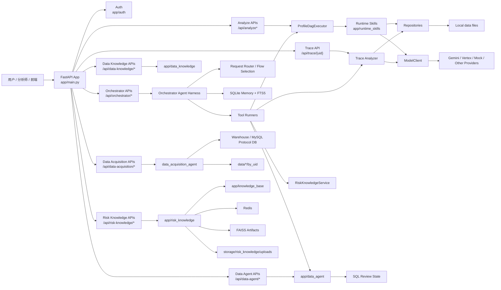
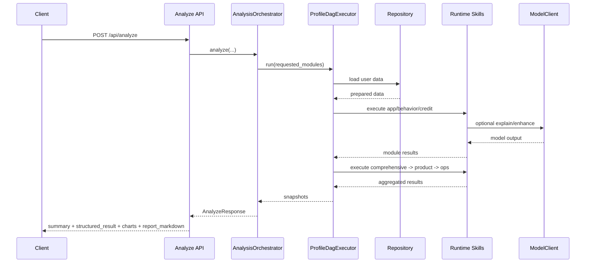
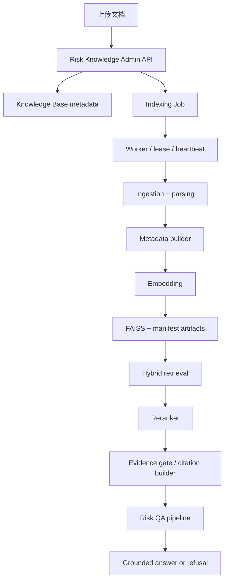

# CHORD 技术实现文档

面向新同学的项目详细设计书。目标不是简单列功能，而是帮助你在第一次进入仓库时，快速建立这套系统的整体心智模型，知道它解决什么问题、由哪些模块组成、每条主链路如何工作、关键技术点在哪里、代码应该从哪里读起。

## 1. 这是什么项目

CHORD 是一个面向墨西哥优先、多国家扩展的用户画像与风险知识系统。它不是单一的“画像接口”，而是一个以 FastAPI 为宿主的 **Agent Harness**，把下面几类能力放在同一个后端系统中：

- 用户画像主链路：围绕 `uid` 聚合 App、行为、信用等数据，输出结构化画像、图表和 Markdown 报告
- 自然语言编排 Agent：把业务问题路由到画像、Trace、Risk Knowledge、SQL 审核任务等能力
- SQL HITL 子系统：把自然语言需求变成待审核 SQL / Python artifact，经人工确认后再执行
- 风险知识 RAG 子系统：管理知识库、上传文档、构建索引、检索证据、生成带引用的风险知识回答
- 工程治理与发布门禁：通过评估、语义校验、release gate 控制上线风险

从架构角度看，CHORD 的核心思想不是“堆很多 Prompt”，而是把模型调用、契约、编排、权限、状态、降级、验证、评估一起设计出来。

## 2. 新人先记住这几个结论

### 2.1 系统定位

- 它是一个单体 FastAPI 应用，入口是 `app/main.py`
- 画像、对话、风险知识、认证、数据知识、SQL 审核任务都跑在同一个服务里
- 主运行代码在 `app/`
- 受控取数执行子系统在顶层 `data_acquisition_agent/`
- 仓库本地 Codex 技能在 `.agents/skills/`，这不是运行时业务代码

### 2.2 当前系统已经实现了什么

- 用户画像主链路已经可运行，核心模块包括 `app / behavior / credit / comprehensive / product / ops`
- 画像主链路已经从早期 registry 调度演进到 `ProfileDagExecutor`
- Orchestrator Chat 已具备 request normalization、flow routing、SSE、memory、ack / resolve、tool execution
- `app/data_agent/` 已支持 SQL 审核任务的创建、编辑、审批、执行
- `data_acquisition_agent/` 已支持自然语言生成 artifact、危险输出扫描、受控执行、按 `uid` 回写数据
- `app/data_knowledge/` 已支持数据资产目录、字段词典、SQL 示例、错误案例、seed 导入
- `app/risk_knowledge/` 已是完整子系统，覆盖上传、索引、worker、manifest、检索、rerank、evidence、QA、evaluation
- `app/release/pre_m3_gate.py` 已提供正式 release gate 入口

### 2.3 当前边界

- 墨西哥 `mx` 是最成熟主战场
- 主画像链路当前正式支持 `mx` 和 `th`
- 风险知识 RAG 已具备完整运行时骨架和生产化边界控制，但不是通用企业知识平台
- Orchestrator 是 LangGraph-ready，不是 LangGraph-migrated
- 这套系统强调 mock、降级、显式阻断，不追求“任何时候都尽量猜着跑”

## 3. 系统能力地图

| 能力域 | 对外入口 | 主要代码 | 作用 | 当前状态 |
| --- | --- | --- | --- | --- |
| 画像主链路 | `/api/analyze*`、`/api/trace/{uid}` | `app/runtime_skills/`、`app/services/orchestrator.py`、`app/services/profile_dag/` | 基于用户数据生成结构化画像与报告 | 已落地 |
| Orchestrator Chat | `/api/orchestrator/*` | `app/services/orchestrator_agent/` | 自然语言路由、工具调用、SSE、memory、HITL 协调 | 已落地 |
| Auth | `/api/auth/*` | `app/auth/` | 登录、权限、项目与国家作用域 | 已落地 |
| Data Agent SQL 审核任务 | `/api/data-agent/*` | `app/data_agent/` | 统一承接 SQL review task 生命周期 | 已落地 |
| Data Acquisition | `/api/data-acquisition/*` | `data_acquisition_agent/` | 自然语言生成 artifact，审核后受控执行与回写 | 已落地 |
| Data Knowledge | `/api/data-knowledge/*` | `app/data_knowledge/` | 维护表目录、字段词典、SQL 示例和错误案例 | 已落地 |
| Risk Knowledge RAG | `/api/risk-knowledge/*` + chat 内部 flow | `app/risk_knowledge/`、`app/knowledge_base/` | 风险知识库、索引、检索、证据、回答、评估 | 已落地 |
| Release Gate | CLI | `app/release/` | 汇总评估与门禁状态，阻断高风险发布 | 已落地 |

## 4. 总体架构图



## 5. 核心主链路流程

### 5.1 用户画像请求流程



### 5.2 自然语言对话流程

```mermaid
sequenceDiagram
  participant User as User
  participant Route as Orchestrator Route
  participant Loop as Agent Loop
  participant Router as Request Router
  participant Flow as Selected Flow
  participant Tool as Tool Runner
  participant Memory as SQLite Memory

  User->>Route: POST /sessions or /messages
  User->>Route: GET /sessions/{id}/stream
  Route->>Loop: run_agent_loop(...)
  Loop->>Memory: retrieve memories
  Loop->>Router: normalize request
  Router-->>Loop: intent
  Loop->>Flow: run selected flow
  Flow->>Tool: optional tool call
  Tool-->>Flow: tool result
  Flow-->>Loop: events + final message
  Loop->>Memory: maybe write memory
  Loop-->>Route: SSE events
  Route-->>User: streaming response
```

### 5.3 风险知识索引与问答流程



## 6. 项目分层与目录地图

```text
CHORD/
├─ app/
│  ├─ api/                       # FastAPI 路由层
│  ├─ auth/                      # 认证、授权、用户上下文
│  ├─ core/                      # 配置、模型客户端、通用基础设施
│  ├─ country_packs/             # 国家配置与规则
│  ├─ data_agent/                # SQL 审核任务运行时
│  ├─ data_knowledge/            # 数据知识资产
│  ├─ knowledge_base/            # 风险知识库持久化与契约
│  ├─ prompts/                   # 运行时 Prompt 模板
│  ├─ release/                   # Release gate
│  ├─ repositories/              # 用户数据访问抽象
│  ├─ risk_knowledge/            # 风险知识 RAG 子系统
│  ├─ runtime_skills/            # 用户画像技能模块
│  ├─ schemas/                   # API 输出契约
│  ├─ services/                  # 画像编排、Agent Harness 等
│  ├─ static/                    # 前端资源
│  └─ ui/                        # 首页前端构建
├─ data/                         # 本地 by_uid 数据
├─ data_acquisition_agent/       # 受控取数与回写子系统
├─ docs/                         # specs / plans / reviews / runbooks
├─ outputs/                      # 本地运行产物
├─ storage/                      # 风险知识上传等持久化文件
├─ tests/                        # 回归与单测
├─ AGENTS.md
├─ PLANNING.md
├─ TASK.md
└─ README.md
```

## 7. 模块详细设计

下面是新人最需要理解的部分。建议读法是先看 7.1 到 7.4，再按你要改的方向深入对应子系统。

### 7.1 `app/main.py` 与 API 入口层

**作用**

- 创建 FastAPI 应用
- 注册所有业务 router
- 在启动时初始化 auth schema、seed 数据、Risk Knowledge worker
- 对部分错误做统一归一化

**当前已经实现**

- 首页 `/`
- 健康检查 `/health`
- 画像、Trace、Chat、Auth、Data Agent、Data Knowledge、Risk Knowledge、Data Acquisition 路由挂载
- 根据 capability 决定是否挂载 `/api/data-acquisition/*`
- 根据配置决定是否启动 in-process Risk Knowledge worker

**关键文件**

- `app/main.py`
- `app/api/*.py`

**关键技术点**

- FastAPI router 分层
- startup / shutdown 生命周期
- 条件路由挂载
- 后台 worker 托管

### 7.2 `app/core/` 基础设施层

**作用**

- 集中管理配置
- 统一模型访问
- 提供运行时通用能力

**当前已经实现**

- `Settings` 从 `.env` 读取大部分核心配置
- `ModelClient` 统一封装不同 provider
- 支持 `gemini`、`mock` 及其他 provider 适配
- 已包含 Risk Knowledge、Auth、Data Agent 等多个子系统配置

**关键文件**

- `app/core/config.py`
- `app/core/model_client.py`
- `app/core/providers/`

**关键技术点**

- 环境变量驱动配置
- route-aware 模型调用 facade
- 模型 provider 解耦

### 7.3 `app/auth/` 认证与权限上下文

**作用**

- 提供登录注册、JWT、角色权限、项目作用域、国家作用域
- 把用户身份上下文传递到业务层

**当前已经实现**

- `/api/auth/register`
- `/api/auth/login`
- `/api/auth/logout`
- `/api/auth/me`
- `/api/auth/my-permissions`
- `/api/auth/my-projects`
- 业务 API 中按权限注入 `UserContext`

**关键文件**

- `app/auth/router.py`
- `app/auth/dependencies.py`
- `app/auth/service.py`
- `app/auth/database.py`

**关键技术点**

- JWT
- 权限依赖注入
- 项目与国家双重作用域
- auth 可开关，很多测试使用 `AUTH_ENABLED=0`

### 7.4 `app/repositories/` 数据访问层

**作用**

- 负责“去哪里拿数据”
- 不负责业务判断

**当前已经实现**

- 本地文件 repository 是默认真相
- warehouse repository 仍是扩展位

**关键文件**

- `app/repositories/local_repository.py`
- `app/repositories/warehouse_repository.py`

**关键技术点**

- 访问层与画像逻辑解耦
- 便于 mock、fallback 和后续迁移

### 7.5 `app/runtime_skills/` 画像技能层

这是用户画像主链路的核心业务实现层。

#### 7.5.1 这一层解决什么问题

把原始用户数据转换为业务可读的画像结果。它是系统里的“领域判断层”。

#### 7.5.2 当前技能模块

| 模块 | 作用 | 当前状态 |
| --- | --- | --- |
| `app_profile` | 基于安装应用和分类规则分析用户设备生态与偏好 | 已实现 |
| `behavior_profile` | 基于行为事件分析活跃、流失、触达特征等 | 已实现 |
| `credit_profile` | 基于信用或风险特征分析负债、风险、信贷成熟度等 | 已实现 |
| `comprehensive_profile` | 汇总前三者并输出综合画像 | 已实现 |
| `product_advice` | 基于综合画像生成产品建议 | 已实现 |
| `ops_advice` | 基于综合画像生成运营策略 | 已实现 |
| `trace_analyzer` | 单用户行为轨迹深挖 | 已实现，但不在主 skill registry 内 |

#### 7.5.3 当前设计模式

除 `trace_analyzer` 以外，标准模块优先使用六步管线：

1. `contracts.py`
2. `data_access.py`
3. `feature_builder.py`
4. `decision_engine.py`
5. `explainer.py`
6. `assembler.py`

#### 7.5.4 为什么这样设计

- 数据读取、特征构建、规则判断、LLM 解释、输出组装分离
- 方便测试
- 方便国家扩展
- 避免“一个大文件包办全部逻辑”

#### 7.5.5 关键技术点

- BaseSkill 注册机制
- 六步管线
- 规则引擎 + LLM 解释混合
- 统一输出契约：`summary`、`structured_result`、`charts`、`report_markdown`

### 7.6 `app/services/orchestrator.py` 与 `app/services/profile_dag/`

这是主画像链路的调度层。

#### 7.6.1 解决什么问题

用户画像不是单个模块，而是一组有依赖关系的模块：

- `app / behavior / credit` 可以并行
- `comprehensive` 依赖前三者
- `product / ops` 依赖 `comprehensive`

早期系统更偏 SkillRegistry 串并行调度。现在已经把运行时真相收敛到 `ProfileDagExecutor`。

#### 7.6.2 当前已经实现

- `AnalysisOrchestrator.analyze()` 走 `ProfileDagExecutor`
- `AnalysisOrchestrator.analyze_module()` 也走同一套 DAG
- chat `run_profile` 也复用同一套 DAG
- 节点状态、run 状态、兼容事件都已明确化

#### 7.6.3 关键文件

- `app/services/orchestrator.py`
- `app/services/profile_dag/executor.py`
- `app/services/profile_dag/node_registry.py`
- `app/services/profile_dag/adapters.py`
- `app/services/profile_dag/contracts.py`

#### 7.6.4 关键技术点

- 静态 DAG
- dependency closure
- 并行 stage 执行
- 兼容旧 API 事件形状
- 降级状态和 skipped / degraded 语义

#### 7.6.5 新人需要知道的一个重要事实

现在“画像主运行时真相”不是 `SkillRegistry` 本身，而是 `ProfileDagExecutor`。`SkillRegistry` 还存在，但更像技能注册与查找层，而不是调度真相层。

### 7.7 `app/services/orchestrator_agent/` 自然语言 Agent Harness

这是项目里最复杂、也最容易让新人迷路的模块。

#### 7.7.1 解决什么问题

用户在前端输入的是自然语言，而不是固定 API 参数。系统需要：

- 理解用户意图
- 判断该走哪个 flow
- 在需要时调用画像、Trace、Risk Knowledge、Data Agent 等工具
- 处理澄清、等待确认、继续执行、SSE 返回、记忆写入

#### 7.7.2 当前已经实现的能力

- session 创建、查询、恢复
- pending prompt 机制
- SSE 流式执行
- request normalization
- flow dispatch
- visible execution trace
- memory read / write
- query_data ACK / resolution
- risk knowledge fast path
- profile / trace / data query / general chat 多 flow

#### 7.7.3 主要内部模块

| 模块 | 作用 |
| --- | --- |
| `agent_loop.py` | 顶层运行循环，负责 lifecycle 和事件流 |
| `request_router.py` | 把自然语言归一化为 intent |
| `flows/` | 不同类型请求的执行实现 |
| `execution/` | tool / query / profile / repair 执行器 |
| `runtime/` | cancellation、trace metadata、human input 等 |
| `memory_*` | 长期记忆策略、存储、注入 |
| `session_store.py` | session 持久化 |
| `visible_execution.py` | 前端可见执行轨迹 |

#### 7.7.4 当前已有 flow

- `AnswerWorkspaceFlow`
- `ClarifyScopeFlow`
- `RunTraceFlow`
- `ProfileFlow`
- `QueryDataThenProfileFlow`
- `GeneralChatFlow`
- `RiskKnowledgeAnswerFlow`

#### 7.7.5 关键技术点

- request normalization
- intent-based flow selection
- SSE
- human-in-the-loop 状态机
- memory retrieval / writeback
- workspace-aware answer
- graceful blocking / fallback

#### 7.7.6 新人最容易误解的点

- 它不是多 agent runtime
- 它不是 LangGraph 运行时
- 它是一个 **LangGraph-ready thin orchestrator shell**
- 这里的复杂度主要来自状态、工具、等待态、兼容性，而不是“Prompt 很长”

### 7.8 `app/services/orchestrator_agent/memory_*` 长期记忆子系统

#### 7.8.1 作用

为 Orchestrator Chat 提供跨 session 的长期记忆召回能力。

#### 7.8.2 当前已经实现

- SQLite 存储
- FTS5 检索
- 记忆写入白名单
- 归档、恢复、软删除
- 前端 Memory Inspector
- identity-aware 检索

#### 7.8.3 关键文件

- `memory_store.py`
- `memory_policy.py`
- `memory_context.py`
- `memory_manager.py`

#### 7.8.4 关键技术点

- SQLite + FTS5
- policy-first write control
- user / project / country identity isolation

#### 7.8.5 当前边界

- 长期记忆只服务 Chat
- 不直接影响画像主链路输出
- 当前不是 embedding memory

### 7.9 `app/data_agent/` SQL 审核任务运行时

这是新版更标准化的 SQL review task 层。

#### 7.9.1 作用

把“创建 SQL 审核任务、审批、修改、驳回、执行”抽成一个独立业务子系统，而不是让聊天 flow 直接操作底层 artifact。

#### 7.9.2 当前已经实现

- 创建 run
- 列出 run
- 查询 run 详情
- approve / edit / revise / reject / execute

#### 7.9.3 API 入口

- `/api/data-agent/runs`
- `/api/data-agent/runs/{run_id}`
- `/approve`
- `/edit`
- `/revise`
- `/reject`
- `/execute`

#### 7.9.4 关键文件

- `app/data_agent/api.py`
- `app/data_agent/service.py`
- `app/data_agent/schemas.py`

#### 7.9.5 关键技术点

- SQL 审核生命周期建模
- 业务状态显式化
- 和自然语言编排层解耦

### 7.10 `data_acquisition_agent/` 受控取数与数据回写子系统

这是顶层独立 package，不属于 `app/runtime_skills/`。

#### 7.10.1 作用

把自然语言数据需求变成待审核 artifact，并在人工批准后受控执行，再把结果回写成画像主链路能消费的 `by_uid` 数据。

#### 7.10.2 当前已经实现

- 生成 SQL / Python artifact
- Prompt 组装与知识路由
- L1 凭据脱敏
- L2 输出扫描
- query-only SQL 受控执行
- 结果按 bucket / uid 写回本地目录
- 通过 capability gating 控制是否挂载 API

#### 7.10.3 关键文件

- `data_acquisition_agent/orchestrator.py`
- `data_acquisition_agent/executor.py`
- `data_acquisition_agent/prompt_assembler.py`
- `data_acquisition_agent/output_scanner.py`
- `data_acquisition_agent/output_writer.py`
- `data_acquisition_agent/connection.py`

#### 7.10.4 关键技术点

- artifact-first，而不是直接执行
- human review before execute
- 输出安全扫描
- 结果切片回写
- StarRocks / MySQL protocol compatible access

#### 7.10.5 当前边界

- SQL / Python artifact 不是自动执行授权
- SQL 执行必须走审批路径
- 当前强调受控 `query_only`

### 7.11 `app/data_knowledge/` 数据知识资产层

#### 7.11.1 作用

维护 Data Agent 和分析流程可复用的数据知识资产，让系统知道“有哪些表、字段是什么意思、有哪些 SQL 示例、哪些错误值得避免”。

#### 7.11.2 当前已经实现

- catalog tables
- catalog fields
- glossary
- examples
- error cases
- seed bundle import

#### 7.11.3 关键文件

- `app/data_knowledge/api.py`
- `app/data_knowledge/service.py`
- `app/data_knowledge/schemas.py`

#### 7.11.4 关键技术点

- 结构化知识资产管理
- 作为 Prompt / planning / SQL review 的上游输入

### 7.12 `app/risk_knowledge/` 风险知识 RAG 子系统

这是当前另一个大型子系统，复杂度接近一个独立产品。

#### 7.12.1 它解决什么问题

当用户问的是“风险知识解释问题”而不是“某个 uid 的画像问题”时，系统需要基于知识库里的文档检索证据，并生成带引用、可拒答、受 grounding 约束的回答。

#### 7.12.2 当前模块划分

| 目录 | 作用 |
| --- | --- |
| `admin/` | 管理知识库、文档、版本、任务、清理、debug retrieve |
| `ingestion/` | 上传文档后的解析与导入 |
| `metadata/` | chunk 与 evidence 元数据构建 |
| `embedding/` | 向量化 |
| `indexing/` | FAISS 索引与提交 facade |
| `runtime/` | job control、progress、worker、Redis 状态 |
| `retrieval/` | hybrid retrieval |
| `reranking/` | reranker provider |
| `evidence/` | evidence gate、citation builder、bundle builder |
| `qa/` | Risk QA pipeline |
| `service/` | 对上层暴露 `RiskKnowledgeService` |
| `evaluation/` | golden set 与回归评估 |

#### 7.12.3 当前已经实现的能力

- 知识库、文档、版本建模
- 文档上传
- 索引任务提交、重试、重建、取消
- manifest 激活与回滚
- worker heartbeat / lease / stale recovery
- hybrid retrieval
- rerank
- evidence gate
- grounding / citation validation
- insufficient-evidence refusal
- chat 中 `risk_knowledge_answer` flow
- regression / evaluation

#### 7.12.4 对外入口

- `/api/risk-knowledge/admin/*`
- `/api/risk-knowledge/indexing/*`
- `/api/risk-knowledge/manifests/*`
- `/api/risk-knowledge/workers/*`
- Orchestrator 内部 `RiskKnowledgeAnswerFlow`

#### 7.12.5 关键技术点

- FAISS
- BM25 / hybrid retrieval / RRF
- reranker provider 抽象
- evidence gating
- citation validation
- fail-closed grounding
- Redis job state
- durable job lifecycle
- manifest governance

#### 7.12.6 新人需要特别知道的边界

- 它是 **Risk Domain Knowledge RAG**
- 它不服务 Data Agent SQL 生成
- 它不替代数据知识资产层
- 它和主画像链路是不同问题域

### 7.13 `app/knowledge_base/` 风险知识底层存储与契约层

#### 7.13.1 作用

为 Risk Knowledge 提供知识库、文档、版本、索引任务等底层持久化契约与 repository 实现。

#### 7.13.2 当前已经实现

- schema / repository protocol
- SQLAlchemy repository
- in-memory 辅助实现
- 持久化服务层

#### 7.13.3 为什么它要独立出来

因为 `app/risk_knowledge/` 更偏运行时 pipeline，而 `app/knowledge_base/` 更偏底层资源模型与持久化。

### 7.14 `app/release/` 发布门禁层

#### 7.14.1 作用

把“能不能进入下一步上线/验收”显式化，而不是依赖人工印象判断。

#### 7.14.2 当前已经实现

- `python -m app.release.pre_m3_gate --profile pr_acceptance`
- `python -m app.release.pre_m3_gate --profile production_release --strict`
- full regression 状态接入
- PASS / WARN / FAIL / BLOCKED 语义

#### 7.14.3 关键文件

- `app/release/pre_m3_gate.py`
- `app/release/schemas.py`
- `docs/runbooks/pre-m3-release-gate-runbook.md`

#### 7.14.4 关键技术点

- structured release decision
- strict gate policy
- 与 Risk QA regression、semantic validation、worker / manifest 检查配合

### 7.15 前端层 `app/static/` + `app/ui/`

#### 7.15.1 作用

提供单页 Dashboard，让画像、Trace、Chat、Memory、Risk Knowledge Console 等能力可视化。

#### 7.15.2 当前已经实现

- 首页由 FastAPI 动态构建
- Analyze / module progressive loading
- Chat 面板
- Memory Inspector
- Risk Knowledge Admin Console

#### 7.15.3 关键文件

- `app/ui/build_frontend.py`
- `app/static/js/app.jsx`
- `app/static/js/components/`
- `app/static/js/services/`

#### 7.15.4 关键技术点

- 前后端同仓
- 无独立 Node dev server 的轻量模式
- 基于 API service 层与后端通信

### 7.16 `tests/` 与 `docs/` 工程治理层

#### 7.16.1 `tests/`

作用：

- 回归保护
- 契约验证
- 运行时边界验证
- 前端与路由兼容性验证

当前测试覆盖重点：

- 画像主链路
- Orchestrator Agent
- Risk Knowledge
- Data Agent
- Data Knowledge
- Auth
- Frontend capability tests
- Release gate

#### 7.16.2 `docs/`

作用：

- `docs/specs/`：设计契约
- `docs/plans/`：执行计划
- `docs/reviews/`：验收与审计
- `docs/runbooks/`：运维与门禁运行手册

这套目录很重要，因为仓库治理要求“复杂能力先有 spec / plan，再有实现”。

## 8. 关键技术点总览

如果你只想先快速知道项目用了哪些核心技术，可以先看这一节。

### 8.1 Web 框架与契约

- FastAPI
- Pydantic
- APIRouter 分层
- Depends 依赖注入

### 8.2 编排与运行时

- 静态 Profile DAG
- flow-based Orchestrator shell
- SSE 流式事件
- visible execution trace

### 8.3 领域实现模式

- 六步管线
- registry + DAG 结合
- rules + LLM explain hybrid

### 8.4 数据与存储

- 本地 `by_uid` 文件数据
- SQLite + FTS5 memory
- SQLAlchemy
- Redis runtime state
- FAISS artifact persistence

### 8.5 RAG 相关

- hybrid retrieval
- BM25
- query embedding
- RRF
- reranker
- evidence gate
- citation validation
- grounded answer / refusal

### 8.6 安全与治理

- JWT / role / permission / project scope / country scope
- SQL 审核 + HITL
- output scanning
- release gate
- fail-closed citation / evidence policy

### 8.7 开发与验证

- mock 模式
- targeted pytest
- compileall / diff check
- specs / plans / reviews 驱动复杂改动

## 9. 当前实现状态总结

### 9.1 已稳定落地的主干

- FastAPI 单体宿主
- 主画像六模块
- Trace Analyzer
- Auth
- Orchestrator Chat
- SQL review task runtime
- Data Acquisition
- Data Knowledge
- Risk Knowledge runtime
- Pre-M3 release gate

### 9.2 当前仍是边界而不是目标的内容

- LangGraph 正式迁移
- 多实例分布式 Orchestrator session / ACK 协调
- 通用 Memory Platform
- 通用企业知识平台
- Data Agent 自动执行绕过人工审核

## 10. 新人第一天怎么上手

### 10.1 推荐阅读顺序

1. `AGENTS.md`
2. `PLANNING.md`
3. 本文 `README.md`
4. `app/main.py`
5. `app/services/orchestrator.py`
6. `app/services/profile_dag/`
7. `app/services/orchestrator_agent/`
8. 你要修改的具体子系统

### 10.2 如果你负责画像主链路

先读：

- `app/services/orchestrator.py`
- `app/services/profile_dag/node_registry.py`
- `app/runtime_skills/`
- `tests/test_profile_dag_runtime.py`

### 10.3 如果你负责 Chat / Agent Harness

先读：

- `app/api/orchestrator_routes.py`
- `app/services/orchestrator_agent/agent_loop.py`
- `app/services/orchestrator_agent/request_router.py`
- `app/services/orchestrator_agent/flows/`
- `tests/orchestrator_agent/`

### 10.4 如果你负责 Risk Knowledge

先读：

- `app/api/risk_knowledge_admin.py`
- `app/risk_knowledge/service/risk_knowledge_service.py`
- `app/risk_knowledge/runtime/worker.py`
- `app/risk_knowledge/retrieval/`
- `app/risk_knowledge/evidence/`
- `tests/risk_knowledge/`

### 10.5 如果你负责 SQL / 数据链路

先读：

- `app/data_agent/`
- `data_acquisition_agent/`
- `app/data_knowledge/`
- `tests/data_agent/`
- `data_acquisition_agent/tests/`

## 11. 如何本地跑起来

### 11.1 最小 mock 模式

```bash
python -m venv .venv
source .venv/bin/activate
pip install -r requirements.txt
cp .env.example .env
MODEL_MODE=mock uvicorn app.main:app --reload
```

适合做：

- 路由开发
- 前端联调
- Orchestrator / memory / API contract 调试

### 11.2 常规开发模式

```bash
uvicorn app.main:app --reload
```

### 11.3 关闭 Data Acquisition 能力

```bash
DATA_ACQUISITION_ENABLED=false uvicorn app.main:app --reload
```

### 11.4 本地 MySQL 沙箱

仓库已经提供本地联调脚本：

```bash
python -m scripts.local_mysql.local_stack write-env
python -m scripts.local_mysql.local_stack up
python -m scripts.local_mysql.local_stack smoke
python -m scripts.local_mysql.local_stack down
```

### 11.5 Risk Knowledge 相关环境

重点环境变量包括：

- `RISK_KNOWLEDGE_REDIS_URL`
- `RISK_KNOWLEDGE_EMBEDDING_PROVIDER`
- `RISK_KNOWLEDGE_EMBEDDING_MODEL`
- `RISK_KNOWLEDGE_RERANKER_PROVIDER`
- `RISK_KNOWLEDGE_RERANKER_MODEL`
- `RISK_KNOWLEDGE_WORKER_MODE`
- `RISK_KNOWLEDGE_IN_PROCESS_WORKER_FALLBACK_ENABLED`

默认生产姿态强调：

- `RISK_KNOWLEDGE_WORKER_MODE=external`
- `RISK_KNOWLEDGE_IN_PROCESS_WORKER_FALLBACK_ENABLED=false`

## 12. 如何验证

### 12.1 画像主链路

```bash
AUTH_ENABLED=0 pytest tests/test_profile_dag_runtime.py tests/test_analyze_stream_endpoint.py tests/test_analyze_module_endpoint.py -q
```

### 12.2 Orchestrator Agent

```bash
PYTHONPATH=. MODEL_MODE=mock pytest tests/orchestrator_agent tests/test_orchestrator_chat_routes.py tests/test_orchestrator_visible_execution.py -q
```

### 12.3 Risk Knowledge

```bash
pytest tests/risk_knowledge tests/knowledge_base -q
```

### 12.4 Data Agent / Data Knowledge

```bash
pytest tests/data_agent tests/data_knowledge data_acquisition_agent/tests -q
```

### 12.5 发布门禁

```bash
python -m app.release.pre_m3_gate --profile pr_acceptance
python -m app.release.pre_m3_gate --profile production_release --strict
```

## 13. 新人常见误区

### 13.1 “这个仓库就是用户画像 API”

不对。画像只是主链路之一。这个仓库同时承载 Agent Harness、Risk Knowledge、SQL 审核任务、数据知识、权限和 release gate。

### 13.2 “`runtime_skills` 就是 Codex skills”

不对。`app/runtime_skills/` 是业务运行时技能，`.agents/skills/` 才是 Codex 本地开发技能。

### 13.3 “Orchestrator 是多 agent 框架”

不对。当前是单 orchestrator shell + 多 flow + 多工具，不是多 agent runtime。

### 13.4 “Risk Knowledge 和 Data Knowledge 是一回事”

不对。

- `Data Knowledge` 面向数据资产与 SQL 辅助
- `Risk Knowledge` 面向风险知识解释与带证据回答

### 13.5 “Data Acquisition 生成了 SQL 就能执行”

不对。生成 artifact 不等于执行授权，执行必须经过审批路径。

## 14. 文档导航

### 14.1 项目治理

- `AGENTS.md`
- `PLANNING.md`
- `TASK.md`

### 14.2 风险知识

- `docs/specs/risk-qa-production-gate-contract.md`
- `docs/specs/pre-m3-eval-semantic-release-gate-contract.md`
- `docs/runbooks/pre-m3-release-gate-runbook.md`

### 14.3 画像运行时

- `docs/reviews/m3-1-profile-dag-runtime-acceptance-review.md`

### 14.4 Data Acquisition / SQL 审核链路

- `docs/specs/data_acquisition_agent.md`
- `docs/specs/data_acquisition_agent_v2.md`

## 15. 一句话总结

如果把 CHORD 当成一个系统来理解，它的核心不是“给用户打标签”，而是：

**在明确的数据边界、权限边界、证据边界和发布边界内，把用户画像、风险知识问答和受控数据操作组织成一套可演进、可验证、可降级的 agent harness。**
