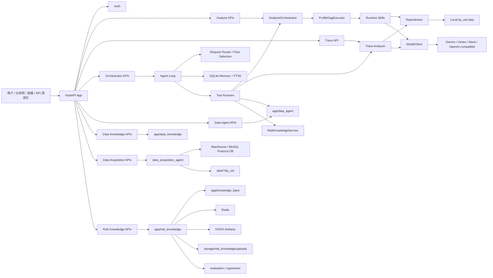
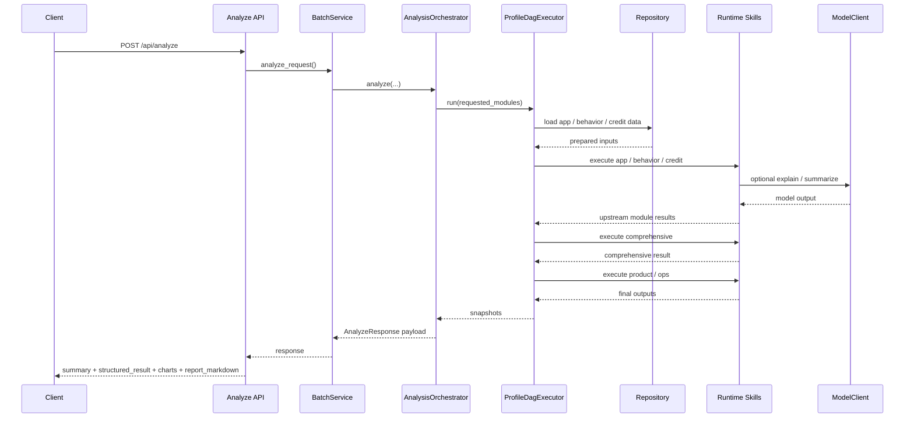
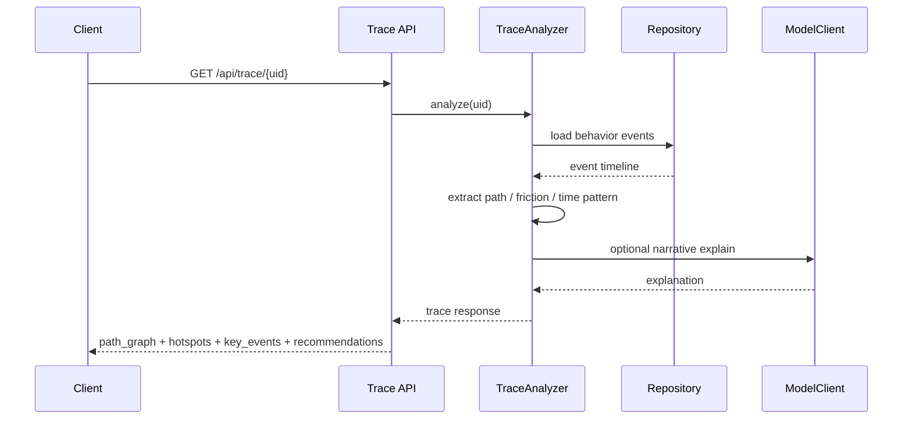
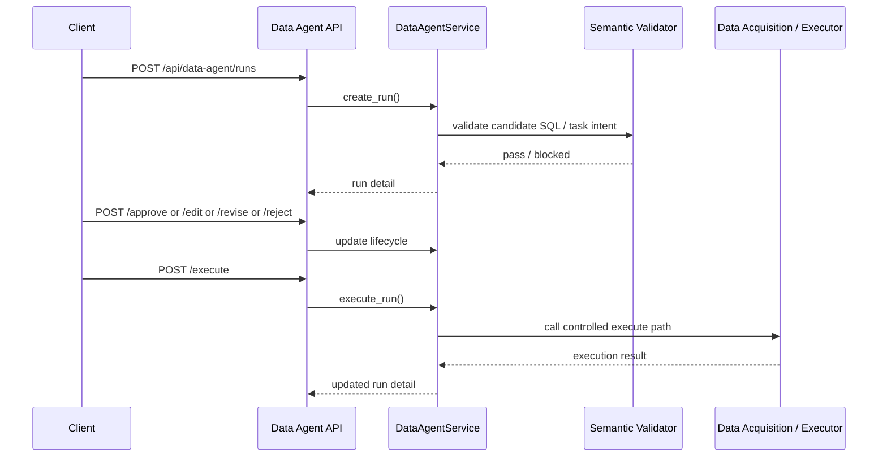
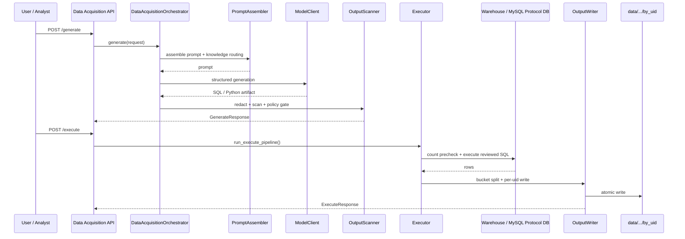
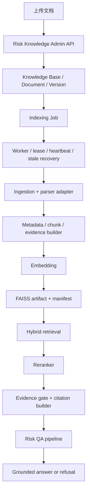
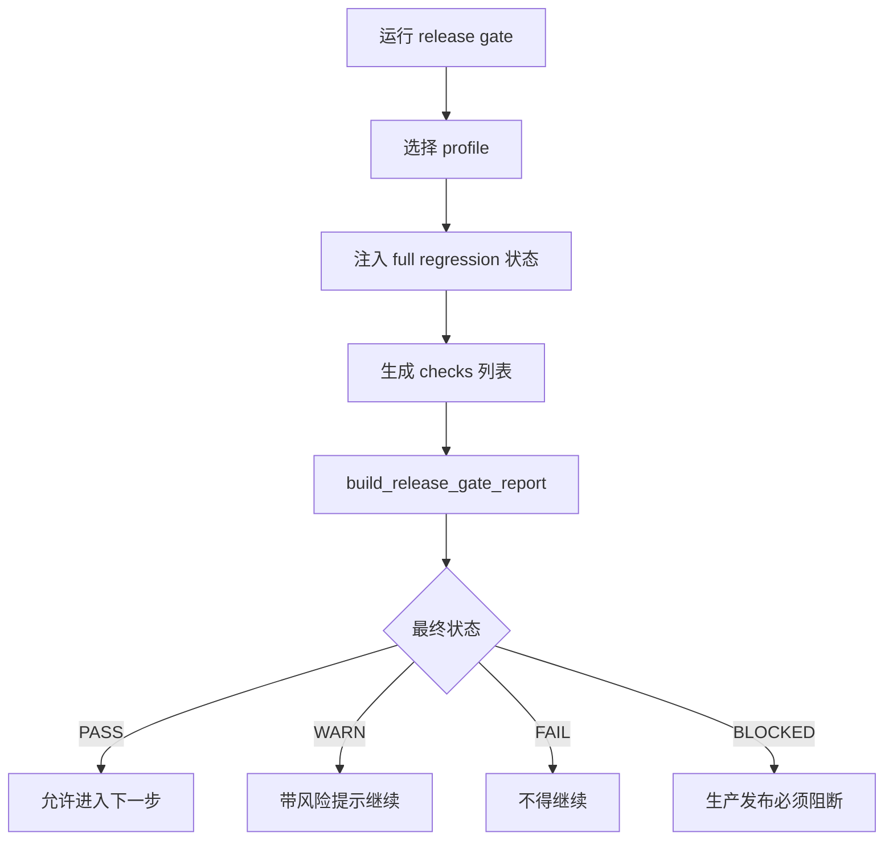
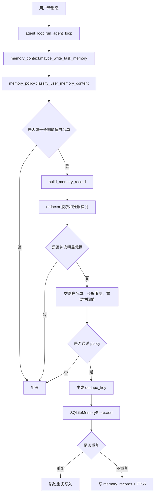
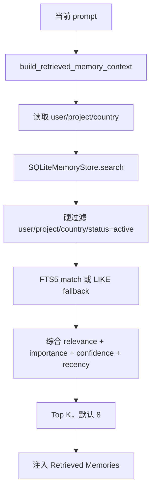

# CHORD 内部研发主入口

面向内部研发同学的项目主入口文档。本文档不是一句话项目介绍，也不是单纯的“新人导读”，而是本仓库的厚文档型研发手册：帮助你快速理解系统全貌、主要模块、关键主链路、当前实现状态、运行方式、测试路径、边界约束和后续演进方向。

如果你是第一次进入本仓库，建议按下面顺序阅读：

1. `AGENTS.md`：项目开发规则与 Harness Gate
2. `PLANNING.md`：当前系统阶段状态与架构真相
3. 本文 `README.md`：项目整体实现说明与研发索引
4. 你要修改方向对应的 `docs/specs/`、`docs/plans/`、`docs/reviews/`

---

## 1. 当前能力概览

CHORD 当前已经不是“只有画像接口”的项目，而是一个以 FastAPI 为宿主的 **Agent Harness**。它围绕用户画像、自然语言编排、风险知识、受控 SQL 任务和发布治理，逐步演进成一个多子系统协同的后端平台。

一句话描述：

- 面向墨西哥优先、多国家扩展的用户画像、自然语言分析、风险知识问答与受控取数系统

更完整一点的理解是：

- 这是一套单体 FastAPI 服务
- 画像主链路、Orchestrator Chat、Auth、Data Agent、Data Knowledge、Risk Knowledge、Release Gate 都跑在同一个服务里
- 模型能力只是系统的一部分，真正的系统质量来自 `Model + Harness`

当前可以把项目理解为六条主能力，加若干辅助治理与工程能力：

- **画像主链路**：`App Profile`、`Behavior Profile`、`Credit Profile`、`Comprehensive Profile`、`Product Advice`、`Ops Advice`
- **Orchestrator Chat 链路**：自然语言会话、工具调用、SSE、visible execution、clarification / resolution、长期记忆
- **Trace Analyzer 独立能力**：单用户行为轨迹深挖，不进入主画像 SkillRegistry
- **SQL 审核与受控执行链路**：`app/data_agent/` + `data_acquisition_agent/`
- **Risk Knowledge RAG 链路**：知识库管理、文档上传、索引、检索、证据门禁、带引用问答、评估与发布门禁
- **工程治理链路**：Auth、评估、语义校验、release gate、runbook、review 文档

### 1.1 画像分析能力

画像主链路负责：

1. 接收一个或多个 `uid`
2. 从本地数据或后续仓储实现中读取用户数据
3. 运行 `App / Behavior / Credit`
4. 汇总为 `Comprehensive`
5. 在 `Comprehensive` 基础上进一步给出 `Product Advice / Ops Advice`
6. 返回统一的 API 和前端展示结果

统一输出结构包括：

- `summary`
- `structured_result`
- `charts`
- `report_markdown`

顶层批量结果额外包含：

- `standardized_labels`

此外，前端已支持：

- 模块级渐进加载 `app / behavior / credit / comprehensive / product / ops`
- 单独触发 `trace`
- 单用户与批量 UID 两种分析模式

### 1.2 主画像运行时真相

现在需要特别强调一件事：

- 主画像的运行时真相已经不只是早期的 `SkillRegistry`
- 当前真实执行骨架已经演进到 `ProfileDagExecutor`

这意味着：

- `app / behavior / credit` 是并行第一层
- `comprehensive` 依赖前三者
- `product / ops` 依赖 `comprehensive`
- `/api/analyze`
- `/api/analyze-module`
- chat 内部 `run_profile`

都已经复用这套静态 DAG 运行时

### 1.3 自然语言助手能力

`/api/orchestrator/*` 提供 NL Chat，用来把自然语言请求转成可执行的分析步骤。当前支持：

- 创建、恢复和列出 chat session
- SSE 流式返回 agent 执行过程
- 以 visible execution 形式返回计划、执行步骤、review 和最终结论
- request normalization 与 intent-based flow routing
- 通过工具调用画像、查询数据、运行 trace、解析 UID 文件、读取或写入长期记忆
- cohort 场景先做 clarification / resolution，再决定是否继续 query 或画像
- clarification 中若关闭 `auto_profile`，会在同一 execution 内只做 `query_data`
- 在同一 session 内保留短期上下文
- 通过 SQLite + FTS5 保存可跨 session 召回的长期记忆
- 对高风险 `query_data` 做 “生成 artifact -> 等待人工确认 -> 执行” 分步控制
- 当 Data Acquisition 不可用时，query / repair 路径明确阻断，而不是静默失败
- risk knowledge 问题直接走专门的 `risk_knowledge_answer` flow

### 1.4 Auth 与身份作用域能力

当前系统已经有独立的 `app/auth/` 子系统。它不是简单“加个登录页”，而是：

- 登录 / 注册 / JWT
- 用户上下文 `UserContext`
- 权限依赖注入
- project scope
- country scope
- 业务路由按权限控制

这件事对理解整个系统很重要，因为：

- 很多 API 已不再是假定匿名模式
- Chat、Data Agent、Data Knowledge、Risk Knowledge admin API 等能力都和权限上下文强相关

### 1.5 Data Agent 与 Data Acquisition 能力

这里有两个容易混淆但职责不同的系统：

#### `app/data_agent/`

它是**SQL 审核任务运行时**，负责：

- 创建 SQL review run
- 查看 run
- approve / edit / revise / reject / execute

它更像“任务管理层”。

#### `data_acquisition_agent/`

它是**受控的自然语言取数与回写子系统**，负责：

- 将自然语言需求转成待审核 SQL / Python artifact
- Prompt 组装和知识路由
- L1 / L2 安全扫描
- 审核后受控执行
- 将结果按 `uid` 写回 `data/.../by_uid`

它更像“执行引擎层”。

两者一起构成现在的数据查询与 SQL 审核闭环。

### 1.6 Data Knowledge 能力

`app/data_knowledge/` 是数据知识资产层，主要作用不是执行 SQL，而是维护：

- 表目录
- 字段词典
- glossary
- SQL 示例
- 错误案例
- seed bundle 导入

它是 Data Agent 与后续数据理解能力的知识底座。

### 1.7 Risk Knowledge RAG 能力

`app/risk_knowledge/` 目前已经是一个完整子系统，而不是一组实验脚本。它覆盖：

- knowledge base 元数据管理
- 文档上传
- 版本与 manifest
- 索引任务与 worker
- retrieval / rerank / evidence gate
- citation validation
- grounding-aware 风险知识回答
- insufficient-evidence refusal
- golden set regression 与 release gate 对接

它要解决的问题是：

- 当用户问的是“风险知识解释问题”而不是“某个 uid 的画像问题”时，系统如何基于知识库证据生成可验证回答

### 1.8 Release Gate 能力

当前项目已经同时具备两层发布治理能力：

#### 1.8.1 Pre-M3 release gate

`app/release/` 仍然保留正式的 Pre-M3 release gate 入口：

```bash
python -m app.release.pre_m3_gate --profile pr_acceptance
python -m app.release.pre_m3_gate --profile production_release --strict
```

它不是测试替代品，而是结构化的发布决策入口：

- PASS
- WARN
- FAIL
- BLOCKED

#### 1.8.2 Shared eval release gate

在 `M5-1` 到 `M5-6` 完成后，仓库已经落地 shared eval regression platform，入口在：

```bash
python -m app.eval.runner --list-suites
python -m app.eval.runner --list-profiles
python -m app.eval.runner --profile pr_acceptance
python -m app.eval.runner --profile production_release --strict
```

当前 shared eval 已有 7 个 deterministic runnable suites：

- `release_gate_smoke`
- `memory_governance`
- `data_agent_sql_safety`
- `data_agent_sql_grounding`
- `risk_qa_groundedness`
- `profile_dag_contract`
- `profile_memory_snapshot`

其中：

- `pr_acceptance`：PR regression profile，默认非 strict
- `production_release`：release gate profile，strict-by-default，按当前口径应配合 strict 语义使用

这意味着当前项目已经具备：

- shared eval suite registry
- multi-suite profile runner
- JSON / Markdown regression report
- deterministic release-gate preflight CLI
- Memory / Data Agent / Risk QA / Profile DAG 四类关键能力的离线回归门禁

#### 1.8.3 当前阶段状态

当前主线状态已经更新为：

- `M5 completed`
- `M6A implemented`
- `M6B accepted / ready to merge`
- `M6 overall not completed`

M5 的结果不是“上线观测平台已经完成”，而是：

- Eval / Regression Platform 已完成
- deterministic release gate 已闭环
- M6A shadow vector index 已落地，但仍未接 prompt
- M6B 已把 policy-gated semantic memory retrieval 接到 context，但默认 flag 关闭
- dashboard、CI integration、online monitoring、release automation 仍然留在后续 `M6`

### 1.9 当前没有做的事

为了控制复杂度并保持边界稳定，当前还没有做这些事情：

- LangGraph 正式迁移
- 通用多 agent runtime
- 通用企业知识平台
- Data Agent 自动执行绕过人工审核
- 通用 embedding memory prompt injection platform
- session / memory / ACK 多实例分布式协调
- 将长期记忆直接接入主画像结果生成

### 1.10 国家支持现状

当前真实支持范围需要分开看：

- **主画像 API**：当前正式支持 `mx` 和 `th`
- **`mx`**：主链路最成熟，App / Behavior / Credit / Comprehensive / Advice / Trace 都可运行
- **`th`**：可运行，但整体能力厚度弱于 `mx`
- **其他国家**：仓库中已有 country pack、manifest 或文档痕迹，但不等于已经接入完整主链路

这意味着：

- 代码里出现某个国家 pack，不等于系统已经对该国家形成完整运行能力

---

## 2. 目录结构

```text
CHORD/
├─ app/
│  ├─ api/                         # FastAPI 路由
│  ├─ auth/                        # 认证、授权、权限、用户上下文
│  ├─ core/                        # 配置、日志、模型客户端、通用基础设施
│  ├─ country_packs/               # 国家化规则与配置
│  ├─ data_agent/                  # SQL 审核任务运行时
│  ├─ data_knowledge/              # 数据知识资产管理
│  ├─ knowledge_base/              # 风险知识库底层模型与持久化
│  ├─ prompts/                     # 运行时 LLM Prompt
│  ├─ release/                     # Release Gate
│  ├─ repositories/                # 数据访问抽象
│  ├─ risk_knowledge/              # 风险知识 RAG 子系统
│  ├─ runtime_skills/              # App/Behavior/Credit/Comprehensive/Advice/Trace 模块
│  ├─ schemas/                     # API 响应契约
│  ├─ scripts/                     # 数据准备和辅助脚本
│  ├─ services/                    # 画像编排、Orchestrator Agent、Profile DAG、Memory 等
│  ├─ static/                      # 前端 JSX/CSS/静态资源
│  ├─ third_party/                 # 三方代码隔离区，如 SWXY RAG
│  ├─ ui/                          # 前端构建入口
│  └─ utils/
├─ data/                           # 本地 by_uid 数据
├─ data_acquisition_agent/         # 受控自然语言取数与数据回写子项目
├─ data_knowledge_eval/            # 数据知识评估相关资产
├─ data_knowledge_seed/            # 数据知识 seed 资产
├─ docs/                           # specs / plans / reviews / runbooks / dev docs
├─ outputs/                        # 本地运行输出
├─ scripts/                        # 项目级脚本
├─ storage/                        # 上传文件、风险知识相关持久化目录
├─ tests/                          # 单测、回归、前端、golden/eval
├─ AGENTS.md
├─ PLANNING.md
├─ TASK.md
└─ README.md
```

---

## 3. 核心目录说明

### 3.1 `app/api/`

API 路由层，只负责请求接入、参数校验、调用服务层和返回响应，不承载画像业务推理。

主要入口：

- `app/api/analyze.py`：`POST /api/analyze`、`POST /api/analyze-file`、`GET /api/ui-config`
- `app/api/analyze_stream.py`：`POST /api/analyze-stream`
- `app/api/analyze_module.py`：`GET /api/analyze-module`
- `app/api/trace.py`：`GET /api/trace/{uid}`
- `app/api/orchestrator_routes.py`：NL Chat、session、memory API
- `app/api/risk_knowledge_admin.py`：知识库、文档、版本、索引管理 API
- `app/api/risk_knowledge_indexing.py`：生产化索引任务 facade
- `app/api/risk_knowledge_manifests.py`：manifest 激活与回滚 API
- `app/api/risk_knowledge_workers.py`：worker health API

### 3.2 `app/auth/`

认证与授权层，负责：

- 用户注册、登录、登出
- JWT
- 角色与权限
- 项目作用域
- 国家作用域
- `UserContext` 注入

关键文件：

- `app/auth/router.py`
- `app/auth/dependencies.py`
- `app/auth/service.py`
- `app/auth/database.py`
- `app/auth/permissions.py`

### 3.3 `app/core/`

基础设施层：

- `app/core/config.py`：读取环境变量和运行配置
- `app/core/model_client.py`：统一模型调用 facade
- `app/core/providers/`：Gemini、mock、OpenAI-compatible 等 provider 适配
- `app/core/user_context.py`：统一用户上下文对象
- `app/core/audit.py`：运行审计事件

### 3.4 `app/repositories/`

数据访问层，负责“去哪里拿数据”，不负责“怎么做画像”。

主要实现：

- `app/repositories/local_repository.py`：默认本地实现，读取 `data/.../by_uid`
- `app/repositories/warehouse_repository.py`：预留实现，当前仍是 stub / 扩展位

### 3.5 `app/runtime_skills/`

运行时业务模块层，是真正参与用户画像主链路的代码。当前包括：

- `app_profile_agent.py`
- `behavior_profile_agent.py`
- `credit_profile_agent.py`
- `comprehensive_agent.py`
- `product_advice_agent.py`
- `ops_advice_agent.py`
- `trace_analyzer/`

其中 `app / behavior / credit / comprehensive / product / ops` 优先沿用统一六步管线：

- `contracts.py`
- `data_access.py`
- `feature_builder.py`
- `decision_engine.py`
- `explainer.py`
- `assembler.py`

`trace_analyzer` 也是独立分析管线，但它：

- 不继承 `BaseSkill`
- 不注册到主画像 `SkillRegistry`
- 以服务化旁路能力存在

### 3.6 `app/services/`

服务层承载画像主编排、Profile DAG、标签装配和聊天 Agent Harness。

主画像相关：

- `app/services/orchestrator.py`：`AnalysisOrchestrator`
- `app/services/batch_service.py`：批量分析封装
- `app/services/label_builder.py`：标准化标签构建
- `app/services/report_renderer.py`：报告渲染

Chat / Harness 相关：

- `app/services/orchestrator_agent/`

Profile DAG 相关：

- `app/services/profile_dag/`

### 3.7 `app/services/profile_dag/`

这是当前主画像运行时真相层。

关键文件：

- `executor.py`：`ProfileDagExecutor`
- `node_registry.py`：静态节点依赖图
- `contracts.py`：run / node / event 契约
- `events.py`：显式事件构造
- `adapters.py`：兼容旧 API 输出与事件

它的作用是：

- 统一主画像执行调度
- 让 `/api/analyze`、`/api/analyze-module`、chat `run_profile` 共用同一套运行时骨架

### 3.8 `app/data_agent/`

这是 SQL 审核任务运行时，而不是取数执行引擎本体。

职责：

- 创建 SQL review task
- 查看与管理 run
- 承接 approve / edit / revise / reject / execute 生命周期

关键文件：

- `app/data_agent/api.py`
- `app/data_agent/service.py`
- `app/data_agent/schemas.py`
- `app/data_agent/semantic_validation/`

### 3.9 `app/data_knowledge/`

数据知识资产层，负责结构化地维护：

- catalog tables
- catalog fields
- glossary
- SQL examples
- SQL error cases
- seed import

关键文件：

- `app/data_knowledge/api.py`
- `app/data_knowledge/service.py`
- `app/data_knowledge/schemas.py`

### 3.10 `data_acquisition_agent/`

这是顶层独立 package，负责自然语言取数与受控执行，不属于 `app/runtime_skills/`。

重点文件：

- `orchestrator.py`：artifact 生成编排
- `executor.py`：审核后受控执行
- `manifest.py`：country manifest 加载和校验
- `prompt_assembler.py`：Prompt 组装和知识路由
- `redactor.py`：L1 凭据脱敏
- `output_scanner.py`：L2 输出扫描和危险代码检测
- `connection.py`：数据库连接层
- `output_writer.py`：按 bucket / uid 落盘

### 3.11 `app/knowledge_base/`

这是 Risk Knowledge 的底层资源模型与持久化层，不等于整个 RAG 运行时。

职责：

- knowledge base / document / version / job 的底层模型
- repository 协议与 SQLAlchemy 持久化
- 风险知识资源层建模

### 3.12 `app/risk_knowledge/`

这是 Risk Knowledge RAG 主子系统。

主要子目录：

- `admin/`
- `ingestion/`
- `metadata/`
- `embedding/`
- `indexing/`
- `runtime/`
- `retrieval/`
- `reranking/`
- `evidence/`
- `qa/`
- `service/`
- `evaluation/`

它解决的是：

- 风险知识库文档管理
- 索引任务
- 检索、重排、证据门禁
- 带 citation 的 grounded answer
- evaluation / regression

### 3.13 `app/release/`

发布门禁层。

关键文件：

- `app/release/pre_m3_gate.py`
- `app/release/schemas.py`

主要职责：

- 将发布检查结构化为 PASS / WARN / FAIL / BLOCKED
- 聚合 full regression 状态
- 作为生产发布前的正式门禁入口

### 3.14 前端层 `app/static/` 与 `app/ui/`

前端代码在 `app/static/js/`，由 `app/ui/build_frontend.py` 在首页请求时构建并返回 HTML。

主要结构：

- `app/static/js/app.jsx`
- `app/static/js/services/`
- `app/static/js/components/`
- `app/static/js/components/panels/chat/`
- `app/static/js/components/panels/trace/`
- `app/static/js/services/riskKnowledgeAdminApi.js`
- `app/static/js/services/authApi.js`

### 3.15 `tests/`

测试层覆盖：

- 主画像与 API
- Orchestrator Agent
- Auth
- Data Agent
- Data Knowledge
- Risk Knowledge
- Release Gate
- Frontend capability tests

### 3.16 `docs/`

文档层是研发流程的重要组成部分：

- `docs/specs/`：设计契约
- `docs/plans/`：执行计划
- `docs/reviews/`：验收、复盘、审计
- `docs/runbooks/`：运维与发布门禁手册
- `docs/dev/`：开发者导读

---

## 4. 总体架构图



### 4.1 这张图应该怎么读

- 左边是入口：前端、分析师、外部 API 调用方
- 中间分成几条主线：画像主链路、Chat 编排链路、SQL 审核与执行链路、Risk Knowledge 链路
- `AnalysisOrchestrator + ProfileDagExecutor` 代表主画像运行时真相
- `AgentLoop + FlowRouter + ToolRunners` 代表当前 Orchestrator Harness
- `data_acquisition_agent` 是执行引擎，不是画像模块
- `app/risk_knowledge/` 是独立 RAG 子系统，不等于 Data Knowledge

### 4.2 模块依赖关系

| 层级 | 主要目录/文件 | 依赖谁 | 被谁调用 | 职责边界 |
| --- | --- | --- | --- | --- |
| API 层 | `app/api/*.py` | FastAPI、schemas、services | 前端、外部调用方 | 接收请求、校验参数、返回响应 |
| Auth 层 | `app/auth/` | SQLAlchemy、JWT、权限配置 | API、services | 登录、权限、身份作用域 |
| 主编排层 | `app/services/orchestrator.py` | repository、runtime skills、profile_dag | `/api/analyze*`、chat tools | 调度画像模块并聚合结果 |
| DAG 运行时 | `app/services/profile_dag/` | node registry、skill map | orchestrator、chat profile tool | 统一画像执行真相 |
| Chat 编排层 | `app/services/orchestrator_agent/` | session、prompt、memory、flows、model client | `/api/orchestrator/*` | natural language harness |
| Memory 层 | `memory_store.py`、`memory_policy.py` | sqlite3、policy | chat、memory API | 长期记忆写入、召回、管理 |
| 业务模块层 | `app/runtime_skills/*` | repository、prompts、model client | orchestrator | App/Behavior/Credit/Advice 画像 |
| Trace 层 | `app/runtime_skills/trace_analyzer/` | repository、model client | trace API、chat tool | 单用户行为轨迹深挖 |
| Data Agent 层 | `app/data_agent/` | auth、schemas、semantic validator | API、chat tool | SQL 审核任务生命周期 |
| Data Acquisition 层 | `data_acquisition_agent/` | manifest、prompt、scanner、DB connection | DA API、data agent | artifact 生成、执行、回写 |
| Data Knowledge 层 | `app/data_knowledge/` | auth、service、schemas | API、后续 prompt 依赖 | 数据知识资产管理 |
| Risk Knowledge 层 | `app/risk_knowledge/` | knowledge_base、Redis、FAISS、model client | risk APIs、chat flow | 风险知识库与 grounded QA |
| Release 层 | `app/release/` | release schemas、外部检查结果 | CLI、发布流程 | 结构化门禁判断 |

---

## 5. 主流程说明

### 5.1 画像主链路流程



实现细节：

- `AnalysisOrchestrator.analyze()` 统一走 `ProfileDagExecutor`
- `shared_orchestrator` 带模块级缓存，前端渐进加载会复用
- `app / behavior / credit` 同 stage 并行
- `comprehensive` 聚合上游结果
- `product / ops` 基于 `comprehensive` 输出策略建议

### 5.2 `analyze-module` 渐进加载流程

`GET /api/analyze-module` 不是“跑一个完全独立的模块”，而是：

- 先确定你请求的是哪个模块
- 计算该模块需要的依赖闭包
- 在同一套 Profile DAG 里执行最小必要路径

例如：

- 请求 `app`：只执行 `app`
- 请求 `comprehensive`：会执行 `app + behavior + credit + comprehensive`
- 请求 `product`：会执行 `app + behavior + credit + comprehensive + product`

### 5.3 Trace Analyzer 流程



关键边界：

- Trace 是独立能力
- 不注册到主画像 SkillRegistry
- 不属于 `ProfileDagExecutor`

### 5.4 Orchestrator Chat 流程

```mermaid
sequenceDiagram
  participant User as User
  participant Route as Orchestrator Routes
  participant Session as Session Store
  participant Loop as Agent Loop
  participant Memory as Memory Context
  participant Router as Request Router
  participant Flow as Selected Flow
  participant Tool as Tool Runner

  User->>Route: POST /sessions or /messages
  Route->>Session: create/load session
  User->>Route: GET /sessions/{id}/stream
  Route->>Loop: run_agent_loop(...)
  Loop->>Memory: retrieve active memories
  Loop->>Router: normalize request
  Router-->>Loop: intent
  Loop->>Flow: run selected flow
  Flow->>Tool: optional tool call
  Tool-->>Flow: result
  Flow-->>Loop: visible execution events + final answer
  Loop->>Memory: maybe_write_memory()
  Loop-->>Route: SSE
  Route-->>User: streaming events
```

实现细节：

- `/sessions` 创建会话，可带 `initial_message`
- `/messages` 只是写入 pending prompt
- `/stream` 才真正触发 `run_agent_loop()`
- `ack` 用于人工确认
- `resolve` 用于 clarification / resolution 卡片继续执行

### 5.4.1 当前 Orchestrator Harness 状态

当前更准确的表述是：

- **LangGraph-ready thin orchestrator shell**

这意味着：

- `agent_loop.py` 已经不是“所有逻辑堆在一起”的大文件
- 主要业务流程已经进入 `flows/`
- 仍保留少量 shell-local adapter、compat seam、defensive fallback
- 当前不是多 agent runtime
- 当前也不是已经正式迁入 LangGraph 的状态

### 5.5 Data Agent SQL 审核任务流程



关键点：

- `app/data_agent/` 管的是 task lifecycle
- 不是直接执行 SQL 的地方
- 语义校验必须先过

### 5.6 Data Acquisition 流程



### 5.7 Risk Knowledge 流程



### 5.8 Release Gate 流程



---

## 6. 各画像与分析模块分别做什么

### 6.1 App Profile

依赖：

- repository 里的 App 安装明细
- 国家 pack 的分类规则与指标映射
- 可选的 LLM 解释增强

输入：

- 用户 App 安装明细

主要输出：

- App 活跃画像
- 安装类别分布
- 金融成熟度判断
- 借贷风险判断
- 消费能力判断
- 图表数据
- App 报告

实现方式：

- 先做 App 去重、分类、装机/更新/活跃窗口计算
- 再做借贷、银行、消费、工具等类别特征汇总
- 确定性规则先产出结构化结果
- LLM 主要负责解释增强、摘要和报告

设计原则：

- 规则结果先生成
- LLM 负责解释增强
- LLM 失败时仍尽量返回可用的规则结果

### 6.2 Behavior Profile

依赖：

- repository 里的行为事件 prepared record 或原始 CSV
- 国家 pack 的行为特征映射
- timeline / journey / churn 解释逻辑

输入：

- 用户行为事件数据

主要输出：

- 活跃行为画像
- 行为标签
- engagement / repayment willingness / product sensitivity / churn risk / contact preference
- 时间线或旅程分析
- 行为报告

实现方式：

- 行为数据先准备成标准化 prepared record
- 从 session、journey、时间分布、还款相关行为中抽取特征
- 再做确定性判断和标签融合
- 通过 LLM 生成大纲摘要、时间线解释和流失原因补充

补充说明：

- 已包含 Quincena 发薪日相关分析
- 即使 LLM 不可用，也尽量保留结构化行为结论

### 6.3 Credit Profile

依赖：

- MX：征信 / buro prepared 数据或原始信用数据
- TH：`risk_features` 型聚合记录
- 国家 pack 的信用指标解释逻辑

输入：

- 用户征信或信用相关数据

主要输出：

- 信用稳定性判断
- 债务压力、财务成熟度、借贷紧迫度等维度
- 风险等级
- 关键标签
- 征信报告

实现方式：

- MX 和 TH 走不同 profile mode
- MX 路径更偏完整征信解析
- TH 路径更偏风险特征输入
- 规则结果先确定，再交给 LLM 做摘要和报告

当前状态：

- MX 主路径最完整
- TH 已可运行，但能力厚度和字段丰富度低于 MX

### 6.4 Comprehensive Profile

依赖：

- `app_profile`
- `behavior_profile`
- `credit_profile`

输入：

- App / Behavior / Credit 三模块结果

主要输出：

- 综合画像
- 人群分层 `S1-S6`
- 跨维度冲突解释
- 总体风险与价值判断
- 置信度与维度评分
- 最终报告

实现方式：

- 先读取上游模块状态和结构化结果
- 汇总维度分数、冲突说明和 persona seed
- 得出综合 segment、risk、value、confidence
- 再用 LLM 生成综合描述和报告

它是主画像主线的汇总层，也是 `Product Advice` 和 `Ops Advice` 的直接依赖。

### 6.5 Product Advice

依赖：

- `comprehensive_profile`
- 国家 pack 中的 `segments.py` 与 `product_advice_rules.py`

输入：

- 综合画像 segment
- 部分 contact / channel / behavior 辅助字段

主要输出：

- `renewal_strategy`
- `credit_line_action`
- `rate_plan`
- `recommended_channel`
- `priority`
- 产品策略报告

实现方式：

- 以 `S1-S6` 为核心做确定性策略映射
- 对推荐渠道和最佳时间做有限动态覆盖
- 再由 LLM 生成对业务同学更友好的解释和报告

当前状态：

- 已实现并在主链路中运行
- 当前最核心驱动字段仍然是 `segment`

### 6.6 Ops Advice

依赖：

- `comprehensive_profile`
- 行为侧 churn / contact 信号
- 国家 pack 中的 `ops_advice_rules.py`

输入：

- 综合画像 segment
- churn risk / churn root cause / contact 相关信号

主要输出：

- `collection_strategy`
- `churn_warning`
- `outreach_channel`
- `retention_offer`
- 运营策略报告

实现方式：

- 以 `S1-S6` 为核心做确定性运营策略映射
- 当行为侧 `churn_risk=高` 时上调 churn warning
- 根据 `churn_root_cause` 调整 retention offer 和触达渠道
- 再通过 LLM 生成运营同学可直接阅读的说明和报告

当前状态：

- 已实现并在主链路中运行
- 与 Product Advice 一样，当前最稳定的核心输入仍然是 `segment`

### 6.7 Trace Analyzer

依赖：

- 行为原始事件数据
- 独立的 trace 管线
- 单独的 trace schema 和 prompt

输入：

- 单个 UID 的行为事件

主要输出：

- `path_graph`
- `friction_hotspots`
- `time_pattern`
- `key_events`
- churn 故事与候选原因
- 干预建议

实现方式：

- 读取行为事件时间线
- 抽取路径、停留、跳出、时段分布、关键节点
- 生成可控 token 预算内的 prompt payload
- 使用 LLM 做故事化解释和干预总结

重要边界：

- Trace Analyzer 不进入主画像 `SkillRegistry`
- 它是按需触发的独立能力
- 当前接口为 `GET /api/trace/{uid}`

---

## 7. Auth、Profile DAG 与运行时边界

### 7.1 Auth 当前实现了什么

Auth 层当前已经实现：

- 用户注册
- 用户登录
- 用户登出
- `me` 查询
- 权限列表查询
- 可访问项目列表查询

核心 API：

- `POST /api/auth/register`
- `POST /api/auth/login`
- `POST /api/auth/logout`
- `GET /api/auth/me`
- `GET /api/auth/my-permissions`
- `GET /api/auth/my-projects`

### 7.2 为什么 Auth 对整个系统重要

因为它不只是一个“登录页”：

- `require_permission(...)` 已经进入多条业务 API
- `UserContext` 会参与 project / country scope 判断
- Data Agent、Data Knowledge、Risk Knowledge admin API 都已与权限耦合

### 7.3 Profile DAG 当前实现了什么

当前 `ProfileDagExecutor` 已经提供：

- 静态节点图
- dependency closure
- stage 并行执行
- node status 显式化
- run status 显式化
- 兼容旧事件流
- 兼容旧 API 输出形状

节点状态包括：

- `pending`
- `running`
- `completed`
- `failed`
- `skipped`
- `degraded`

run 状态包括：

- `pending`
- `running`
- `completed`
- `completed_with_degradation`
- `failed`
- `cancelled`

### 7.4 当前哪些入口走 Profile DAG

- `AnalysisOrchestrator.analyze()`
- `AnalysisOrchestrator.analyze_module()`
- `AnalysisOrchestrator.run_profile_request()`

这意味着：

- 主画像相关入口已经统一到同一套运行时骨架

### 7.5 当前还不是哪些东西

- 不是动态 DAG 平台
- 不是 LangGraph runtime
- 不是具备持久化 resume/retry 的通用工作流引擎

---

## 8. SQLite 长期记忆机制

### 8.1 记忆保存位置

默认数据库路径：

```text
outputs/memory/memory.sqlite3
```

session 文件默认写入：

```text
outputs/orchestrator_sessions/
```

### 8.2 Feature flags

默认配置为启用本地 SQLite 记忆：

```bash
MEMORY_ENABLED=1
LONG_TERM_MEMORY_ENABLED=1
MEMORY_WRITE_ENABLED=1
MEMORY_BACKEND=sqlite
MEMORY_RETRIEVAL_TOP_K=8
MEMORY_VECTOR_ENABLED=0
MEMORY_VECTOR_SHADOW_ENABLED=1
MEMORY_VECTOR_BACKEND=faiss
MEMORY_VECTOR_INDEX_DIR=outputs/memory/vector/default
MEMORY_VECTOR_EMBEDDING_PROVIDER=deterministic
MEMORY_VECTOR_EMBEDDING_MODEL=memory-fake-embedding-v1
MEMORY_VECTOR_EMBEDDING_DIM=16
MEMORY_VECTOR_TOP_K=8
MEMORY_VECTOR_CONTEXT_INJECTION_ENABLED=0
MEMORY_VECTOR_RETRIEVAL_MODE=fts_primary
MEMORY_VECTOR_POLICY_STRICT=1
MEMORY_VECTOR_FALLBACK_TO_FTS=1
MEMORY_VECTOR_MAX_CONTEXT_ITEMS=3
MEMORY_CONTEXT_MAX_TOTAL_ITEMS=8
MEMORY_CONTEXT_PROVENANCE_ENABLED=1
```

### 8.3 身份隔离

长期记忆按以下字段隔离：

- `user_id`
- `project_id`
- `country`
- `status`

默认值：

```text
user_id=local-default-user
project_id=agent-user-profile-fork
country=mx
```

### 8.4 长期记忆字段

SQLite 记录包含：

- `memory_id`
- `scope`
- `user_id`
- `project_id`
- `session_id`
- `country`
- `category`
- `memory_type`
- `content`
- `importance`
- `confidence`
- `status`
- `tags`
- `source`
- `dedupe_key`
- `created_at`
- `updated_at`
- `expires_at`
- `metadata_json`

### 8.5 M6A Shadow Vector Index

M6A 在 SQLite 长期记忆旁边新增了 shadow-only FAISS 语义索引：

- relational source of truth 仍然是 `outputs/memory/memory.sqlite3`
- vector index 默认目录为 `outputs/memory/vector/default`
- 当前只支持 CLI / debug shadow search
- vector 结果必须回表并重新按 `user_id/project_id/country/status` 过滤
- 不接 prompt，不替换 FTS5

可用命令：

```bash
python -m app.services.orchestrator_agent.memory_vector.cli status
python -m app.services.orchestrator_agent.memory_vector.cli sync-all
python -m app.services.orchestrator_agent.memory_vector.cli rebuild
python -m app.services.orchestrator_agent.memory_vector.cli shadow-search --query "我之前的输出偏好是什么？" --user-id local-default-user --project-id agent-user-profile-fork --country mx
```

### 8.6 M6B Policy-gated Semantic Retrieval

M6B 现在已经把 semantic memory retrieval 接入 Orchestrator context，但边界保持保守：

- `app/services/memory/*` 是唯一 retrieval / policy / provenance 治理层
- `app/services/memory/vector_index_adapter.py` 是唯一临时兼容 seam
- `MEMORY_VECTOR_CONTEXT_INJECTION_ENABLED=0` 时，legacy FTS context 输出保持不变
- flag 打开后，semantic supplement 只 allowlist：
  - `general_chat`
  - `profile_followup`
  - `risk_qa_followup`
- `data_agent_sql` / `sql_repair` 在 M6B 不接 vector semantic supplement
- prompt 中只保留最小 provenance，不暴露 `raw_distance` 或 policy internals
- 当前分支状态可表述为：`M6B accepted / ready to merge`；`M6C not started`

### 8.7 允许写入的 category

当前长期记忆采用严格白名单：

| Category | 适合保存的内容 |
| --- | --- |
| `preference` | 用户长期偏好 |
| `feedback` | 用户纠正或稳定反馈 |
| `project` | 项目事实、技术决策、约定 |
| `reference` | 文档、文件、接口、入口地址 |
| `task` | 真实画像、取数、trace、工程任务摘要 |
| `insight` | 历史兼容类别，当前不鼓励普通聊天结论自动写入 |

### 8.8 明确拒写的内容

以下内容不会进入长期记忆：

- 普通问候
- 自我介绍式闲聊
- 模型身份问答
- 短确认
- assistant 通用回复
- 明显凭据、密钥、token、密码
- 没有长期价值的闲聊

### 8.9 长期记忆写入流程



### 8.8 长期记忆召回流程



### 8.9 当前边界

- 长期记忆只服务 Orchestrator Chat
- 不直接影响画像主链路输出
- 当前是 FTS / LIKE 文本召回，不是 embedding memory

---

## 9. Data Agent、Data Acquisition 与 Data Knowledge 详细说明

### 9.1 为什么这三者要区分开

它们虽然都与“查数据 / 写 SQL / 数据知识”有关，但职责不同：

- `app/data_agent/`：任务生命周期
- `data_acquisition_agent/`：artifact 生成、执行与回写
- `app/data_knowledge/`：知识资产管理

### 9.2 `app/data_agent/` 当前实现

当前支持：

- 创建 run
- 列出 run
- 查看 run 详情
- approve
- edit
- revise
- reject
- execute

API：

- `POST /api/data-agent/runs`
- `GET /api/data-agent/runs`
- `GET /api/data-agent/runs/{run_id}`
- `POST /api/data-agent/runs/{run_id}/approve`
- `POST /api/data-agent/runs/{run_id}/edit`
- `POST /api/data-agent/runs/{run_id}/revise`
- `POST /api/data-agent/runs/{run_id}/reject`
- `POST /api/data-agent/runs/{run_id}/execute`

### 9.3 `data_acquisition_agent/` 当前实现

当前支持：

- 自然语言转 SQL / Python artifact
- Prompt 组装与知识路由
- L1 凭据脱敏
- L2 输出扫描
- 审核后受控执行
- 按 bucket / uid 写回 `data/.../by_uid`
- tri-state capability gating

`DATA_ACQUISITION_ENABLED` 说明：

- 未设置：`auto`
- `false`：显式禁用
- `true`：显式要求启用

### 9.4 `app/data_knowledge/` 当前实现

当前支持的资产类型：

- catalog tables
- catalog fields
- glossary
- examples
- error cases
- seed import

这层的重要性在于：

- 它让 SQL 生成与审核不完全依赖自由文本 Prompt
- 它为后续数据理解、知识路由和审核提供结构化底座

### 9.5 Semantic Validation 与 Release Gate 的关系

在当前架构里：

- `app/data_agent/semantic_validation/` 提供 deterministic SQL semantic validation
- release gate 会把它作为生产门禁的一部分来看待

边界要求：

- blocked SQL 不得变成 executable SQL
- semantic validator 不能绕过原有 HITL

---

## 10. Risk Knowledge RAG 与 Knowledge Base 详细说明

### 10.1 这个子系统解决什么问题

当用户问的是：

- “什么是多头借贷？”
- “为什么短期多次申请会被视为风险信号？”
- “贷前风控里通常重点看哪些指标？”

这类问题不是某个 `uid` 的画像问题，而是风险知识解释问题。系统需要：

- 从知识库中检索文档证据
- 做检索融合与 rerank
- 选出足够证据
- 构建引用
- 输出 grounded answer
- 在证据不足时拒答

### 10.2 核心子模块

#### `admin/`

负责：

- knowledge base 管理
- document 管理
- version 上传
- indexing job 查看与控制
- artifact cleanup
- retrieval debug

#### `ingestion/`

负责：

- parser adapter
- parsed document / raw chunk 契约转化

#### `metadata/`

负责：

- content hash
- chunk builder
- evidence builder

#### `embedding/`

负责：

- embedding provider 抽象
- batch embedding

#### `indexing/`

负责：

- FAISS store
- indexing facade

#### `runtime/`

负责：

- durable job control
- progress
- Redis state
- worker
- stale recovery

#### `retrieval/`

负责：

- keyword retrieval
- vector retrieval
- hybrid retrieval
- query normalization
- RRF

#### `reranking/`

负责：

- reranker provider 抽象
- rerank service

#### `evidence/`

负责：

- evidence gate
- evidence bundle
- citation builder

#### `qa/`

负责：

- Risk QA pipeline
- citation validation
- sufficiency
- grounded answer

#### `service/`

负责：

- 向上层暴露 `RiskKnowledgeService`
- 给 Orchestrator 的 `RiskKnowledgeAnswerFlow` 提供统一接口

#### `evaluation/`

负责：

- golden set
- regression
- 报告构建
- 指标统计

### 10.3 对外 API

Admin 路由：

- `POST /api/risk-knowledge/admin/kbs`
- `GET /api/risk-knowledge/admin/kbs`
- `GET /api/risk-knowledge/admin/kbs/{kb_id}`
- `POST /api/risk-knowledge/admin/kbs/{kb_id}/documents`
- `GET /api/risk-knowledge/admin/kbs/{kb_id}/documents`
- `GET /api/risk-knowledge/admin/documents/{document_id}`
- `POST /api/risk-knowledge/admin/documents/{document_id}/versions:upload`
- `GET /api/risk-knowledge/admin/documents/{document_id}/versions`
- `GET /api/risk-knowledge/admin/versions/{version_id}`
- `POST /api/risk-knowledge/admin/versions/{version_id}:index`
- `POST /api/risk-knowledge/admin/versions/{version_id}:rebuild`
- `POST /api/risk-knowledge/admin/versions/{version_id}:activate`
- `GET /api/risk-knowledge/admin/indexing-jobs`
- `GET /api/risk-knowledge/admin/indexing-jobs/{job_id}`
- `POST /api/risk-knowledge/admin/indexing-jobs/{job_id}:retry`
- `POST /api/risk-knowledge/admin/indexing-jobs/{job_id}:cancel`
- `POST /api/risk-knowledge/admin/artifacts:cleanup`
- `POST /api/risk-knowledge/admin/debug/retrieve`

生产化 facade 路由：

- `POST /api/risk-knowledge/indexing/jobs`
- `GET /api/risk-knowledge/indexing/jobs/{job_id}`
- `POST /api/risk-knowledge/indexing/jobs/{job_id}/retry`
- `POST /api/risk-knowledge/indexing/rebuild`
- `GET /api/risk-knowledge/workers/health`
- `GET /api/risk-knowledge/manifests/{manifest_id}`
- `POST /api/risk-knowledge/manifests/{manifest_id}/activate`
- `POST /api/risk-knowledge/manifests/{manifest_id}/rollback`

### 10.4 当前生产化边界

当前默认姿态强调：

- `RISK_KNOWLEDGE_WORKER_MODE=external`
- `RISK_KNOWLEDGE_IN_PROCESS_WORKER_FALLBACK_ENABLED=false`

也就是说：

- in-process worker 是 fallback / 本地开发方案
- 生产姿态更偏 external-worker-first

### 10.5 当前不是哪些东西

- 不是 Data Agent SQL 知识库
- 不是通用企业文档搜索平台
- 不是没有 citation 也可以自由编答案的普通 FAQ bot

### 10.6 与 Release Gate 的关系

Risk Knowledge 的 regression、citation validity、context isolation、worker health、manifest state，都已经进入发布门禁视野。

---

## 11. API 说明

### 11.1 画像接口

核心接口：

- `POST /api/analyze`
- `POST /api/analyze-file`
- `POST /api/analyze-stream`
- `GET /api/analyze-module`
- `GET /api/ui-config`

### 11.2 Trace 接口

核心接口：

- `GET /api/trace/{uid}`

### 11.3 Orchestrator Chat 接口

核心接口：

- `POST /api/orchestrator/chat`
- `POST /api/orchestrator/sessions`
- `GET /api/orchestrator/sessions`
- `POST /api/orchestrator/sessions/{session_id}/messages`
- `GET /api/orchestrator/sessions/{session_id}/stream`
- `POST /api/orchestrator/sessions/{session_id}/ack`
- `POST /api/orchestrator/sessions/{session_id}/resolve`
- `POST /api/orchestrator/sessions/{session_id}/runs/{run_id}/cancel`
- `GET /api/orchestrator/sessions/{session_id}`

### 11.4 Memory 调试与管理接口

- `GET /api/orchestrator/memory/status`
- `GET /api/orchestrator/memory/list`
- `POST /api/orchestrator/memory/query`
- `POST /api/orchestrator/memory`
- `PATCH /api/orchestrator/memory/{memory_id}`
- `POST /api/orchestrator/memory/{memory_id}/archive`
- `POST /api/orchestrator/memory/{memory_id}/restore`
- `DELETE /api/orchestrator/memory/{memory_id}`

### 11.5 Auth 接口

- `POST /api/auth/register`
- `POST /api/auth/login`
- `POST /api/auth/logout`
- `GET /api/auth/me`
- `GET /api/auth/my-permissions`
- `GET /api/auth/my-projects`

### 11.6 Data Agent 接口

- `POST /api/data-agent/runs`
- `GET /api/data-agent/runs`
- `GET /api/data-agent/runs/{run_id}`
- `POST /api/data-agent/runs/{run_id}/approve`
- `POST /api/data-agent/runs/{run_id}/edit`
- `POST /api/data-agent/runs/{run_id}/revise`
- `POST /api/data-agent/runs/{run_id}/reject`
- `POST /api/data-agent/runs/{run_id}/execute`

### 11.7 Data Knowledge 接口

- `GET /api/data-knowledge/catalog/tables`
- `POST /api/data-knowledge/catalog/tables`
- `PATCH /api/data-knowledge/catalog/tables/{row_id}`
- `GET /api/data-knowledge/catalog/fields`
- `POST /api/data-knowledge/catalog/fields`
- `PATCH /api/data-knowledge/catalog/fields/{row_id}`
- `GET /api/data-knowledge/glossary`
- `POST /api/data-knowledge/glossary`
- `PATCH /api/data-knowledge/glossary/{row_id}`
- `GET /api/data-knowledge/examples`
- `POST /api/data-knowledge/examples`
- `PATCH /api/data-knowledge/examples/{row_id}`
- `GET /api/data-knowledge/error-cases`
- `POST /api/data-knowledge/error-cases`
- `PATCH /api/data-knowledge/error-cases/{row_id}`
- `POST /api/data-knowledge/seed/import`

### 11.8 Data Acquisition 接口

- `POST /api/data-acquisition/generate`
- `POST /api/data-acquisition/execute`
- `GET /api/data-acquisition/manifests`
- `GET /api/data-acquisition/healthz`

### 11.9 Risk Knowledge 接口

见第 10 节，包含：

- `/api/risk-knowledge/admin/*`
- `/api/risk-knowledge/indexing/*`
- `/api/risk-knowledge/manifests/*`
- `/api/risk-knowledge/workers/*`

### 11.10 Release Gate 入口

这是 CLI，不是 HTTP API。当前有两组入口：

```bash
# shared eval preflight / regression / release gate
python -m app.eval.runner --list-suites
python -m app.eval.runner --list-profiles
python -m app.eval.runner --profile pr_acceptance
python -m app.eval.runner --profile production_release --strict

# historical Pre-M3 release gate
python -m app.release.pre_m3_gate --profile pr_acceptance
python -m app.release.pre_m3_gate --profile production_release --strict
```

---

## 12. 本地数据目录规范

推荐目录：

```text
data/
  app/
    source/
    by_uid/
  behavior/
    source/
    by_uid/
  credit/
    source/
    by_uid/
  id_files/
```

说明：

- `source/` 放原始或待处理源数据
- `by_uid/` 放 prepare 后的 uid 级数据
- `id_files/` 放供聊天工具或批量流程解析的 UID 文件
- repository 默认读取 prepare 后的结果
- Data Acquisition `execute` 也会把结果写入 `by_uid/`

---

## 13. data_prep 使用方式

### 13.1 App 数据准备

```bash
python -m app.scripts.data_prep.prepare_local_data --module app
```

### 13.2 Behavior 数据准备

```bash
python -m app.scripts.data_prep.prepare_local_data --module behavior
```

### 13.3 Credit 数据准备

```bash
python -m app.scripts.data_prep.prepare_local_data --module credit
```

### 13.4 一次准备全部模块

```bash
python -m app.scripts.data_prep.prepare_local_data --module all
```

---

## 14. 环境准备

安装依赖：

```bash
pip install -r requirements.txt
pip install -r requirements-dev.txt
```

复制环境变量模板：

```bash
cp .env.example .env
```

### 14.1 常用基础配置

```bash
MODEL_MODE=gemini
MODEL_NAME=gemini-2.5-flash
GEMINI_API_KEY=your-gemini-api-key-here
DATA_SOURCE=local
LOG_LEVEL=INFO
```

### 14.2 Data Acquisition 相关

```bash
DATA_ACQUISITION_ENABLED=
DA_DB_HOST=127.0.0.1
DA_DB_PORT=3307
DA_DB_USER=maps_user
DA_DB_PASSWORD=change_me
DA_DB_DATABASE=user_profile
DA_MAX_RESULT_ROWS=100000
DA_QUERY_TIMEOUT_SECONDS=60
DA_CONNECTION_PROFILE=default
```

### 14.3 Auth 相关

```bash
AUTH_ENABLED=0
AUTH_DATABASE_URL=
AUTH_JWT_SECRET=change-me-in-env
AUTH_JWT_EXPIRE_MINUTES=1440
AUTH_SEED_ON_STARTUP=1
DEFAULT_ADMIN_USERNAME=admin
DEFAULT_ADMIN_EMAIL=admin@example.com
DEFAULT_ADMIN_PASSWORD=admin123456
```

### 14.4 Memory 相关

```bash
MEMORY_ENABLED=1
LONG_TERM_MEMORY_ENABLED=1
MEMORY_WRITE_ENABLED=1
MEMORY_BACKEND=sqlite
MEMORY_RETRIEVAL_TOP_K=8
MEMORY_DB_PATH=outputs/memory/memory.sqlite3
MEMORY_VECTOR_ENABLED=0
MEMORY_VECTOR_SHADOW_ENABLED=1
MEMORY_VECTOR_BACKEND=faiss
MEMORY_VECTOR_INDEX_DIR=outputs/memory/vector/default
MEMORY_VECTOR_NAMESPACE=default
MEMORY_VECTOR_EMBEDDING_PROVIDER=deterministic
MEMORY_VECTOR_EMBEDDING_MODEL=memory-fake-embedding-v1
MEMORY_VECTOR_EMBEDDING_DIM=16
MEMORY_VECTOR_TOP_K=8
MEMORY_VECTOR_TEXT_MAX_CHARS=2000
```

### 14.5 Risk Knowledge 相关

```bash
RISK_KNOWLEDGE_UPLOAD_DIR=storage/risk_knowledge/uploads
RISK_KNOWLEDGE_REDIS_URL=redis://127.0.0.1:6379/15
RISK_KNOWLEDGE_EMBEDDING_PROVIDER=dashscope
RISK_KNOWLEDGE_EMBEDDING_MODEL=text-embedding-v4
RISK_KNOWLEDGE_RERANKER_PROVIDER=dashscope
RISK_KNOWLEDGE_RERANKER_MODEL=qwen3-rerank
RISK_KNOWLEDGE_ANSWER_PROVIDER=deterministic
RISK_KNOWLEDGE_WORKER_MODE=external
RISK_KNOWLEDGE_IN_PROCESS_WORKER_FALLBACK_ENABLED=false
```

### 14.6 无真实模型时如何本地开发

如果只是开发前端、Memory API、SQLite store、大部分单测或主链路联调，可以使用 mock provider：

```bash
MODEL_MODE=mock
```

### 14.7 推荐本地开发启动前检查

```bash
python --version
python -m pip --version
python -m py_compile app/main.py app/api/orchestrator_routes.py data_acquisition_agent/api.py
```

---

## 15. 如何运行项目

### 15.1 基础启动

```bash
uvicorn app.main:app --reload
```

### 15.2 mock 模式联调

```bash
MODEL_MODE=mock uvicorn app.main:app --reload
```

### 15.3 常见运行模式

| 场景 | 推荐命令/配置 | 说明 |
| --- | --- | --- |
| 正常开发 | `uvicorn app.main:app --reload` | 自动 reload |
| 无模型联调 | `MODEL_MODE=mock uvicorn app.main:app --reload` | UI/API/store 开发 |
| 禁用 Data Acquisition | `DATA_ACQUISITION_ENABLED=false uvicorn app.main:app --reload` | 验证 blocked 路径 |
| 强制要求 Data Acquisition | `DATA_ACQUISITION_ENABLED=true uvicorn app.main:app --reload` | 缺依赖时启动失败 |
| 指定端口 | `uvicorn app.main:app --reload --port 8013` | 端口冲突时使用 |
| 临时隔离 Memory DB | `MEMORY_DB_PATH=/tmp/test-memory.sqlite3 uvicorn app.main:app --reload` | 不污染默认 DB |
| 关闭长期记忆 | `LONG_TERM_MEMORY_ENABLED=0 uvicorn app.main:app --reload` | 验证无长期记忆模式 |

### 15.4 本地 MySQL 一键联调

```bash
python -m scripts.local_mysql.local_stack write-env
python -m scripts.local_mysql.local_stack up
python -m scripts.local_mysql.local_stack smoke
python -m scripts.local_mysql.local_stack down
```

### 15.5 页面入口

- 前端页面：`http://127.0.0.1:8000/`
- API 文档：`http://127.0.0.1:8000/docs`
- 健康检查：`http://127.0.0.1:8000/health`

---

## 16. 如何测试

### 16.1 主画像与主链路回归

```bash
python -m pytest tests -q
```

### 16.2 Profile DAG 定向回归

```bash
AUTH_ENABLED=0 pytest tests/test_profile_dag_runtime.py tests/test_analyze_stream_endpoint.py tests/test_analyze_module_endpoint.py -q
```

### 16.3 Orchestrator / Memory 单测

```bash
python -m pytest tests/orchestrator_agent -q
```

### 16.4 Visible Execution、前端 Chat 与路由回归

```bash
PYTHONPATH=. MODEL_MODE=mock pytest -q tests/test_orchestrator_visible_execution.py
PYTHONPATH=. MODEL_MODE=mock pytest -q tests/test_orchestrator_chat_routes.py tests/test_orchestrator_phase3.py
PYTHONPATH=. MODEL_MODE=mock pytest -q tests/frontend/test_chat_reducer.py tests/frontend/test_chat_phase3_capabilities.py
```

### 16.5 Auth 测试

```bash
pytest tests/auth -q
```

### 16.6 Data Agent / Data Knowledge 测试

```bash
pytest tests/data_agent tests/data_knowledge data_acquisition_agent/tests -q
```

### 16.7 Risk Knowledge 测试

```bash
pytest tests/risk_knowledge tests/knowledge_base -q
```

### 16.8 Release Gate 验证

```bash
python -m app.eval.runner --list-suites
python -m app.eval.runner --list-profiles
python -m app.eval.runner --profile pr_acceptance
python -m app.eval.runner --profile production_release --strict

python -m app.release.pre_m3_gate --profile pr_acceptance
python -m app.release.pre_m3_gate --profile production_release --strict
```

### 16.9 更大范围测试

```bash
python -m pytest tests data_acquisition_agent/tests -q
```

---

## 17. outputs 目录说明

`outputs/` 是本地运行产物目录，不是核心源码目录。常见内容：

```text
outputs/
  orchestrator_sessions/    # NL Chat session JSON
  memory/                   # SQLite 长期记忆数据库
  evals/memory/             # Memory eval 报告
  evals/shared/             # shared eval JSON / Markdown regression 报告
  local_mysql_dev/          # 本地 MySQL 沙箱日志与进程信息
  risk_knowledge/           # 风险知识相关产物
  cache/
```

注意：

- `outputs/memory/memory.sqlite3` 是本地长期记忆库
- `outputs/orchestrator_sessions/` 是短期会话历史
- `outputs/risk_knowledge/` 通常用于风险知识运行期产物

---

## 18. 参考文档

### 18.1 项目治理

- `AGENTS.md`
- `PLANNING.md`
- `TASK.md`

### 18.2 画像与编排

- `docs/reviews/m3-1-profile-dag-runtime-acceptance-review.md`
- `docs/dev/orchestrator-decomposition-guide.md`

### 18.3 Data Acquisition / Data Agent

- `docs/specs/data_acquisition_agent.md`
- `docs/specs/data_acquisition_agent_v2.md`

### 18.4 Risk Knowledge / Release Gate

- `docs/specs/risk-qa-production-gate-contract.md`
- `docs/specs/pre-m3-eval-semantic-release-gate-contract.md`
- `docs/runbooks/pre-m3-release-gate-runbook.md`

---

## 19. 常见问题

### 19.1 当前是不是多智能体系统？

当前不是多智能体架构，也不是已经迁入 LangGraph 的系统。更准确地说，它是一个 **LangGraph-ready 的单 orchestrator harness**。

### 19.2 Product Advice / Ops Advice 现在是 stub 吗？

不是。它们已经接入主画像主链路并能返回结果，只是当前最稳定的核心输入仍然是 `segment`。

### 19.3 Trace 和主画像是什么关系？

Trace 是独立旁路能力，不依赖主画像主接口。前端可以在不等待全量画像完成的情况下单独触发。

### 19.4 `runtime_skills` 和 `.agents/skills` 是一回事吗？

不是。

- `app/runtime_skills/`：业务运行时技能
- `.agents/skills/`：Codex 本地开发技能

### 19.5 Data Knowledge 和 Risk Knowledge 是一回事吗？

不是。

- `Data Knowledge` 面向数据资产与 SQL 辅助
- `Risk Knowledge` 面向风险知识解释与 grounded answer

### 19.6 为什么刚写入的记忆搜不到？

优先检查：

1. `user_id / project_id / country` 是否一致
2. 状态是否为 `active`
3. category filter 是否过窄
4. 查询词与内容是否有直接重合。生产召回当前仍是 SQLite FTS5；M6A 的 vector search 仅用于 CLI/debug shadow search

### 19.7 为什么 Risk Knowledge 不应该混进 Data Agent RAG？

因为两者解决的是不同问题域：

- Risk Knowledge：风险概念解释、证据支持回答
- Data Agent：SQL / 数据任务生成与执行

混在一起会破坏边界，也容易导致错误知识进入 SQL 路径。

---

## 20. 安全说明

不要把下面内容上传到公开仓库：

- `.env`
- `key.json`
- 真实用户数据
- `outputs/` 下带真实运行痕迹的文件
- API key、token、数据库密码、证书

系统级安全边界还包括：

- 未脱敏凭据不得进入 Prompt、日志、API 响应和文档
- `data_acquisition_agent` 生成的 SQL / Python 是待审核 artifact，不是自动执行授权
- SQL 执行必须走 `approved_sql + approved_by` 的受控路径
- 风险知识回答必须受 citation / evidence gate 约束
- blocked SQL 不得变成 executable SQL

---

## 21. 后续演进方向

短期优先级：

1. 启动 `M6`：dashboard、CI integration、release automation、report retention
2. 继续统一国家支持边界
3. 逐步打通 `warehouse_repository`
4. 提升 `th` 与其他国家 pack 的能力厚度
5. 让 Product Advice / Ops Advice 更充分消费上游信号
6. 在 M6A shadow index 基础上，根据评估再决定是否进入 M6B policy-gated semantic retrieval / context injection
7. 继续加强 Risk Knowledge worker / manifest / release gate 的生产化边界
8. 在条件成熟后再决定是否推进 LangGraph runtime 迁移

当前项目在未来总系统中的定位是：

- 一个可被更大 Agent 系统调用的国家画像引擎子系统
- 一个已具备画像、聊天编排、长期记忆、受控取数、风险知识和 deterministic eval / regression / release gate 能力的本地 Agent Harness
